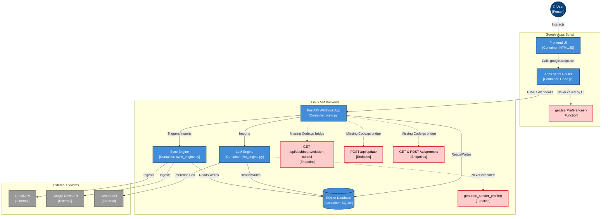

# Attempt 1
## Stage 1: The Dependency Trace
After tracing the Apps Script webhook bridges against the FastAPI backend implementations and background engines, I identified the following Orphaned Elements:

1. getUserPreferences() (Code.gs)
    - Never called. Acts as a redundant getter for /api/settings/pipeline (duplicate of getPipelineSettings()).
2. GET /api/dashboard/mission-control (main.py)
    - Backend KPI dashboard endpoint with no corresponding Code.gs webhook bridge, leaving it inaccessible to the Apps Script UI.
3. POST /api/update (main.py)
    -An endpoint (along with its underlying call to generate_tuning_rule) disconnected from the UI router. Likely a deprecation or unfinished feature for manual UI-based corrections.
4. GET and POST /api/prompts (main.py)
    - Prompt management API routes present in the FastAPI backend, but entirely untethered from the Code.gs frontend router.
5. generate_sender_profile() (llm_engine.py)
    - An isolated entity profile generation function defined in the LLM Engine but never imported into main.py or triggered by the active sync loops.

## Stage 2: The Mermaid C4 Diagram

## Stage 3: Bug Fixes
- Added `from googleapiclient.errors import HttpError` to `sync_engine.py` to resolve `NameError` and allow graceful error handling during Drive file exports.
- Fixed 403 Error in `sync_engine.py` by explicitly requesting the `mimeType` field in Drive API list calls and updating the download logic to ensure `mimeType` is checked safely (`if mime_type and mime_type.startswith(...)`).
- Updated Frontend UI model selection dropdowns in `Index.html` to feature `gemini-2.5-flash` (default) and `gemini-2.5-pro`, replacing the outdated Gemini 1.5 references.
- Implemented architectural isolation in `sync_engine.py` to prevent indexing the user's entire Drive. The `sync_drive` function now fetches the `drive_ingest_dropbox_id` from the config table and explicitly checks if this ID is in the file's `parents` list. If not, the file is immediately skipped and no LLM processing occurs.
- Fixed two `NameError` exceptions in `sync_engine.py`:
  - Added explicit import for `generate_sender_profile` from `llm_engine`.
  - Defined `ingest_dropbox_id` by retrieving its value from the `Config_System` database table before the Google Drive file processing loop begins.

## Fixes Applied: JS_Actions.html Syntax Error

- Investigated the reported frontend freeze issue.
- Diagnosed the core issue: A duplicate/orphaned code block inside the \ppActions\ object (lines 1074-1111) was causing a fatal JavaScript syntax error (\Unexpected identifier 'artifact'\). The code block contained unclosed logic for \
enderDetailsPane\ that was floating outside of any function scope.
- Replaced the fragmented single-item view logic with a properly consolidated \
enderDetailsPane\ function.
- Verified that \Code.gs\ successfully implements the \searchArtifacts\ pass-through webhook calling \/api/artifacts/search\ with no modifications needed.
- Ran runtime syntax validation confirming resolution of the issue.

## Fixes Applied: UI Container Missing

- Investigated the missing Inbox Cleanup container.
- Verified that JS_Actions.html syntax is valid and the dangling \const artifact = appState.getArtifact...\ block was successfully removed from outside of the \
enderDetailsPane\ function.
- Added the \	ab-inbox-cleanup\ container inside the \<main class="main-content">\ area of Index.html to prevent null reference errors when the sidebar button is clicked.

## Fixes Applied: JS_Actions.html runtime reference error

- Fixed an undeclared variable 'newStatus' inside 'submitManualReview'. Replaced \if(art) art.status = newStatus;\ with \if(art) { art.status = "PROCESSED"; art.purpose = newPurpose; }\.

## Fixes Applied: 405 Method Not Allowed on /api/artifacts/search

- Confirmed that FastAPI /api/artifacts/search is a GET route.
- Discovered that Apps Script's UrlFetchApp always attaches a 'payload' object in Code.gs sendToNexusVM, which is invalid for GET requests.
- Updated Code.gs sendToNexusVM to only attach 'payload' if the method is NOT 'get'.
- The frontend will now correctly issue a strictly formed GET request without a body, preventing the 405 error.

## Apps Script Provisioning Automation

- Added an interactive "Apps Script Initialization" section to `scripts/provision.ps1` and `scripts/provision.sh`.
- Provided clear instructions to the user on how to locate their Script ID in the Google Apps Script Editor.
- The scripts now pause and prompt the user to input their `scriptId`.
- Dynamically generates the `.clasp.json` file in the project root, inserting the provided `scriptId` and setting the `rootDir` to `frontend/`.
- Included a success validation message confirming that local clasp is securely linked to the user's Google account and restricted to the `frontend/` directory.

## Blue-Green Deployment Architecture

- Upgraded deployment scripts (`deploy.ps1` and `deploy.sh`) to support a zero-downtime "Blue-Green" deployment architecture using symlinks.
- Implemented Branch Guardrails: The scripts fetch branches, prompt for selection, verify prod bounds (requiring confirmation for non-main pushes to prod), and execute a local git checkout/pull.
- Enhanced Remote Architecture & Backup: Created remote shared directories (`shared/data`, `shared/backups`) and added a prompt to securely copy/backup the `nexus.db` SQLite database before pushing.
- Refactored SSH Code Clone logic to pull the code into timestamped `RELEASE_DIR` folders, setup an isolated `venv`, symlink the shared `.env` and `nexus.db`, and swap the `/home/frank/nexus/current` pointer.
- Documented the architecture and database location in `INSTRUCTIONS.md`.
- Added the emergency Symlink Rollback commands to `DEBUGGING.md`.

## Interactive GCP Discovery Menu

- Overhauled `provision.ps1` and `provision.sh` to prompt the user: "Do you want to (1) Create a NEW Nexus Environment or (2) Configure an EXISTING one?".
- Implemented a dynamic GCP Discovery Menu using `gcloud compute instances list` to automatically fetch existing VM names and zones, eliminating manual entry errors.
- Updated `deploy.ps1` and `deploy.sh` to read both `TARGET_VM` and `TARGET_ZONE` from `.nexus_env`.
- Modified deployment scripts to prompt: "Deploying to [TARGET_VM]. Press Enter to confirm, or type 'list' to choose a different VM", which seamlessly loops back into the Discovery Menu and updates `.nexus_env`.
- Ensured all `gcloud compute ssh` commands explicitly use the dynamically resolved `--zone=$TARGET_ZONE`.
- Updated `INSTRUCTIONS.md` to highlight the new interactive discovery menu and automated zone routing.

## Quick-Connect SSH Tool

- Created `scripts/connect.ps1` and `scripts/connect.sh` to abstract `gcloud compute ssh` commands and improve developer quality of life.
- Implemented the dynamic GCP Discovery Menu within the connect scripts to fetch existing VMs, prompt the user for selection, and extract the `TARGET_VM` and `TARGET_ZONE`.
- The scripts output a clear "Connecting to [TARGET_VM] in [TARGET_ZONE]..." message and establish the SSH session.
- Updated `INSTRUCTIONS.md` and `DEBUGGING.md` to reference the new connect scripts instead of requiring developers to manually write `gcloud compute ssh` commands.

## Frontend UI Refactoring & Feature Flagging

- Created `frontend/debug.gs` to serve as a centralized configuration and feature flag system, defining `NEXUS_CONFIG` and a unified `systemLog` function.
- Updated `Code.gs`'s `doGet` function to securely pass the `NEXUS_CONFIG` environment object synchronously to the UI client.
- Injected the configuration into the `<head>` of `Index.html`.
- Removed diagnostic clutter: deleted the "Dump Raw API Payload" button from the Audit Timeline tab in `Index.html` and its associated `dumpRawPayload` handler from `JS_Actions.html`.
- Wrapped the raw payload console logging inside `JS_Actions.html` (`refreshData` call) within a feature flag conditional (`NEXUS_CONFIG.UI_FLAGS.showRawPayloads`).
- Documented the new Environment Configuration controls in `DEBUGGING.md`.

## Standardized Google Drive Folder Hierarchy

- Updated `initialize_drive_structure` in `backend/sync_engine.py` to enforce the new root hierarchy: `Nexus` -> `Inbox`, `Archive`, and `System` -> `Diagnostics`.
- Modified `sync_drive` in `backend/sync_engine.py` to target `drive_inbox_id` for staging/ingestion logic instead of the fragmented `drive_ingest_dropbox_id`.
- Reconfigured the Drive Relocation Engine in `sync_drive` to automatically route documents to `drive_archive_id` rather than checking `drive_permanent_archive_id`.
- Updated `backend/diagnostics.py` to fetch `drive_diagnostics_id` from the SQLite `Config_System` table, ensuring diagnostic logs target `Nexus/System/Diagnostics` directly instead of searching for `Nexus Diagnostics`.
- Removed initialization of the obsolete `drive_permanent_archive_id` in `backend/db_init.py`.

## Automated Credentials & Auth Tunneling

- Updated the metadata startup script in `scripts/provision.ps1` and `scripts/provision.sh` to correctly map to the new `/home/frank/nexus` path structure instead of the legacy `/opt/nexus` directory.
- Refactored the metadata startup script to only handle core package dependencies, stripping out the legacy `git clone` and Python virtual environment initialization, as these are now natively handled by the deploy scripts.
- Automated the SCP credentials transfer in the provision scripts by prompting the user for the local JSON file path, initiating a secure 15-second VM spin-up wait loop, and performing a zero-touch `gcloud compute scp` operation to the remote `shared/` directory.
- Created `scripts/auth_tunnel.ps1` and `scripts/auth_tunnel.sh` to abstract the complex SSH port-forwarding requirements for Google OAuth. These scripts automatically connect to the VM via `.nexus_env`, bind port 8080 to `localhost`, and silently invoke the backend `auth.py` script.
- Updated `deploy.ps1` and `deploy.sh` to automatically symlink `credentials.json` and `token.json` from the `shared/` directory into the active backend release folder.
- Rewrote "Phase 2: Securely Authenticating Your Server" in `INSTRUCTIONS.md` to remove manual `scp` and `ssh` tunneling steps, instructing users to instead utilize the automated prompt in the provisioner and the new one-click `auth_tunnel` script.

## Lifecycle Order & Auth Tunnel Bulletproofing

- Overhauled `INSTRUCTIONS.md` to swap the deployment and authentication phases, correctly framing Deployment as Phase 2 and Authentication as Phase 3. This resolves directory-not-found errors resulting from the new Capistrano-style symlink architecture where code is no longer injected during VM provisioning.
- Fixed the credentials logic in `scripts/provision.ps1` and `scripts/provision.sh` by moving the `credentials.json` prompt and SCP transfer outside of the new VM creation block, ensuring it correctly executes for users choosing to configure an existing environment.
- Implemented an idempotency check in the credentials transfer logic to query the VM for an existing `credentials.json` via SSH, skipping the upload process if found to streamline re-provisioning.
- Bulletproofed the `scripts/auth_tunnel.ps1` and `.sh` scripts by prepending a remote directory check (`if [ ! -d /home/frank/nexus/current/backend ]; then exit 1; fi`). If the backend directory is missing, the script halts safely and prompts the user to run the deploy script first.

## Provisioning Script Race Condition & Interactivity Fixes

- Fixed a race condition in `scripts/provision.ps1` and `scripts/provision.sh` where the script attempted to establish an SSH connection for the credentials check immediately after the VM creation command, before the VM's SSH daemon had initialized. Inserted a mandatory 30-second wait period (`Start-Sleep -Seconds 30` / `sleep 30`) immediately after VM creation.
- Removed redundant sleep commands from the credentials upload block.
- Suppressed interactive host-key prompts that were breaking automation on Windows (`plink.exe` hang) by appending the `--quiet` flag to all `gcloud compute ssh` and `gcloud compute scp` commands used during directory creation, credentials verification, and SCP transfers.

## PowerShell Escaping & Automation Fixes

- Fixed `.env` string formatting in `scripts/deploy.ps1`. The multi-line here-string was failing to parse correctly over SSH on Windows. Replaced the here-string with a single, flattened command chain using `&&` and single quotes to ensure safe interpretation by the remote Bash shell.
- Fixed premature Bash variable evaluation in `scripts/deploy.ps1`. Replaced invalid backslash escapes (`\$`) with the correct PowerShell backtick escapes (`` `$ ``) for remote variables like `$(date)`, `$RELEASE_DIR`, and `$FULL_RELEASE_DIR` inside the `$sshCommand` here-string. This prevents PowerShell from attempting to evaluate them locally before execution on the VM.

- Updated `scripts/provision.ps1` and `scripts/provision.sh` to prompt the user for an **Environment Label**.
- VM instance names are now dynamically generated using the pattern `nexus-vm-[label]`.
- Enforced a naming convention for the Apps Script project: `Nexus for Google - [UPPERCASE_ENV_LABEL]`.
- Implemented environment tracking by generating a hidden `.nexus_env` file containing the `TARGET_VM` at the end of the provision scripts. Added `.nexus_env` to `.gitignore`.
- Updated systemd `nexus.service` generation in provision scripts to set `WorkingDirectory=/home/frank/nexus/current/backend` and `ExecStart=/home/frank/nexus/current/backend/venv/bin/uvicorn main:app --host 0.0.0.0 --port 8000`.
- Overhauled the "Setup and Installation" section in `INSTRUCTIONS.md` to explain the new Multi-Environment workflow, detailing the "Environment Label" and the use of the `.nexus_env` file.

## Deployment Script Branch HEAD Fix

- Fixed an issue in `scripts/deploy.ps1` and `scripts/deploy.sh` where `git branch -r` would return the symbolic reference `origin/HEAD -> origin/...`. This would cause the `git checkout` command to fail with an invalid pathspec error if selected.
- Injected `Where-Object { $_ -notmatch "HEAD" }` filter into `deploy.ps1`.
- Injected `grep -v "HEAD"` filter into `deploy.sh`.

## Apps Script Open Error Fix

- Removed `clasp open` from `scripts/deploy.ps1` and `scripts/deploy.sh` due to a Commander.js parsing error on Windows.
- Scripts now parse `.clasp.json` to extract `scriptId` and construct the Apps Script Editor URL manually.
- Implemented native browser launch commands (`Start-Process`, `open`, `start`, `xdg-open`) to reliably open the URL cross-platform.
- The editor URL is also printed cleanly to the console as a fallback.

## PowerShell Multi-line String Escaping Fix

- Fixed an issue in `scripts/deploy.ps1` where PowerShell split the `$sshCommand` multi-line string at the space inside the `$(date...)` bash command before passing it to gcloud.
- Wrapped `$sshCommand` in double quotes in the `gcloud compute ssh` execution command to force PowerShell to pass it as a single argument.
- Removed nested double quotes from the `RELEASE_DIR` assignment within the here-string to prevent Windows `cmd.exe` escaping collisions.

## Portability, Reliability, and UX Updates

- Removed hardcoded `/home/frank` paths across `provision.ps1`, `provision.sh`, `deploy.ps1`, `deploy.sh`, `auth_tunnel.ps1`, and `auth_tunnel.sh` in favor of dynamic `$HOME` resolution and a `NEXUS_ROOT` variable.
- Refactored VM initialization in the provision scripts by moving the directory creation and systemd service generation (which previously wrote files as root with `/root` variables) into a delayed SSH block to ensure they execute as the logged-in gcloud user.
- Fixed Address already in use error by injecting `sudo fuser -k 8080/tcp || true` into the `auth_tunnel` scripts before launching the Python authentication server.
- Prevented garbage character output on Windows by modifying the `pip install` commands in `deploy` and `auth_tunnel` to use `--progress-bar off --quiet`.
- Unified CLI formatting to match the project taxonomy: applied distinct colors for Titles, Prompts, Success, Warnings, and Errors, and implemented reverse-video (white background/black text or `\e[7m`) highlighting for URLs across all deployment scripts.
