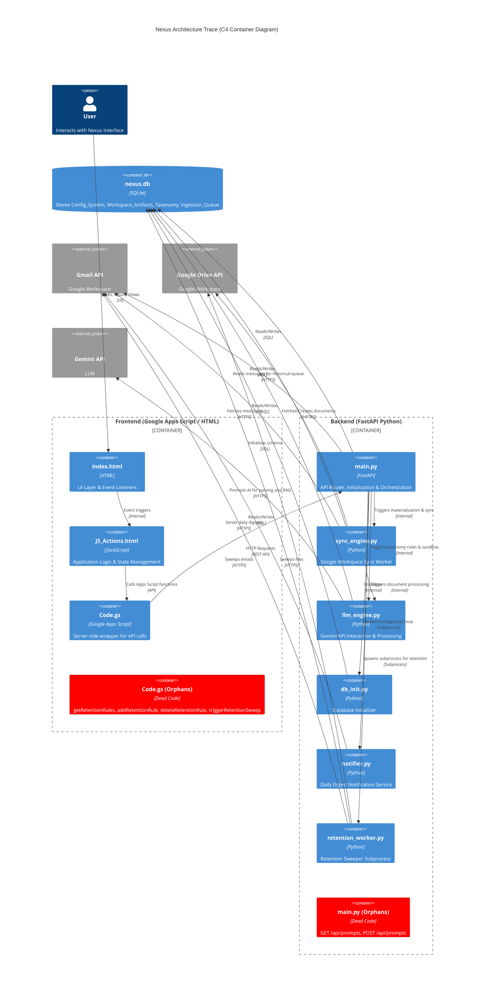

# Nexus Architecture C4 Container Diagram

```mermaid
C4Container
    title Nexus Architecture Trace (C4 Container Diagram)

    Person(user, "User", "Interacts with Nexus Interface")

    Container_Boundary(frontend, "Frontend (Google Apps Script / HTML)") {
        Container(index_html, "Index.html", "HTML", "UI Layer & Event Listeners")
        Container(js_actions, "JS_Actions.html", "JavaScript", "Application Logic & State Management")
        Container(code_gs, "Code.gs", "Google Apps Script", "Server-side wrapper for API calls")
        
        Container(code_gs_dead, "Code.gs (Orphans)", "Dead Code", "getRetentionRules, addRetentionRule, deleteRetentionRule, triggerRetentionSweep")
    }

    Container_Boundary(backend, "Backend (FastAPI Python)") {
        Container(main_py, "main.py", "FastAPI", "API Router, Initialization & Orchestration")
        Container(sync_engine, "sync_engine.py", "Python", "Google Workspace Sync Worker")
        Container(llm_engine, "llm_engine.py", "Python", "Gemini API Interaction & Processing")
        Container(db_init, "db_init.py", "Python", "Database Initializer")
        Container(notifier, "notifier.py", "Python", "Daily Digest Notification Service")
        Container(retention_worker, "retention_worker.py", "Python", "Retention Sweeper Subprocess")
        
        Container(main_py_dead, "main.py (Orphans)", "Dead Code", "GET /api/prompts, POST /api/prompts")
    }

    ContainerDb(nexus_db, "nexus.db", "SQLite", "Stores Config_System, Workspace_Artifacts, Taxonomy, Ingestion_Queue")

    System_Ext(gmail_api, "Gmail API", "Google Workspace", "Email read/write")
    System_Ext(drive_api, "Google Drive API", "Google Workspace", "Drive read/write")
    System_Ext(gemini_api, "Gemini API", "LLM", "Generative AI models")

    Rel(user, index_html, "Clicks, Inputs, Views", "UI")
    Rel(index_html, js_actions, "Event triggers", "Internal")
    Rel(js_actions, code_gs, "Calls Apps Script functions", "API")
    Rel(code_gs, main_py, "HTTP Requests", "REST API")

    Rel(main_py, sync_engine, "Triggers materialization & sync", "Internal")
    Rel(main_py, llm_engine, "Triggers taxonomy rules & sandbox", "Internal")
    Rel(main_py, db_init, "Initializes", "Internal")
    Rel(main_py, notifier, "Spawns background loop", "Subprocess")
    Rel(main_py, retention_worker, "Spawns subprocess for retention", "Subprocess")
    
    Rel(sync_engine, llm_engine, "Triggers document processing", "Internal")

    Rel(main_py, nexus_db, "Reads/Writes", "SQL")
    Rel(sync_engine, nexus_db, "Reads/Writes", "SQL")
    Rel(llm_engine, nexus_db, "Reads/Writes", "SQL")
    Rel(retention_worker, nexus_db, "Reads/Writes", "SQL")
    Rel(db_init, nexus_db, "Initializes schema", "SQL")

    Rel(sync_engine, gmail_api, "Fetches messages", "HTTPS")
    Rel(sync_engine, drive_api, "Fetches/Creates documents", "HTTPS")
    Rel(notifier, gmail_api, "Sends daily digests", "HTTPS")
    Rel(main_py, gmail_api, "Reads messages for historical queue", "HTTPS")
    Rel(retention_worker, gmail_api, "Sweeps emails", "HTTPS")
    Rel(retention_worker, drive_api, "Sweeps files", "HTTPS")
    Rel(llm_engine, gemini_api, "Prompts AI for parsing and RAG", "HTTPS")

    UpdateElementStyle(code_gs_dead, $bgColor="red", $fontColor="white", $borderColor="darkred")
    UpdateElementStyle(main_py_dead, $bgColor="red", $fontColor="white", $borderColor="darkred")
```
