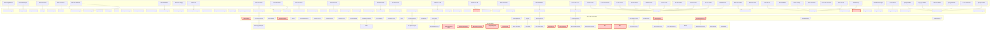

# Nexus Exhaustive Matrix Diagram

```mermaid
graph TD
    classDef dead fill:#ffcccc,stroke:#cc0000,stroke-width:4px,color:#000

    subgraph UI [HTML UI Elements]
        UI0["`button class='menu-toggle' onclick='...`"]
        UI1["`div class='nav-item' onclick='appSta...`"]
        UI2["`div class='nav-item active' onclick=...`"]
        UI3["`div class='nav-item' onclick='appSta...`"]
        UI4["`div class='nav-item' onclick='appSta...`"]
        UI5["`div class='nav-item' onclick='appSta...`"]
        UI6["`div class='nav-item' onclick='appSta...`"]
        UI7["`div class='nav-item' onclick='appSta...`"]
        UI8["`div class='nav-item' onclick='appSta...`"]
        UI9["`div class='nav-item' onclick='appSta...`"]
        UI10["`div class='nav-item' onclick='appSta...`"]
        UI11["`input type='checkbox' id='toggle-ret...`"]
        UI12["`input type='checkbox' id='toggle-rel...`"]
        UI13["`input type='checkbox' id='toggle-mat...`"]
        UI14["`input type='checkbox' id='toggle-tas...`"]
        UI15["`div class='nav-item' onclick='appAct...`"]
        UI16["`button class='btn btn-primary' oncli...`"]
        UI17["`button class='icon-btn save' title='...`"]
        UI18["`button class='icon-btn' title='Advan...`"]
        UI19["`button class='view-btn' id='view-san...`"]
        UI20["`button class='view-btn active' id='v...`"]
        UI21["`a href='#' id='global-select-link' o...`"]
        UI22["`button class='chip' onclick='toggleC...`"]
        UI23["`button class='chip' onclick='toggleC...`"]
        UI24["`button class='chip' onclick='toggleC...`"]
        UI25["`button class='chip' onclick='toggleC...`"]
        UI26["`button class='btn btn-primary' oncli...`"]
        UI27["`button class='btn btn-primary' oncli...`"]
        UI28["`select id='filter-category' onchange...`"]
        UI29["`select id='filter-correspondent' onc...`"]
        UI30["`select id='filter-purpose' onchange=...`"]
        UI31["`button class='btn btn-secondary' onc...`"]
        UI32["`button class='btn btn-secondary' onc...`"]
        UI33["`button class='drawer-close-btn' oncl...`"]
        UI34["`button class='btn btn-primary' oncli...`"]
        UI35["`button class='drawer-close-btn' oncl...`"]
        UI36["`button class='btn btn-primary' oncli...`"]
        UI37["`button class='btn btn-primary' oncli...`"]
        UI38["`button class='btn btn-primary' oncli...`"]
        UI39["`button class='btn btn-primary' oncli...`"]
        UI40["`button class='btn btn-primary' oncli...`"]
        UI41["`button class='btn btn-primary' oncli...`"]
        UI42["`button class='btn btn-secondary' onc...`"]
        UI43["`button class='btn btn-primary' oncli...`"]
        UI44["`i class='material-icons' style='curs...`"]
        UI45["`button class='btn btn-primary' oncli...`"]
    end

    subgraph JS [JS Actions & State Functions]
        JS0["activateGlobalSelect()"]
        JS1["applyFilters()"]
        JS2["approveCluster()"]
        JS3["askAI()"]
        JS4["buildHeatmap()"]
        JS5["bulkEdit()"]
        JS6["closeContextDrawer()"]
        JS7["executeASTSearch()"]
        JS8["getArtifact()"]
        JS9["hexToRgba()"]
        JS10["init()"]
        JS11["loadPipelineSettings()"]
        JS12["loadQuotaGovernor()"]
        JS13["loadUserPreferences()"]
        JS14["materializeSelected()"]
        JS15["onCategoryChange()"]
        JS16["onCorrespondentChange()"]
        JS17["openClusterDrawer()"]
        JS18["openManualReviewModal()"]
        JS19["pingHealth()"]
        JS20["populateCategoryDropdown()"]
        JS21["queueHistoricalImport()"]
        JS22["refreshData()"]
        JS23["rejectCluster()"]
        JS24["renderAnalyticsDashboard()"]
        JS25["renderDetailsPane()"]
        JS26["renderGrid()"]
        JS27["renderHeatmap()"]
        JS28["renderThreadsView()"]
        JS29["renderTimeline()"]
        JS30["renderZeroTrustQueue()"]
        JS31["runSandbox()"]
        JS32["saveCorrespondentRules()"]
        JS33["savePipelineSettings()"]
        JS34["savePurposeRules()"]
        JS35["selectAll()"]
        JS36["selectArtifact()"]
        JS37["setArtifacts()"]
        JS38["setHistory()"]:::dead
        JS39["setupOmnibox()"]
        JS40["showToast()"]
        JS41["startHealthPing()"]
        JS42["submitManualReview()"]
        JS43["submitZeroShotRule()"]
        JS44["switchTab()"]
        JS45["switchWorkspaceView()"]
        JS46["toggleChip()"]
        JS47["toggleRowSelection()"]
        JS48["toggleSelectAll()"]:::dead
        JS49["toggleSelection()"]
        JS50["toggleSidebar()"]
        JS51["triggerDiagnostics()"]
        JS52["updateBulkEstimate()"]
        JS53["updateSafeMode()"]
        JS54["updateSelectionBanner()"]
    end

    subgraph GS [Code.gs Apps Script Functions]
        GS0["addRetentionRule()"]:::dead
        GS1["bulkUpdateArtifacts()"]
        GS2["configureHMAC()"]
        GS3["deleteRetentionRule()"]:::dead
        GS4["doGet()"]
        GS5["generateHMACSignature_()"]
        GS6["getHeatmapData()"]
        GS7["getPipelineSettings()"]
        GS8["getQuotaGovernor()"]
        GS9["getROIDashboard()"]
        GS10["getRetentionRules()"]:::dead
        GS11["getThreadsData()"]
        GS12["getUserPreferences()"]
        GS13["include()"]
        GS14["materializeSelectedItems()"]
        GS15["pingHealthAPI()"]
        GS16["queueHistoricalImport()"]
        GS17["runAskAI()"]
        GS18["runSandboxPrompt()"]
        GS19["runSystemDiagnostics()"]
        GS20["savePipelineSettings()"]
        GS21["searchArtifacts()"]
        GS22["sendToNexusVM()"]
        GS23["submitZeroShotRule()"]
        GS24["triggerRetentionSweep()"]:::dead
        GS25["updateEntityRules()"]
        GS26["updateSafeMode()"]
    end

    subgraph API [FastAPI Endpoints]
        API0["POST /api/ingestion/queue-historical"]
        API1["POST /api/workflows/materialize"]
        API2["POST /api/taxonomy/zero-shot-rule"]
        API3["GET /api/artifacts/search"]
        API4["GET /api/dashboard/mission-control"]:::dead
        API5["GET /api/analytics/heatmap"]:::dead
        API6["GET /api/analytics/threads"]:::dead
        API7["GET /api/analytics/roi-dashboard"]:::dead
        API8["POST /api/update"]:::dead
        API9["POST /api/sandbox"]
        API10["POST /api/ask"]
        API11["POST /api/bulk-update"]
        API12["GET /api/prompts"]:::dead
        API13["POST /api/prompts"]:::dead
        API14["GET /api/settings/pipeline"]
        API15["POST /api/settings/pipeline"]
        API16["PUT /api/entities/correspondents/{id}"]:::dead
        API17["PUT /api/entities/purposes/{id}"]:::dead
        API18["GET /api/health/quota"]
        API19["GET /api/retention/rules"]
        API20["POST /api/retention/rules"]
        API21["DELETE /api/retention/rules/{rule_id}"]
        API22["POST /api/retention/sweep"]
        API23["POST /api/health"]
        API24["GET /api/health"]
    end

    %% Mappings
    UI0 --> JS50
    UI1 --> JS44
    UI2 --> JS44
    UI3 --> JS44
    UI4 --> JS44
    UI5 --> JS44
    UI6 --> JS44
    UI7 --> JS44
    UI8 --> JS44
    UI9 --> JS44
    UI10 --> JS44
    UI11 --> JS53
    UI12 --> JS53
    UI13 --> JS53
    UI14 --> JS53
    UI15 --> JS51
    UI16 --> JS27
    UI17 --> JS40
    UI18 --> JS40
    UI19 --> JS45
    UI20 --> JS45
    UI21 --> JS0
    UI22 --> JS46
    UI23 --> JS46
    UI24 --> JS46
    UI25 --> JS46
    UI26 --> JS22
    UI27 --> JS21
    UI28 --> JS15
    UI29 --> JS16
    UI30 --> JS1
    UI31 --> JS5
    UI33 --> JS6
    UI26 --> JS22
    UI33 --> JS6
    UI36 --> JS32
    UI37 --> JS34
    UI38 --> JS31
    UI39 --> JS33
    UI40 --> JS24
    UI41 --> JS3
    UI43 --> JS42
    UI45 --> JS14
    JS42 --> GS1
    JS21 --> GS16
    JS33 --> GS20
    JS43 --> GS23
    JS53 --> GS26
    GS21 --> API3
    GS17 --> API10
    GS1 --> API11
    GS19 --> API18
    GS16 --> API0
    GS10 --> API19
    GS24 --> API22
    GS18 --> API9
    GS20 --> API14
    GS23 --> API2
    GS14 --> API1
```
