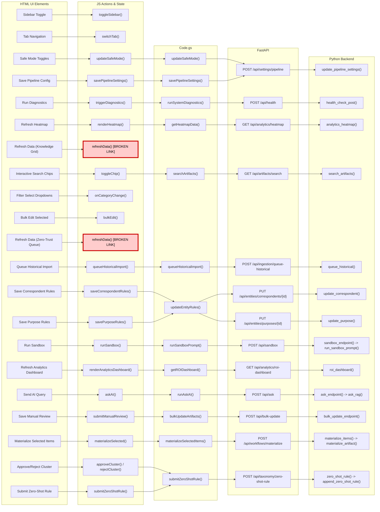

# Nexus UI Reverse Trace Flowchart

```mermaid
graph LR
    %% Broken Link styling
    classDef broken fill:#ffcccc,stroke:#cc0000,stroke-width:4px,color:#000

    subgraph UI [HTML UI Elements]
        direction TB
        UI_Sidebar["Sidebar Toggle"]
        UI_Tab["Tab Navigation"]
        UI_SafeMode["Safe Mode Toggles"]
        UI_Diag["Run Diagnostics"]
        UI_Heatmap["Refresh Heatmap"]
        UI_Chips["Interactive Search Chips"]
        UI_RefKG["Refresh Data (Knowledge Grid)"]
        UI_Hist["Queue Historical Import"]
        UI_Filter["Filter Select Dropdowns"]
        UI_BulkEdit["Bulk Edit Selected"]
        UI_RefZT["Refresh Data (Zero-Trust Queue)"]
        UI_Corr["Save Correspondent Rules"]
        UI_Purp["Save Purpose Rules"]
        UI_Sandbox["Run Sandbox"]
        UI_Pipe["Save Pipeline Config"]
        UI_ROI["Refresh Analytics Dashboard"]
        UI_AI["Send AI Query"]
        UI_Rev["Save Manual Review"]
        UI_Mat["Materialize Selected Items"]
        UI_Clus["Approve/Reject Cluster"]
        UI_ZS["Submit Zero-Shot Rule"]
    end

    subgraph JS [JS Actions & State]
        direction TB
        JS_Sidebar["toggleSidebar()"]
        JS_Tab["switchTab()"]
        JS_SafeMode["updateSafeMode()"]
        JS_Diag["triggerDiagnostics()"]
        JS_Heatmap["renderHeatmap()"]
        JS_Chips["toggleChip()"]
        JS_RefKG["refreshData() [BROKEN LINK]"]:::broken
        JS_Hist["queueHistoricalImport()"]
        JS_Filter["onCategoryChange()"]
        JS_BulkEdit["bulkEdit()"]
        JS_RefZT["refreshData() [BROKEN LINK]"]:::broken
        JS_Corr["saveCorrespondentRules()"]
        JS_Purp["savePurposeRules()"]
        JS_Sandbox["runSandbox()"]
        JS_Pipe["savePipelineSettings()"]
        JS_ROI["renderAnalyticsDashboard()"]
        JS_AI["askAI()"]
        JS_Rev["submitManualReview()"]
        JS_Mat["materializeSelected()"]
        JS_Clus["approveCluster() / rejectCluster()"]
        JS_ZS["submitZeroShotRule()"]
    end

    subgraph GS [Code.gs]
        direction TB
        GS_SafeMode["updateSafeMode()"]
        GS_Diag["runSystemDiagnostics()"]
        GS_Heatmap["getHeatmapData()"]
        GS_Chips["searchArtifacts()"]
        GS_Hist["queueHistoricalImport()"]
        GS_EntRules["updateEntityRules()"]
        GS_Sandbox["runSandboxPrompt()"]
        GS_Pipe["savePipelineSettings()"]
        GS_ROI["getROIDashboard()"]
        GS_AI["runAskAI()"]
        GS_Rev["bulkUpdateArtifacts()"]
        GS_Mat["materializeSelectedItems()"]
        GS_ZS["submitZeroShotRule()"]
    end

    subgraph API [FastAPI]
        direction TB
        API_Pipe["POST /api/settings/pipeline"]
        API_Diag["POST /api/health"]
        API_Heatmap["GET /api/analytics/heatmap"]
        API_Chips["GET /api/artifacts/search"]
        API_Hist["POST /api/ingestion/queue-historical"]
        API_Corr["PUT /api/entities/correspondents/{id}"]
        API_Purp["PUT /api/entities/purposes/{id}"]
        API_Sandbox["POST /api/sandbox"]
        API_ROI["GET /api/analytics/roi-dashboard"]
        API_AI["POST /api/ask"]
        API_Rev["POST /api/bulk-update"]
        API_Mat["POST /api/workflows/materialize"]
        API_ZS["POST /api/taxonomy/zero-shot-rule"]
    end

    subgraph PY [Python Backend]
        direction TB
        PY_Pipe["update_pipeline_settings()"]
        PY_Diag["health_check_post()"]
        PY_Heatmap["analytics_heatmap()"]
        PY_Chips["search_artifacts()"]
        PY_Hist["queue_historical()"]
        PY_Corr["update_correspondent()"]
        PY_Purp["update_purpose()"]
        PY_Sandbox["sandbox_endpoint() -> run_sandbox_prompt()"]
        PY_ROI["roi_dashboard()"]
        PY_AI["ask_endpoint() -> ask_rag()"]
        PY_Rev["bulk_update_endpoint()"]
        PY_Mat["materialize_items() -> materialize_artifact()"]
        PY_ZS["zero_shot_rule() -> append_zero_shot_rule()"]
    end

    %% Mappings
    UI_Sidebar --> JS_Sidebar
    UI_Tab --> JS_Tab
    UI_Filter --> JS_Filter
    UI_BulkEdit --> JS_BulkEdit

    UI_RefKG --> JS_RefKG
    UI_RefZT --> JS_RefZT

    UI_SafeMode --> JS_SafeMode --> GS_SafeMode --> API_Pipe --> PY_Pipe
    UI_Pipe --> JS_Pipe --> GS_Pipe --> API_Pipe

    UI_Diag --> JS_Diag --> GS_Diag --> API_Diag --> PY_Diag
    UI_Heatmap --> JS_Heatmap --> GS_Heatmap --> API_Heatmap --> PY_Heatmap
    UI_Chips --> JS_Chips --> GS_Chips --> API_Chips --> PY_Chips
    UI_Hist --> JS_Hist --> GS_Hist --> API_Hist --> PY_Hist
    
    UI_Corr --> JS_Corr --> GS_EntRules
    UI_Purp --> JS_Purp --> GS_EntRules
    GS_EntRules --> API_Corr --> PY_Corr
    GS_EntRules --> API_Purp --> PY_Purp

    UI_Sandbox --> JS_Sandbox --> GS_Sandbox --> API_Sandbox --> PY_Sandbox
    UI_ROI --> JS_ROI --> GS_ROI --> API_ROI --> PY_ROI
    UI_AI --> JS_AI --> GS_AI --> API_AI --> PY_AI
    UI_Rev --> JS_Rev --> GS_Rev --> API_Rev --> PY_Rev
    UI_Mat --> JS_Mat --> GS_Mat --> API_Mat --> PY_Mat
    
    UI_Clus --> JS_Clus --> GS_ZS
    UI_ZS --> JS_ZS --> GS_ZS
    GS_ZS --> API_ZS --> PY_ZS
```
