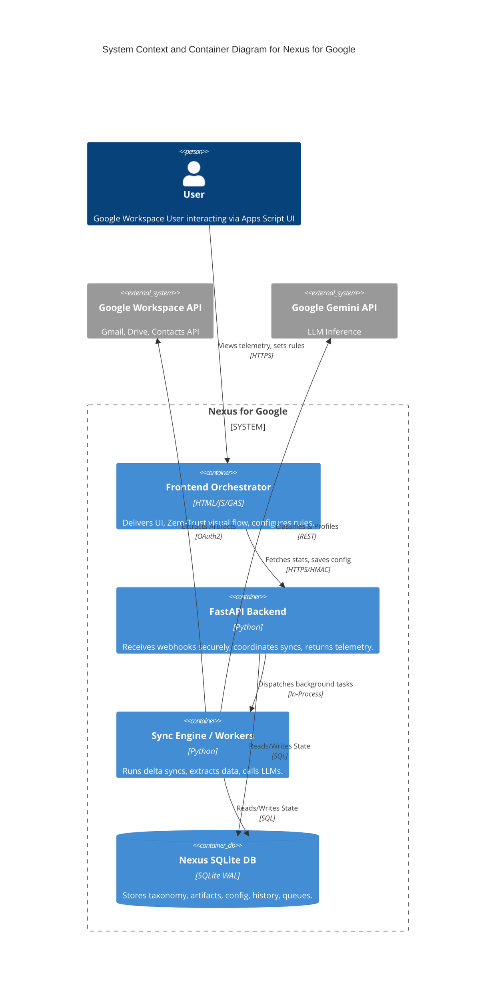

# Nexus for Google - System Architectural Audit Snapshot
**Version:** v1.1.11
**Date:** 2026-05-16

## Phase 1: Total Census
### Files and Purposes
- **`.clasp.json`**: Core module
- **`.google_gca/config.json`**: Core module
- **`ARCHITECTURE.md`**: Core module
- **`CHANGELOG.md`**: Core module
- **`CONTRIBUTING.md`**: Core module
- **`DEBUGGING.md`**: Core module
- **`DEFAULTS/agent_classifier.tmpl`**: Core module
- **`DEFAULTS/agent_profiler_commercial.tmpl`**: Core module
- **`DEFAULTS/agent_profiler_personal.tmpl`**: Core module
- **`DEFAULTS/deduplicate_legacy_labels.tmpl`**: Core module
- **`DEFAULTS/drive_extraction_stage1.tmpl`**: Core module
- **`DEFAULTS/drive_extraction_stage2.tmpl`**: Core module
- **`DEFAULTS/entity_profiler.tmpl`**: Core module
- **`DEFAULTS/gmail_extraction.tmpl`**: Core module
- **`DEFAULTS/profile_and_map_entities.tmpl`**: Core module
- **`DEFAULTS/quarantine_consolidation.tmpl`**: Core module
- **`DEFAULTS/zero_trust_defaults.json`**: Core module
- **`FEATURE_TRACKING.md`**: Core module
- **`INSTRUCTIONS.md`**: Core module
- **`README.md`**: Core module
- **`audit_helper.py`**: # Nexus for Google - System Architectural Audit Snapshot
  - Functions: get_file_purpose
- **`backend/auth.py`**: Module: auth.py
  - Functions: authenticate
- **`backend/branding_engine.py`**: Module: branding_engine.py
  - Functions: hex_to_rgb, get_closest_gmail_color, color_distance, sync_workspace_colors
- **`backend/db_init.py`**: Module: db_init.py
  - Functions: seed_default_configs, seed_default_prompts, get_prompt_template, init_db
- **`backend/diagnostics.py`**: Module: diagnostics.py
  - Functions: upload_diagnostic_log, write_migration_trace, run_all_diagnostics, check_api_health, check_oauth_token, check_database
- **`backend/llm_engine.py`**: LLM Engine for Nexus.
  - Functions: run_sandbox_prompt, update_artifact_status, evaluate_quarantine_clusters, ask_rag, run_bulk_profiler, call_gemini, deduplicate_legacy_labels, append_zero_shot_rule, fetch_active_prompt, generate_tuning_rule, normalize_taxonomy, run_agent_profiler, get_genai_client, process_gmail_thread, profile_and_map_entities, persist_llm_results, process_drive_document, run_bulk_classifier, run_agent_classifier
- **`backend/main.py`**: FastAPI Backend Application for Nexus.
  - Functions: legacy_labels_execute, search_artifacts, batch_process, preview_legacy_labels, legacy_labels_preview, health_check_post, execute_legacy_labels, bulk_update_endpoint, ask_endpoint, health_check_get, zero_shot_rule, add_blacklist, discover_entity, get_health_quota, daily_digest, update_pipeline_settings, get_prompts, start_cron_jobs, process_historical_data, get_analytics_taxonomy, get_orchestrator_telemetry, queue_historical, run_pipeline_now, trigger_retention_sweep, get_quarantine_queue, get_pipeline_settings, add_link, get_taxonomy_flow, sandbox_endpoint, get_retention_rules, get_analytics_heatmap, get_db, verify_nexus_signature, add_retention_rule, get_blacklist, get_taxonomy_tree, get_analytics_sankey, materialize_items, delete_retention_rule, simulate_orchestrator, periodic_sync
- **`backend/notifier.py`**: Module: notifier.py
  - Functions: send_urgent_webhook, __init__, send_daily_digest
- **`backend/requirements.txt`**: Core module
- **`backend/retention_worker.py`**: Module: retention_worker.py
  - Functions: run_retention_sweep, is_feature_enabled
- **`backend/sync_engine.py`**: Sync Engine for Nexus.
  - Functions: fetch_legacy_gmail_labels, sync_contacts_pipeline, _init_quota_tracker, __init__, init_gmail_history_id, find_or_create_folder, sync_gmail_pipeline, update_sync_state, initialize_drive_structure, sync_drive, get_sync_state, sync_contacts, can_process_historical, sync_gmail, init_drive_page_token, fetch_drive_changes, materialize_artifact, push_to_google_tasks, ingest_taxonomy_seed, fetch_gmail_history, sync_drive_pipeline, run_sync, record_api_call, is_feature_enabled, process_file_with_governor
- **`frontend/CSS_Styles.html`**: Core module
- **`frontend/Code.gs`**: Nexus for Google - Apps Script Backend Router.
  - Functions: updateSafeMode, configureHMAC, generateHMACSignature_, materializeSelectedItems, runAskAI, queueHistoricalImport, runSystemDiagnostics, getOrchestratorTelemetry, updateEntityRules, savePipelineSettings, getPipelineSettings, doGet, sendToNexusVM, searchArtifacts, submitZeroShotRule, runSandboxPrompt, getQuarantineQueue, bulkUpdateArtifacts, getHeatmapData, include, getQuotaGovernor, pingHealthAPI, getROIDashboard, getThreadsData
- **`frontend/Index.html`**: Core module
- **`frontend/JS_Actions.html`**: Core module
  - Functions: refreshVQB, runPipelineNow, toggleVQBView, filterZeroTrustTree, toggleDebugMode, previewBatch, switchTab, savePipelineConfig, clearQuarantineFilter, renderVQB, switchOrchestratorTab, toggleSidebar, openSettingsModal, simulatePipeline, executeBatch, init, stageChip, loadZeroTrustFlow, switchSettingsTab, snapshotLegacyLabels, closeSettingsModal, renderSankey, renderQuarantineBanner, initOrchestrator
- **`frontend/JS_State.html`**: Core module
- **`frontend/appsscript.json`**: Core module
- **`frontend/debug.gs`**: Centralized configuration and logging for the Nexus frontend.
  - Functions: systemLog
- **`scripts/auth_tunnel.ps1`**: Core module
- **`scripts/auth_tunnel.sh`**: Core module
- **`scripts/deploy.ps1`**: Core module
- **`scripts/deploy.sh`**: Core module
- **`scripts/health_check.ps1`**: Core module
- **`scripts/health_check.sh`**: Core module
- **`scripts/provision.ps1`**: Core module
- **`scripts/provision.sh`**: Core module
- **`tooltips.json`**: Core module

### API Endpoints (`backend/main.py`)
- `POST /api/ingestion/queue-historical`
- `POST /api/workflows/materialize`
- `POST /api/taxonomy/zero-shot-rule`
- `GET /api/artifacts/search`
- `POST /api/sandbox`
- `POST /api/ask`
- `POST /api/bulk-update`
- `GET /api/settings/pipeline`
- `POST /api/settings/pipeline`
- `GET /api/health/quota`
- `GET /api/retention/rules`
- `POST /api/retention/rules`
- `DELETE /api/retention/rules`
- `POST /api/retention/sweep`
- `POST /api/health`
- `GET /api/health`
- `GET /api/analytics/taxonomy`
- `GET /api/taxonomy/flow`
- `POST /api/taxonomy/discover`
- `GET /api/taxonomy/blacklist`
- `POST /api/taxonomy/blacklist`
- `GET /api/orchestrator/telemetry`
- `GET /api/quarantine/queue`
- `POST /api/batch/process`
- `POST /api/orchestrator/simulate`
- `GET /api/analytics/heatmap`
- `GET /api/analytics/sankey`
- `POST /api/ingestion/legacy-labels/preview`
- `POST /api/ingestion/legacy-labels/execute`
- `GET /api/prompts`
- `POST /api/orchestrator/run-now`
- `GET /api/taxonomy/tree`
- `POST /api/ingestion/legacy-labels/preview`
- `POST /api/ingestion/legacy-labels/execute`

## Phase 2: Hook Map
### Frontend (Apps Script / UI) -> Backend API
- UI calls API Route: `/api/ingestion/queue-historical`
- UI calls API Route: `/api/analytics/threads`
- UI calls API Route: `/api/health`
- UI calls API Route: `/api/orchestrator/run-now`
- UI calls API Route: `/api/artifacts/search`
- UI calls API Route: `/api/bulk-update`
- UI calls API Route: `/api/health/quota`
- UI calls API Route: `/api/workflows/materialize`
- UI calls API Route: `/api/quarantine/queue`
- UI calls API Route: `/api/orchestrator/config`
- UI calls API Route: `/api/batch/process`
- UI calls API Route: `/api/analytics/roi-dashboard`
- UI calls API Route: `/api/analytics/heatmap`
- UI calls API Route: `/api/sandbox`
- UI calls API Route: `/api/orchestrator/simulate`
- UI calls API Route: `/api/taxonomy/zero-shot-rule`
- UI calls API Route: `/api/settings/pipeline`
- UI calls API Route: `/api/orchestrator/telemetry`
- UI calls API Route: `/api/taxonomy/tree`
- UI calls API Route: `/api/ask`

### Backend API -> Background Workers
- API triggers worker: `materialize_artifact`
- API triggers worker: `worker)
    return JSONResponse(content={"status": "success"`
- API triggers worker: `process_historical_data`

## Phase 3: C4 Architecture Diagram

## Phase 4: Database Verification
The following tables are defined in the schema and actively verified in queries:
- `Config_System`: ✅ Verified in codebase
- `Sync_State`: ✅ Verified in codebase
- `Config_Prompts`: ✅ Verified in codebase
- `Config_Retention_Rules`: ✅ Verified in codebase
- `categories`: ✅ Verified in codebase
- `purposes`: ✅ Verified in codebase
- `entities`: ✅ Verified in codebase
- `aliases`: ✅ Verified in codebase
- `pipeline_config`: ✅ Verified in codebase
- `blacklist`: ✅ Verified in codebase
- `Workspace_Artifacts`: ✅ Verified in codebase
- `Artifact_History`: ✅ Verified in codebase
- `Error_Logs`: ✅ Verified in codebase
- `Ingestion_Queue`: ✅ Verified in codebase
- `quarantine_queue`: ✅ Verified in codebase

## Phase 5: The Orphan Report
### Disconnected API Endpoints (No frontend match found)
- `POST /api/retention/rules`
- `GET /api/prompts`
- `GET /api/taxonomy/flow`
- `GET /api/analytics/taxonomy`
- `POST /api/taxonomy/blacklist`
- `GET /api/taxonomy/blacklist`
- `POST /api/retention/sweep`
- `POST /api/ingestion/legacy-labels/preview`
- `POST /api/ingestion/legacy-labels/execute`
- `GET /api/retention/rules`
- `DELETE /api/retention/rules`
- `POST /api/taxonomy/discover`
- `GET /api/analytics/sankey`

### Potential Dead Code (Functions defined but not explicitly called locally)
- `refreshVQB`
- `legacy_labels_preview`
- `add_blacklist`
- `queueHistoricalImport`
- `runSystemDiagnostics`
- `getOrchestratorTelemetry`
- `sync_gmail_pipeline`
- `get_health_quota`
- `clearQuarantineFilter`
- `submitZeroShotRule`
- `get_quarantine_queue`
- `snapshotLegacyLabels`
- `get_taxonomy_flow`
- `verify_nexus_signature`
- `sync_drive_pipeline`
- `get_taxonomy_tree`
- `get_analytics_sankey`
- `getROIDashboard`
- `batch_process`
- `execute_legacy_labels`
- `bulk_update_endpoint`
- `send_daily_digest`
- `ask_endpoint`
- `zero_shot_rule`
- `runAskAI`
- `updateEntityRules`
- `switchTab`
- `savePipelineConfig`
- `initialize_drive_structure`
- `toggleSidebar`
- `openSettingsModal`
- `get_prompts`
- `simulatePipeline`
- `start_cron_jobs`
- `run_pipeline_now`
- `generate_tuning_rule`
- `bulkUpdateArtifacts`
- `getHeatmapData`
- `get_analytics_heatmap`
- `pingHealthAPI`
- `queue_historical`
- `runSandboxPrompt`
- `simulate_orchestrator`
- `getThreadsData`
- `legacy_labels_execute`
- `search_artifacts`
- `fetch_legacy_gmail_labels`
- `updateSafeMode`
- `preview_legacy_labels`
- `health_check_post`
- `sync_workspace_colors`
- `toggleVQBView`
- `health_check_get`
- `previewBatch`
- `get_orchestrator_telemetry`
- `trigger_retention_sweep`
- `get_pipeline_settings`
- `getQuotaGovernor`
- `closeSettingsModal`
- `sandbox_endpoint`
- `systemLog`
- `add_retention_rule`
- `get_blacklist`
- `runPipelineNow`
- `materializeSelectedItems`
- `discover_entity`
- `toggleDebugMode`
- `savePipelineSettings`
- `getPipelineSettings`
- `update_pipeline_settings`
- `searchArtifacts`
- `executeBatch`
- `get_analytics_taxonomy`
- `getQuarantineQueue`
- `switchSettingsTab`
- `materialize_artifact`
- `get_retention_rules`
- `materialize_items`
- `delete_retention_rule`
