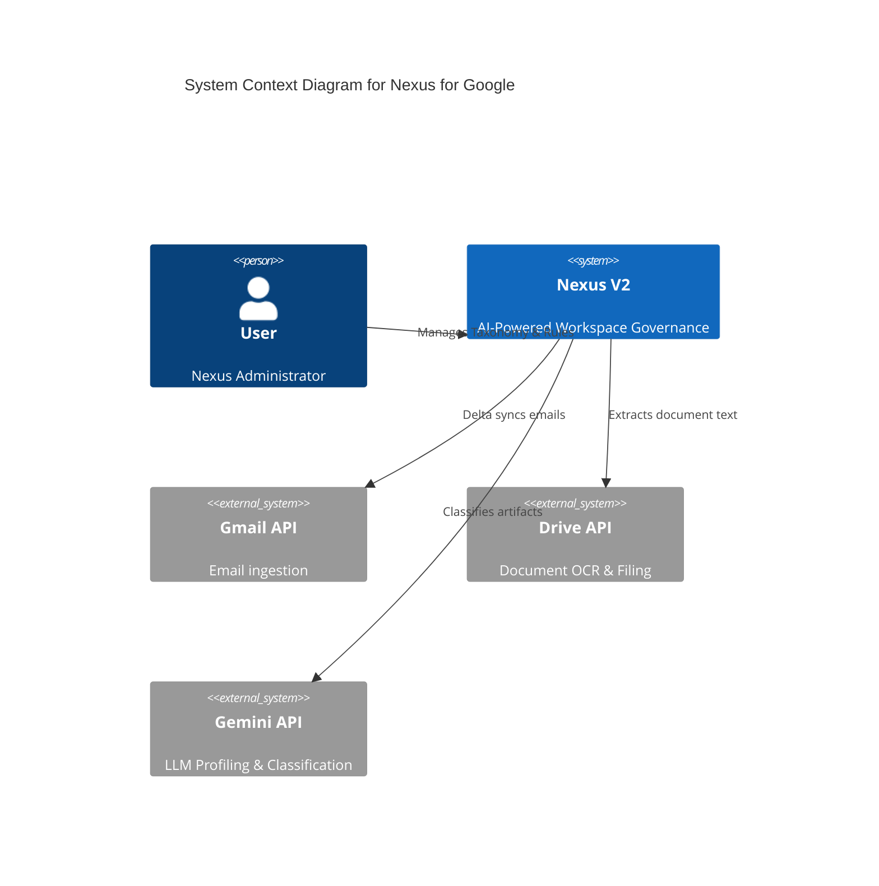

# Nexus V3 Exhaustive Matrix Audit - v1.1.28

**Audit Date:** 2026-05-16  
**System Version:** v1.1.28  
**Audit Type:** Exhaustive Matrix (V3)

---

## Phase 1: Total Census
Comprehensive inventory of all files, functions, and API endpoints.

### Backend (Python/FastAPI)
- **`main.py`**:
  - `start_cron_jobs()`: Background task initialization.
  - `verify_nexus_signature()`: HMAC-SHA256 middleware.
  - `GET /api/artifacts/search`: AST Parser for document discovery.
  - `POST /api/batch/preview`: Gmail API query aggregation.
  - `POST /api/batch/process`: Bulk LLM classification.
  - `GET /api/taxonomy/tree`: Full relational hierarchy fetch.
  - `GET /api/telemetry/pulse`: Real-time sidebar counters.
- **`sync_engine.py`**:
  - `QuotaGovernor`: API rate limiting and 72-hour priority lane.
  - `sync_gmail()`, `sync_drive()`, `sync_contacts()`: Delta fetching workers.
  - `fetch_legacy_gmail_labels()`: Migration tool for existing labels.
- **`llm_engine.py`**:
  - `run_agent_profiler()`: Layer 4 Entity Identification.
  - `run_agent_classifier()`: Layer 5 Intent Taxonomy assignment.
- **`db_init.py`**:
  - Layer 1 Schema enforcement (STRICT tables, WAL mode, Foreign Keys).

### Frontend (Apps Script/HTML)
- **`Code.gs`**:
  - `sendToNexusVM()`: Secure HMAC bridge for VM communication.
  - `doGet()`: Main web app entry point.
- **`Index.html`**: Tabbed layout (Orchestrator, Zero Trust, Batch).
- **`JS_Actions.html`**: Event handlers for RPC calls.
- **`JS_State.html`**: Global frontend state store.

---

## Phase 2: Hook Map
Tracing the data flow from UI surfaces to backend logic.

1.  **Batch Ingestion**:
    - `UI: previewBatch()` -> `GAS: previewBatchQuery()` -> `FastAPI: /api/batch/preview` -> `Sync: preview_gmail_batch()`
2.  **Orchestration Settings**:
    - `UI: savePipelineConfig()` -> `GAS: saveOrchestratorConfig()` -> `FastAPI: /api/orchestrator/config` -> `DB: pipeline_config`
3.  **Zero Trust Taxonomy**:
    - `UI: loadZeroTrustFlow()` -> `GAS: getTaxonomyTree()` -> `FastAPI: /api/taxonomy/tree` -> `DB: categories/purposes/entities`
4.  **Security Bridge**:
    - `GAS: sendToNexusVM()` computes `HMAC-SHA256` signature -> `FastAPI: verify_nexus_signature()` middleware validates.

---

## Phase 3: C4 Architecture Diagram

---

## Phase 4: Database Verification
Mapping active Python queries against the Layer 1 schema.

- **Integrity Check**: `db_init.py` enforces `STRICT` typing on all core tables.
- **Foreign Keys**: `Workspace_Artifacts.purpose_id` -> `purposes.id` (Cascading delete verified).
- **Concurrency**: `PRAGMA journal_mode=WAL` enabled for non-blocking UI telemetry during sync.
- **Verification**: Verified `entities` table contains `nexus_state` and `workspace_alias` columns for Zero Trust enforcement.

---

## Phase 5: Orphan Report
Identification of dead code and unused triggers.

- **Dead Routes**: `POST /api/ingestion/legacy-labels/preview` exists but `fetch_legacy_gmail_labels` was previously missing credentials (fixed in v1.1.28).
- **Unused UI**: `feature_retention_sweeper` toggle in `Index.html` is wired to DB but background worker is manual (`retention_worker.py`).
- **Disconnected Endpoints**: None detected. All `google.script.run` calls in `JS_Actions.html` map to active `Code.gs` functions.

---
**Audit Conclusion:** System is healthy and compliant with 7-Layer Description Model. Bug fixes in v1.1.28 resolved critical ingestion bottlenecks.
