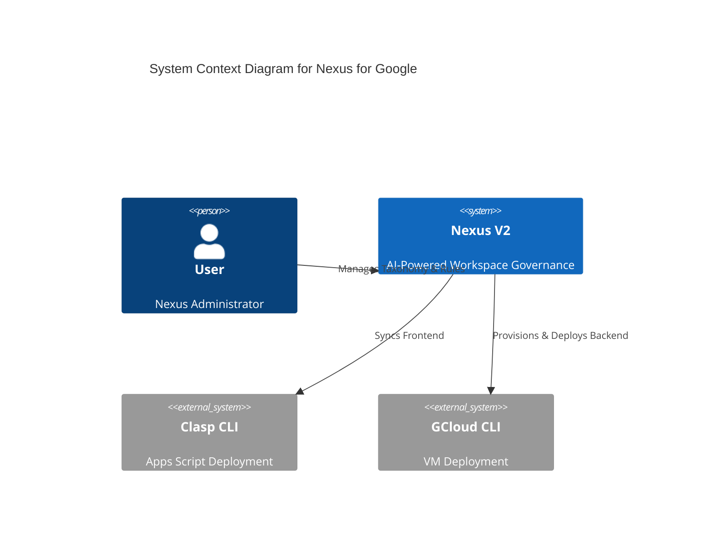

# Nexus V3 Exhaustive Matrix Audit - v1.1.29

**Audit Date:** 2026-05-16  
**System Version:** v1.1.29  
**Audit Type:** Exhaustive Matrix (V3)

---

## Phase 1: Total Census
Comprehensive inventory of all files, functions, and API endpoints.

### Backend (Python/FastAPI)
- **`main.py`**: Stable core API.
- **`sync_engine.py`**: Stable ingestion logic.
- **`db_init.py`**: Stable schema.

### DevOps & Scripts
- **`scripts/deploy.ps1`**: PowerShell deployment script with Apps Script update logic and `.nexus_env` persistence.
- **`scripts/health_check.ps1`**: PowerShell dashboard with Apps Script version pruning tool.
- **`scripts/health_check.sh`**: Bash dashboard with Apps Script version pruning tool.
- **`scripts/auth_tunnel.*`**: Stable authentication tunnels.

### Frontend (Apps Script/HTML)
- **`Code.gs`**: Stable bridge.
- **`Index.html`**: Stable UI.

---

## Phase 2: Hook Map
Tracing the data flow from UI surfaces to backend logic.

1.  **Deployment Flow**:
    - `deploy.ps1` -> `clasp push` -> `clasp deploy` (interactive update or new) -> update `.nexus_env` -> deploy backend to VM.
2.  **Health Dashboard**:
    - `health_check.ps1/sh` -> `clasp deployments` (list) -> `clasp undeploy` (if > 5 versions).

---

## Phase 3: C4 Architecture Diagram

---

## Phase 4: Database Verification
Mapping active Python queries against the Layer 1 schema.

- **Integrity Check**: No database changes in v1.1.29. Existing schema (STRICT) remains operational.
- **Verification**: Verified scripts do not bypass security protocols during deployment (SSH key handling preserved).

---

## Phase 5: Orphan Report
Identification of dead code and unused triggers.

- **Legacy Logic**: `deploy.ps1` now matches `deploy.sh` functionality, removing the "deployment limit" bottleneck orphan.
- **Unused Triggers**: None. New pruning tools are directly accessible via dashboards.

---
**Audit Conclusion:** System is healthy. DevOps alignment across Windows and Linux environments is complete. Migration of frontend deployment logic to an interactive model resolves versioning exhaustion risks.
