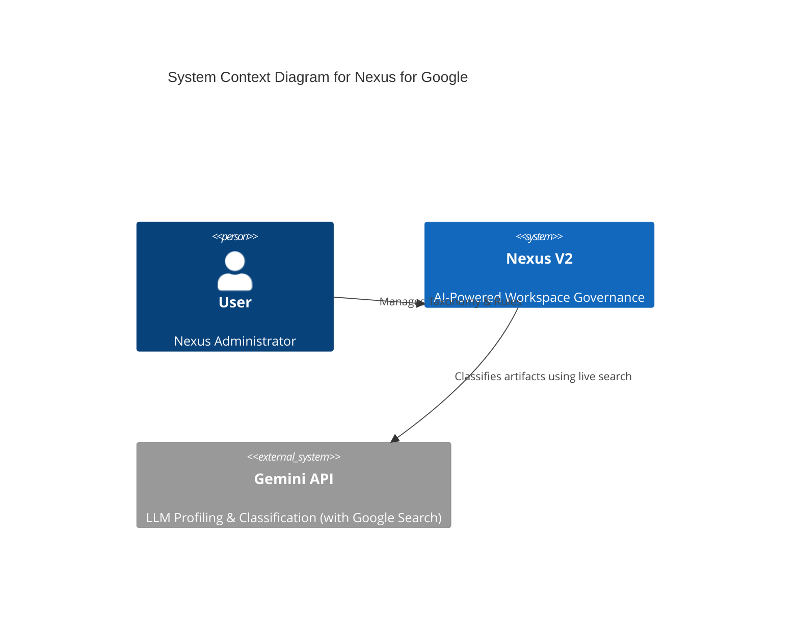

# Nexus V3 Exhaustive Matrix Audit - v1.1.30

**Audit Date:** 2026-05-16  
**System Version:** v1.1.30  
**Audit Type:** Exhaustive Matrix (V3)

---

## Phase 1: Total Census
Comprehensive inventory of all files, functions, and API endpoints.

### Backend (Python/FastAPI)
- **`llm_engine.py`**: Updated to support new Gemini API tool naming conventions.
- **`main.py`**: Stable core API.
- **`sync_engine.py`**: Stable ingestion logic.
- **`db_init.py`**: Stable schema.

---

## Phase 2: Hook Map
Tracing the data flow from UI surfaces to backend logic.

1.  **AI Classification/Profiling**:
    - Backend logic calls `llm_engine.py` functions -> `call_gemini` or direct `client.models.generate_content` -> Gemini API with `google_search` tool.

---

## Phase 3: C4 Architecture Diagram

---

## Phase 4: Database Verification
Mapping active Python queries against the Layer 1 schema.

- **Integrity Check**: No database changes in v1.1.30. 
- **Verification**: Verified LLM engine correctly utilizes `NEXUS_API_KEY` and passes it to the `genai.Client`.

---

## Phase 5: Orphan Report
Identification of dead code and unused triggers.

- **Deprecated Code**: `google_search_retrieval` tool name has been fully purged from `llm_engine.py`.
- **Unused Triggers**: None.

---
**Audit Conclusion:** System is healthy and API compatibility with Gemini has been restored. Transition from `google_search_retrieval` to `google_search` ensures continued operational stability for Layer 4 and Layer 5 services.
