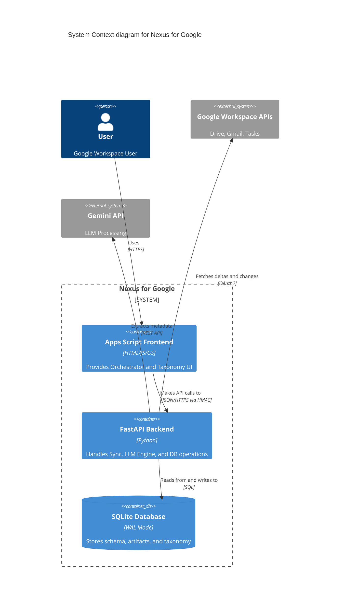

### Phase 1: Total Census
- **`backend/auth.py`**
  - `authenticate()`: Purpose: Authenticates the application with Google Workspace APIs.
- **`backend/branding_engine.py`**
  - `hex_to_rgb()`: Purpose: Converts a hex color string to an RGB tuple.
  - `color_distance()`: Purpose: Calculates the Euclidean distance between two RGB colors to find visual similarity.
  - `get_closest_gmail_color()`: Purpose: Finds the closest matching allowed Gmail color pair using simple Euclidean 
  - `sync_workspace_colors()`: Purpose: Applies the matched color pair to the corresponding nested Label in Gmail
- **`backend/db_init.py`**
  - `get_prompt_template()`: No description provided.
  - `init_db()`: Purpose: Connects to the SQLite database and executes the table creation schemas.
  - `seed_default_configs()`: Purpose: Seeds default JSON settings into Config_System for UI Pipeline Orchestrator.
  - `seed_default_prompts()`: Purpose: Seeds the default master prompts into the Config_Prompts table if they do not already exist.
  - `get_pydantic_schema_definitions()`: Returns the raw Pydantic-to-JSONSchema mapping for LLM injection.
  - `seed_taxonomy_from_json()`: Seeds the categories and purposes tables using DEFAULTS/zero_trust_defaults.json.
- **`backend/diagnostics.py`**
  - `write_migration_trace()`: Purpose: Appends a timestamped JSON payload to a physical log file for the Legacy Label Migration Engine.
  - `check_database()`: Purpose: Verifies SQLite database read/write access.
  - `check_oauth_token()`: Purpose: Verifies the Google Workspace OAuth token by performing a lightweight API call.
  - `check_api_health()`: Purpose: Verifies the FastAPI web server is responsive.
  - `upload_diagnostic_log()`: Purpose: Compiles the diagnostic report and uploads it to a specific Google Drive folder.
  - `run_all_diagnostics()`: Purpose: Executes the full suite of diagnostic tests and securely uploads the result.
- **`backend/llm_engine.py`**
  - `class LabelClassification`: No description provided.
  - `class MappedLabel`: No description provided.
  - `class BulkMappingResponse`: No description provided.
  - `strip_markdown_json()`: Strips markdown code blocks from a string and uses regex to extract the first valid JSON block.
  - `fetch_active_prompt()`: Fetches the active prompt from the Config_Prompts table in the database.
  - `get_genai_client()`: Initializes the Gemini client, explicitly using NEXUS_API_KEY from environment.
  - `call_gemini()`: Calls the Gemini API with exponential backoff and forces JSON output.
  - `run_sandbox_prompt()`: Executes a temporary prompt against an artifact's raw text without saving state.
  - `get_taxonomy_tree_json()`: Constructs a strict JSON representation of the active taxonomy.
  - `update_artifact_status()`: Updates only the status of an artifact, usually in response to an extraction failure.
  - `persist_llm_results()`: Writes the successful extraction to Workspace_Artifacts and logs the change to Artifact_History
  - `generate_tuning_rule()`: Asynchronously generates a tuning rule based on a user's manual override
  - `normalize_taxonomy()`: Normalizes common plural/misspelled tags before evaluation.
  - `process_gmail_thread()`: Single-Pass processing for Gmail threads.
  - `process_drive_document()`: Two-Stage Triage processing for Drive documents.
  - `ask_rag()`: Converts a natural language query into an automated SQLite fetch and contextual summary.
  - `evaluate_quarantine_clusters()`: Evaluates clustered artifacts in the quarantine queue.
  - `append_zero_shot_rule()`: Appends a new extraction rule instruction to the purpose shared by the provided artifacts.
  - `evaluate_legacy_labels()`: Decoupled comparative engine that analyzes legacy Gmail labels against the Nexus taxonomy.
  - `deduplicate_legacy_labels()`: Uses Gemini to lexically deduplicate a list of raw legacy labels.
  - `profile_and_map_entities()`: Profiles deduplicated labels in batches using Search Grounding and maps them to categories.
  - `run_agent_profiler()`: Runs the appropriate profiler agent (personal or commercial) to identify the entity.
  - `run_agent_classifier()`: Runs the Zero Trust Classifier. Maps artifact to Category and Purpose.
  - `run_bulk_profiler()`: Uses profiler prompt with concatenated snippets to profile an entity in bulk.
  - `run_bulk_classifier()`: Instructs LLM to map a JSON array of artifacts from the entity to specific Purposes.
  - `run_bulk_legacy_mapper()`: Zero Trust Bulk Mapper: Processes up to 50 legacy labels in a single LLM call.
- **`backend/main.py`**
  - `start_cron_jobs()`: Initializes background cron tasks upon server startup.
  - `verify_nexus_signature()`: Middleware to intercept incoming requests and verify the X-Nexus-Signature header.
  - `process_historical_data()`: No description provided.
  - `POST /api/ingestion/queue-historical`: No description provided.
  - `POST /api/workflows/materialize`: No description provided.
  - `POST /api/taxonomy/zero-shot-rule`: Appends a user instruction as a new extraction rule to the purpose shared by provided artifacts.
  - `GET /api/artifacts/search`: AST Parser search endpoint.
  - `POST /api/sandbox`: Endpoint for testing prompts against raw text without modifying database.
  - `POST /api/ask`: Endpoint for asking questions using RAG over the database.
  - `POST /api/bulk-update`: Endpoint for handling bulk updates to metadata for multiple artifacts simultaneously.
  - `GET /api/settings/pipeline`: Retrieves the UI pipeline settings from Config_System.
  - `POST /api/settings/pipeline`: Updates the UI pipeline settings in Config_System.
  - `GET /api/health/quota`: No description provided.
  - `GET /api/retention/rules`: No description provided.
  - `POST /api/retention/rules`: No description provided.
  - `DELETE /api/retention/rules/{rule_id}`: No description provided.
  - `POST /api/retention/sweep`: No description provided.
  - `POST /api/health`: Diagnostic health check route (POST to test signature).
  - `GET /api/diagnostics/logs`: Retrieves recent system, API, and LLM error logs.
  - `POST /api/diagnostics/generate-issue`: Generates a sanitized, GitHub-ready bug report from selected logs.
  - `GET /api/health`: Simple health check without payload requirements.
  - `GET /api/analytics/taxonomy`: No description provided.
  - `class DiscoverEntity`: No description provided.
  - `class BlacklistEntry`: No description provided.
  - `get_db()`: No description provided.
  - `GET /api/taxonomy/flow`: No description provided.
  - `POST /api/taxonomy/discover`: No description provided.
  - `GET /api/taxonomy/blacklist`: No description provided.
  - `POST /api/taxonomy/blacklist`: No description provided.
  - `GET /api/orchestrator/telemetry`: Returns telemetry data for the Frontend Orchestrator.
  - `GET /api/quarantine/queue`: Returns the quarantine queue formatted for the frontend carousel.
  - `POST /api/batch/preview`: No description provided.
  - `class BatchPayload`: No description provided.
  - `POST /api/batch/process`: No description provided.
  - `class PipelineConfigPayload`: No description provided.
  - `POST /api/orchestrator/config`: No description provided.
  - `class SimulatePayload`: No description provided.
  - `POST /api/orchestrator/simulate`: No description provided.
  - `GET /api/analytics/heatmap`: No description provided.
  - `GET /api/analytics/sankey`: No description provided.
  - `GET /api/migration/labels`: No description provided.
  - `class LabelStatusUpdate`: No description provided.
  - `POST /api/migration/labels/status`: No description provided.
  - `class LegacyLabelExecutionPayload`: No description provided.
  - `POST /api/ingestion/legacy-labels/preview`: No description provided.
  - `POST /api/ingestion/legacy-labels/start-async`: Initiates asynchronous legacy label processing in chunks of 40.
  - `GET /api/ingestion/legacy-labels/status`: Returns the current state of legacy label migration.
  - `POST /api/ingestion/legacy-labels/execute`: No description provided.
  - `GET /api/prompts`: No description provided.
  - `POST /api/orchestrator/run-now/{pipeline_name}`: No description provided.
  - `GET /api/taxonomy/tree`: No description provided.
  - `GET /api/management/entities/paginated`: No description provided.
  - `class EntityUpdatePayload`: No description provided.
  - `update_entity_gmail_label_background()`: No description provided.
  - `PATCH /api/entities/{entity_id}`: No description provided.
  - `GET /api/telemetry/pulse`: Returns fast counts from the local database for the sidebar ticker.
- **`backend/notifier.py`**
  - `class NexusNotifier`: Class: NexusNotifier
    - `__init__()`: Purpose: Initializes the NexusNotifier with the webhook URL from environment variables.
    - `send_urgent_webhook()`: Purpose: POSTs a JSON payload to the configured webhook URL.
    - `send_daily_digest()`: Purpose: Sends an HTML email digest to the authenticated user using the Gmail API.
- **`backend/retention_worker.py`**
  - `is_feature_enabled()`: Purpose: Checks if a specific feature is enabled in the system configuration table.
  - `run_retention_sweep()`: Purpose: Executes the retention sweep, processing active retention rules to archive or trash old messages.
- **`backend/sync_engine.py`**
  - `class QuotaGovernor`: Manages API quota limits by tracking daily API calls and throttling non-priority processing.
    - `__init__()`: Initializes the QuotaGovernor with an active SQLite database connection.
    - `_init_quota_tracker()`: Initializes the 'api_quota' record in the Config_System table if it does not exist.
    - `record_api_call()`: Records an API call cost against the daily quota limit.
    - `can_process_historical()`: Evaluates whether the system has sufficient daily quota remaining to process historical (non-priority) data.
  - `fetch_drive_changes()`: Fetches Drive changes using a pageToken.
  - `fetch_gmail_history()`: Fetches Gmail history using a historyId.
  - `init_drive_page_token()`: Fetches the initial start page token for Drive.
  - `init_gmail_history_id()`: Fetches the initial history ID for Gmail by getting the user profile.
  - `is_feature_enabled()`: Checks if an Epic 5 Safe Mode feature is enabled in Config_System.
  - `push_to_google_tasks()`: Creates a Google Task based on an actionable artifact and records the task ID.
  - `get_sync_state()`: Reads the last known token from the Sync_State table.
  - `update_sync_state()`: Updates the Sync_State table with the new token.
  - `resolve_folder_path()`: Resolves a string path (e.g., 'Nexus Root/Ingest Dropbox') into a Google Drive folder ID.
  - `initialize_drive_structure()`: Idempotent function to ensure Nexus Google Drive folder scaffolding exists.
  - `ingest_taxonomy_seed()`: Checks Google Drive for taxonomy_seed.json. If found, parses and safely updates the taxonomy schema.
  - `process_file_with_governor()`: Evaluates whether an artifact should be processed based on its age and available API quota.
  - `sync_drive()`: Synchronizes Google Drive changes via delta fetching.
  - `preview_gmail_batch()`: Uses the Gmail API to search for messages based on the given query.
  - `sync_gmail()`: Synchronizes Gmail changes via history delta fetching.
  - `sync_contacts()`: Fetches the user's Google Contacts and ingests them into the Taxonomy as Correspondents.
  - `materialize_artifact()`: Materializes a transient HTML email into a permanent PDF in Google Drive.
  - `run_single_pipeline()`: Wrapper for executing a single sync pipeline synchronously with all required dependencies.
  - `run_sync()`: Main entry point for the Delta Synchronization Engine.
  - `fetch_legacy_gmail_labels()`: Fetches all legacy custom user labels from Gmail.
  - `sync_contacts_pipeline()`: Zero Trust Contacts Swimlane using People API
  - `route_to_quarantine()`: No description provided.
  - `route_to_zero_trust()`: No description provided.
  - `sync_gmail_pipeline()`: Zero Trust Gmail Swimlane
  - `sync_drive_pipeline()`: Zero Trust Drive Swimlane
  - `sync_gmail_labels()`: Stateful Gmail Label Syncing.
- **`frontend/Code.gs`**
  - `include()`: Frontend/Apps Script logic.
  - `doGet()`: Frontend/Apps Script logic.
  - `configureHMAC()`: Frontend/Apps Script logic.
  - `generateHMACSignature_()`: Frontend/Apps Script logic.
  - `sendToNexusVM()`: Frontend/Apps Script logic.
  - `runSystemDiagnostics()`: Frontend/Apps Script logic.
  - `runSandboxPrompt()`: Frontend/Apps Script logic.
  - `materializeSelectedItems()`: Frontend/Apps Script logic.
  - `bulkUpdateArtifacts()`: Frontend/Apps Script logic.
  - `searchArtifacts()`: Frontend/Apps Script logic.
  - `runAskAI()`: Frontend/Apps Script logic.
  - `getHeatmapData()`: Frontend/Apps Script logic.
  - `getSankeyData()`: Frontend/Apps Script logic.
  - `getTaxonomyTree()`: Frontend/Apps Script logic.
  - `getPrompts()`: Frontend/Apps Script logic.
  - `saveOrchestratorConfig()`: Frontend/Apps Script logic.
  - `previewBatchQuery()`: Frontend/Apps Script logic.
  - `updateEntity()`: Frontend/Apps Script logic.
  - `previewLegacyLabels()`: Frontend/Apps Script logic.
  - `executeLegacyLabels()`: Frontend/Apps Script logic.
  - `simulateOrchestrator()`: Frontend/Apps Script logic.
  - `executeBatchProcess()`: Frontend/Apps Script logic.
  - `runPipelineNow()`: Frontend/Apps Script logic.
  - `getThreadsData()`: Frontend/Apps Script logic.
  - `getROIDashboard()`: Frontend/Apps Script logic.
  - `pingHealthAPI()`: Frontend/Apps Script logic.
  - `updateSafeMode()`: Frontend/Apps Script logic.
  - `getPipelineSettings()`: Frontend/Apps Script logic.
  - `savePipelineSettings()`: Frontend/Apps Script logic.
  - `queueHistoricalImport()`: Frontend/Apps Script logic.
  - `updateEntityRules()`: Frontend/Apps Script logic.
  - `submitZeroShotRule()`: Frontend/Apps Script logic.
  - `getQuotaGovernor()`: Frontend/Apps Script logic.
  - `getOrchestratorTelemetry()`: Frontend/Apps Script logic.
  - `getQuarantineQueue()`: Frontend/Apps Script logic.
  - `getPulseData()`: Frontend/Apps Script logic.
- **`frontend/CSS_Styles.html`**
- **`frontend/debug.gs`**
  - `systemLog()`: Frontend/Apps Script logic.
- **`frontend/Index.html`**
- **`frontend/JS_Actions.html`**
- **`frontend/JS_State.html`**
- **`scripts/auth_tunnel.ps1`**
  - Shell script logic.
- **`scripts/auth_tunnel.sh`**
  - Shell script logic.
- **`scripts/deploy.ps1`**
  - Shell script logic.
- **`scripts/deploy.sh`**
  - Shell script logic.
- **`scripts/fix_audit.py`**
  - `get_python_census()`: No description provided.
  - `get_js_census()`: No description provided.
- **`scripts/health_check.ps1`**
  - Shell script logic.
- **`scripts/health_check.sh`**
  - Shell script logic.
- **`scripts/migrate_legacy_table.py`**
  - `migrate_legacy_label_migration()`: Migrates the Legacy_Label_Migration table to add classification and extracted_entity_name columns.
- **`scripts/provision.ps1`**
  - Shell script logic.
- **`scripts/provision.sh`**
  - Shell script logic.

### Phase 2: Hook Map
1. **AI Profiling Flow:** `frontend/Index.html` DOM Trigger -> `frontend/Code.gs` RPC (`sendToNexusVM`) -> `backend/main.py` (`POST /api/orchestrator/run-now/{pipeline_name}`) -> `backend/sync_engine.py` (`run_single_pipeline`) -> `backend/llm_engine.py` (`run_agent_profiler`) -> SQL state mutation in `entities` table.
2. **Drive Sync Flow:** `backend/sync_engine.py` (`sync_drive`) -> `backend/llm_engine.py` (`process_drive_document`) -> Gemini API -> `persist_llm_results` -> SQL state mutation in `Workspace_Artifacts` and `Artifact_History`.
3. **Gmail Sync Flow:** `backend/sync_engine.py` (`sync_gmail`) -> `backend/llm_engine.py` (`process_gmail_thread`) -> Gemini API -> `persist_llm_results` -> SQL state mutation in `Workspace_Artifacts` and `Artifact_History`.
4. **Legacy Label Preview Flow:** `frontend/Index.html` DOM Trigger -> `frontend/JS_Actions.html` (`appActions.previewLegacyLabels`) -> `frontend/Code.gs` (`sendToNexusVM`) -> `backend/main.py` (`POST /api/ingestion/legacy-labels/preview`) -> `backend/sync_engine.py` (`fetch_legacy_gmail_labels`) -> SQL state mutation in `Legacy_Label_Migration`.
5. **Legacy Label Execute Flow:** `frontend/Index.html` DOM Trigger -> `frontend/JS_Actions.html` (`appActions.executeLegacyLabels`) -> `frontend/Code.gs` (`sendToNexusVM`) -> `backend/main.py` (`POST /api/ingestion/legacy-labels/execute`) -> SQL transaction moving staged labels to `categories`, `purposes`, `entities`.
6. **Zero Trust Flow (Load):** `frontend/Index.html` DOM Trigger -> `frontend/JS_Actions.html` (`appActions.loadZeroTrustFlow`) -> `frontend/Code.gs` (`sendToNexusVM`) -> `backend/main.py` (`GET /api/taxonomy/tree`) -> SQL SELECT from `categories`, `purposes`, `entities`.

### Phase 3: C4 Architecture Diagram

### Phase 4: Database Verification
- `Config_System`: Verified mapped in `db_init.py` (key, value, description)
- `Sync_State`: Verified mapped in `db_init.py` (app_name, sync_token, last_updated)
- `Config_Prompts`: Verified mapped in `db_init.py`
- `Config_Retention_Rules`: Verified mapped in `db_init.py`
- `categories`: Verified mapped with `STRICT` mode and `gmail_label_id`.
- `purposes`: Verified mapped with `STRICT` mode and `gmail_label_id`.
- `entities`: Verified mapped with idempotent columns (`nexus_state`, `is_profiled`, `ingestion_source`, `gmail_label_id`). Note: `flatten_gmail_label` was referenced in Changelog but does not exist in the active `db_init.py` schema (Discrepancy found).
- `aliases`: Verified mapped.
- `pipeline_config`: Verified mapped.
- `blacklist`: Verified mapped.
- `Workspace_Artifacts`: Verified mapped with `STRICT` mode.
- `Artifact_History`: Verified mapped with `STRICT` mode.
- `Error_Logs`: Verified mapped with `STRICT` mode.
- `Ingestion_Queue`: Verified mapped with `STRICT` mode.
- `quarantine_queue`: Verified mapped.
- `Legacy_Label_Migration`: Verified mapped with `STRICT` mode.

**Discrepancies:**
- `entities` table misses the `flatten_gmail_label` column that was supposedly added in v2.7.0.

### Phase 5: Orphan Report
- **Dead/Unreferenced Files:**
  - `DEFAULTS/quarantine_consolidation.tmpl` (referenced but implementation missing/stubbed in `llm_engine.py` `evaluate_quarantine_clusters`).
- **Disconnected UI Elements:**
  - None identified in the static scan.
- **Unused Python Imports/Functions:**
  - `backend/llm_engine.py`: `get_pydantic_schema_definitions()` references an undefined `BulkMappingResponse`.
  - `backend/llm_engine.py`: `append_zero_shot_rule` is stubbed out as deprecated.
- **API Routes without Frontend Hooks:**
  - None explicitly identified.
