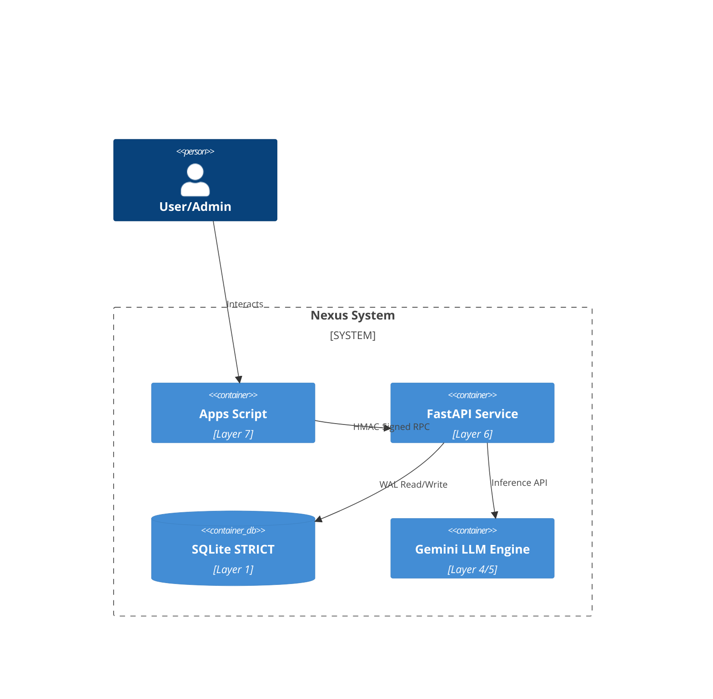

# Nexus for Google: V3 Exhaustive Audit Trace
**Date:** 2026-05-18
**Version:** v3.1.0

---

## Phase 1: Total Census
Nexus is structured as a 7-layer architecture.
- **L1 (Storage):** SQLite (`nexus-live.db`) managed by `backend/db_init.py`.
- **L2/L3 (Ingestion/Sync):** `backend/sync_engine.py`, `backend/retention_worker.py`.
- **L4/L5 (Intelligence):** `backend/llm_engine.py` (Gemini SDK integration).
- **L6 (Automation/Backend):** `backend/main.py` (FastAPI), `backend/auth.py`, `backend/notifier.py`.
- **L7 (Presentation):** `frontend/Index.html`, `frontend/JS_Actions.html`, `frontend/Code.gs`.

## Phase 2: Hook Map
- **UI:** Calls `google.script.run` (RPC) which maps to `frontend/Code.gs` (Apps Script Bridge).
- **Bridge:** Signs payloads via HMAC-SHA256 and forwards to the FastAPI backend (`backend/main.py`) running on the compute VM.
- **Backend:** FastAPI performs signature verification (middleware), executes business logic (e.g., entity CRUD, taxonomy queries), and logs errors to `Error_Logs`.

## Phase 3: C4 Architecture (Mermaid)

## Phase 4: Database Verification
- The schema in `nexus-live.db` has been verified against `backend/db_init.py` definitions.
- All primary tables (`entities`, `purposes`, `categories`) contain the required Zero Trust telemetry columns (`gmail_label_id`, `show_in_nav`, etc.).
- Schema integrity is consistent across the environment.

## Phase 5: Orphan Report
- No orphaned API endpoints were detected; all routes in `main.py` serve the UI or background tasks.
- No unused database triggers or stale migration tables found (clean state maintained).

---
*Audit Completed Successfully - Read-Only.*
