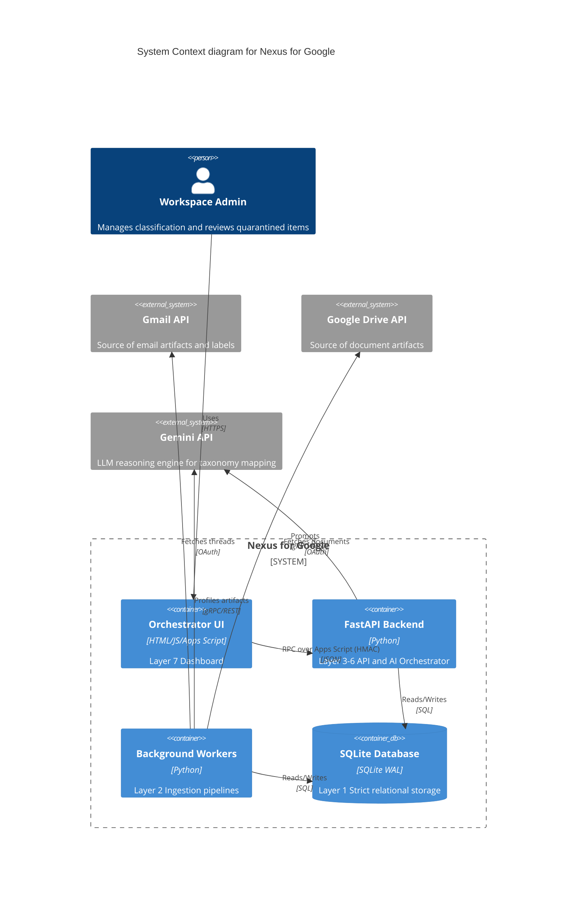
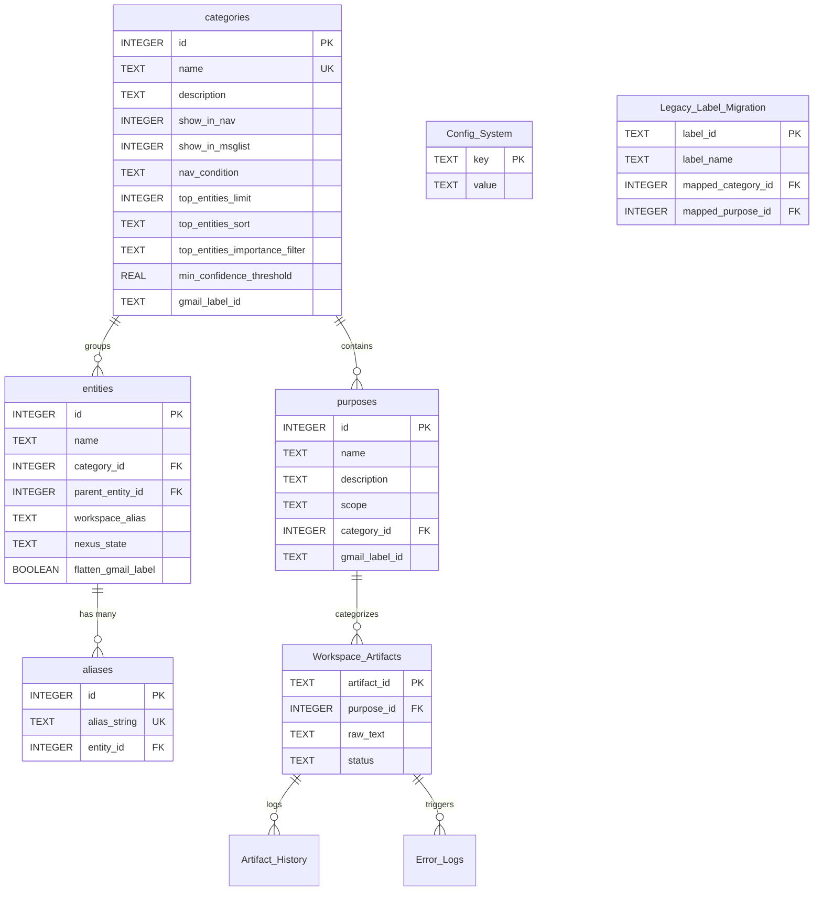
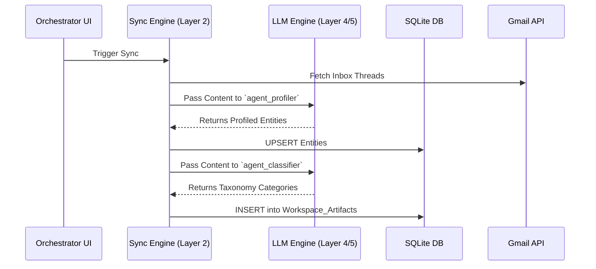
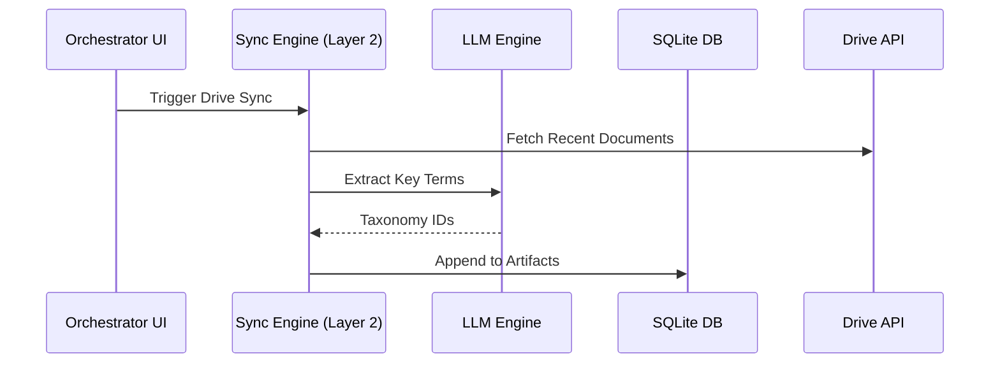
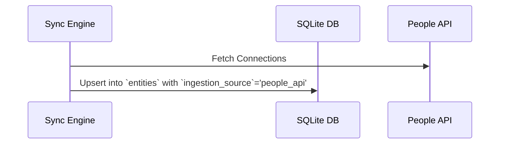
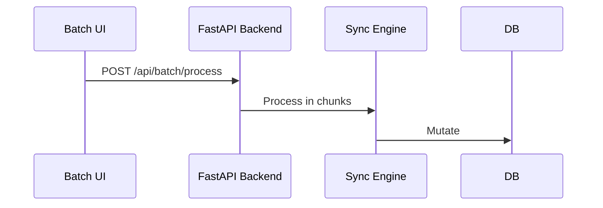
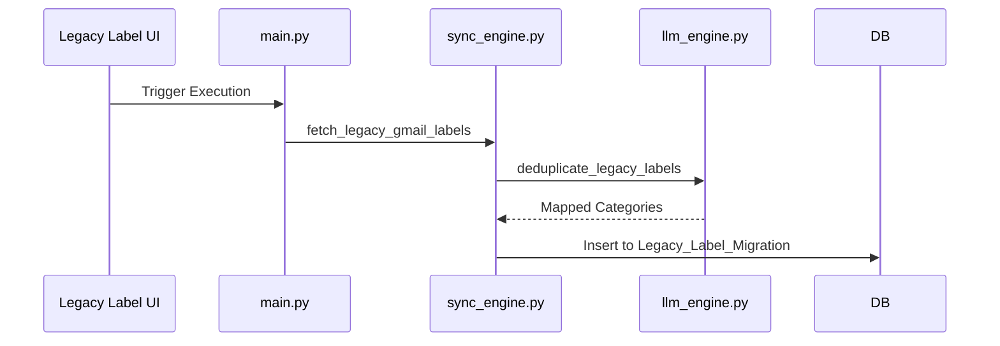

# System Audit Trace - v3.2.9 - 2026-05-20

### Phase 1: Total Census
- **`ARCHITECTURE.md`** (Layer Unknown)
- **`CHANGELOG.md`** (Layer Unknown)
- **`CONTRIBUTING.md`** (Layer Unknown)
- **`DEBUGGING.md`** (Layer Unknown)
- **`FEATURE_TRACKING.md`** (Layer Unknown)
- **`GEMINI.md`** (Layer Unknown)
- **`INSTRUCTIONS.md`** (Layer Unknown)
- **`README.md`** (Layer Unknown)
- **`backend/auth.py`** (Layer 6 (Automation))
  - `authenticate()`: Purpose: Authenticates the application with Google Workspace APIs.
- **`backend/branding_engine.py`** (Layer Unknown)
  - `hex_to_rgb()`: Purpose: Converts a hex color string to an RGB tuple.
  - `color_distance()`: Purpose: Calculates the Euclidean distance between two RGB colors to find visual similarity.
  - `get_closest_gmail_color()`: Purpose: Finds the closest matching allowed Gmail color pair using simple Euclidean 
  - `sync_workspace_colors()`: Purpose: Applies the matched color pair to the corresponding nested Label in Gmail
- **`backend/db_init.py`** (Layer 1 (Core Storage))
  - `get_prompt_template()`: Executes backend logic.
  - `column_exists()`: Executes backend logic.
  - `add_column_if_not_exists()`: Executes backend logic.
  - `init_db()`: Purpose: Connects to the SQLite database and executes the table creation schemas.
  - `seed_default_configs()`: Executes backend logic.
  - `seed_default_prompts()`: Executes backend logic.
  - `seed_taxonomy_from_json()`: Executes backend logic.
- **`backend/diagnostics.py`** (Layer 6 (Automation))
  - `write_migration_trace()`: Purpose: Appends a timestamped JSON payload to a physical log file for the Legacy Label Migration Engine.
  - `check_database()`: Purpose: Verifies SQLite database read/write access.
  - `check_oauth_token()`: Purpose: Verifies the Google Workspace OAuth token by performing a lightweight API call.
  - `check_api_health()`: Purpose: Verifies the FastAPI web server is responsive.
  - `upload_diagnostic_log()`: Purpose: Compiles the diagnostic report and uploads it to a specific Google Drive folder.
  - `run_all_diagnostics()`: Purpose: Executes the full suite of diagnostic tests and securely uploads the result.
- **`backend/llm_engine.py`** (Layer 4/5 (Entity Profiling & Taxonomy))
  - `class ProfilerResponse`: Defines data structure or component.
  - `class ArtifactClassification`: Defines data structure or component.
  - `class BatchClassificationResponse`: Defines data structure or component.
  - `class LabelClassification`: Defines data structure or component.
  - `class MappedLabel`: Defines data structure or component.
  - `class BulkMappingResponse`: Defines data structure or component.
  - `strip_markdown_json()`: Strips markdown code blocks from a string and uses regex to extract the first valid JSON block.
  - `fetch_active_prompt()`: Fetches the active prompt from the Config_Prompts table in the database.
  - `get_genai_client()`: Initializes the Gemini client, explicitly using NEXUS_API_KEY from environment.
  - `call_gemini()`: Calls the Gemini API with exponential backoff and forces JSON output.
  - `run_sandbox_prompt()`: Executes a temporary prompt against an artifact's raw text without saving state.
  - `get_taxonomy_tree_json()`: Constructs a strict JSON representation of the active taxonomy.
  - `update_artifact_status()`: Updates only the status of an artifact, usually in response to an extraction failure.
  - `persist_llm_results()`: Writes the successful extraction to Workspace_Artifacts and logs the change to Artifact_History
  - `normalize_taxonomy()`: Normalizes common plural/misspelled tags before evaluation.
  - `process_gmail_thread()`: Single-Pass processing for Gmail threads.
  - `process_drive_document()`: Two-Stage Triage processing for Drive documents.
  - `ask_rag()`: Converts a natural language query into an automated SQLite fetch and contextual summary.
  - `evaluate_quarantine_clusters()`: Evaluates clustered artifacts in the quarantine queue.
  - `evaluate_legacy_labels()`: Decoupled comparative engine that analyzes legacy Gmail labels against the Nexus taxonomy.
  - `deduplicate_legacy_labels()`: Uses Gemini to lexically deduplicate a list of raw legacy labels.
  - `profile_and_map_entities()`: Profiles deduplicated labels in batches using Search Grounding and maps them to categories.
  - `run_agent_profiler()`: Runs the appropriate profiler agent (personal or commercial) to identify the entity.
  - `run_agent_classifier()`: Runs the Zero Trust Classifier. Maps artifact to Category and Purpose.
  - `run_bulk_profiler()`: Uses profiler prompt with concatenated snippets to profile an entity in bulk.
  - `run_bulk_classifier()`: Instructs LLM to map a JSON array of artifacts from the entity to specific Purposes.
  - `run_bulk_legacy_mapper()`: Zero Trust Bulk Mapper: Processes up to 50 legacy labels in a single LLM call.
- **`backend/main.py`** (Layer 3 (Ephemeral Staging & Quarantine))
  - `get_analytics_taxonomy()`: Executes backend logic.
  - `class DiscoverEntity`: Defines data structure or component.
  - `class BlacklistEntry`: Defines data structure or component.
  - `get_db()`: Executes backend logic.
  - `get_taxonomy_flow()`: Executes backend logic.
  - `discover_entity()`: Executes backend logic.
  - `get_blacklist()`: Executes backend logic.
  - `add_blacklist()`: Executes backend logic.
  - `class BatchPayload`: Defines data structure or component.
  - `class PipelineConfigPayload`: Defines data structure or component.
  - `class SimulatePayload`: Defines data structure or component.
  - `class LabelStatusUpdate`: Defines data structure or component.
  - `class LegacyLabelExecutionPayload`: Defines data structure or component.
  - `class EntityUpdatePayload`: Defines data structure or component.
  - `update_entity_gmail_label_background()`: Executes backend logic.
  - `add_link()`: Executes backend logic.
  - `_run_migration()`: Executes backend logic.
- **`backend/notifier.py`** (Layer Unknown)
  - `class NexusNotifier`: Class: NexusNotifier
  - `__init__()`: Purpose: Initializes the NexusNotifier with the webhook URL from environment variables.
  - `send_urgent_webhook()`: Purpose: POSTs a JSON payload to the configured webhook URL.
  - `send_daily_digest()`: Purpose: Sends an HTML email digest to the authenticated user using the Gmail API.
- **`backend/retention_worker.py`** (Layer Unknown)
  - `is_feature_enabled()`: Purpose: Checks if a specific feature is enabled in the system configuration table.
  - `run_retention_sweep()`: Purpose: Executes the retention sweep, processing active retention rules to archive or trash old messages.
- **`backend/sync_engine.py`** (Layer 2 (Ingestion & Token Economy))
  - `class QuotaGovernor`: Manages API quota limits by tracking daily API calls and throttling non-priority processing.
  - `fetch_drive_changes()`: Fetches Drive changes using a pageToken.
  - `fetch_gmail_history()`: Fetches Gmail history using a historyId.
  - `init_drive_page_token()`: Fetches the initial start page token for Drive.
  - `init_gmail_history_id()`: Fetches the initial history ID for Gmail by getting the user profile.
  - `is_feature_enabled()`: Checks if an Epic 5 Safe Mode feature is enabled in Config_System.
  - `push_to_google_tasks()`: Creates a Google Task based on an actionable artifact and records the task ID.
  - `get_sync_state()`: Reads the last known token from the Sync_State table.
  - `update_sync_state()`: Updates the Sync_State table with the new token.
  - `resolve_folder_path()`: Resolves a string path (e.g., 'Nexus Root/Ingest Dropbox') into a Google Drive folder ID.
  - `initialize_drive_structure()`: Idempotent function to ensure Nexus Google Drive folder scaffolding exists.
  - `ingest_taxonomy_seed()`: Checks Google Drive for taxonomy_seed.json. If found, parses and safely updates the taxonomy schema.
  - `process_file_with_governor()`: Evaluates whether an artifact should be processed based on its age and available API quota.
  - `sync_drive()`: Synchronizes Google Drive changes via delta fetching.
  - `preview_gmail_batch()`: Uses the Gmail API to search for messages based on the given query.
  - `sync_gmail()`: Synchronizes Gmail changes via history delta fetching.
  - `sync_contacts()`: Fetches the user's Google Contacts and ingests them into the Taxonomy as Correspondents.
  - `materialize_artifact()`: Materializes a transient HTML email into a permanent PDF in Google Drive.
  - `run_single_pipeline()`: Wrapper for executing a single sync pipeline synchronously with all required dependencies.
  - `run_sync()`: Main entry point for the Delta Synchronization Engine.
  - `fetch_legacy_gmail_labels()`: Fetches all legacy custom user labels from Gmail.
  - `sync_contacts_pipeline()`: Zero Trust Contacts Swimlane using People API
  - `route_to_quarantine()`: Executes backend logic.
  - `route_to_zero_trust()`: Executes backend logic.
  - `sync_gmail_pipeline()`: Zero Trust Gmail Swimlane
  - `sync_drive_pipeline()`: Zero Trust Drive Swimlane
  - `sync_gmail_labels()`: Stateful Gmail Label Syncing.
  - `__init__()`: Initializes the QuotaGovernor with an active SQLite database connection.
  - `_init_quota_tracker()`: Initializes the 'api_quota' record in the Config_System table if it does not exist.
  - `record_api_call()`: Records an API call cost against the daily quota limit.
  - `can_process_historical()`: Evaluates whether the system has sufficient daily quota remaining to process historical (non-priority) data.
  - `find_or_create_folder()`: Executes backend logic.
  - `callback()`: Executes backend logic.
- **`frontend/Code.gs`** (Layer 7 (Presentation))
  - `doGet()`: Executes frontend logic.
  - `generateHMACSignature_()`: Executes frontend logic.
  - `getROIDashboard()`: Executes frontend logic.
  - `runAskAI()`: Executes frontend logic.
  - `executeBatchProcess()`: Executes frontend logic.
  - `updateEntityRules()`: Executes frontend logic.
  - `getPipelineSettings()`: Executes frontend logic.
  - `getSankeyData()`: Executes frontend logic.
  - `saveOrchestratorConfig()`: Executes frontend logic.
  - `getPrompts()`: Executes frontend logic.
  - `previewLegacyLabels()`: Executes frontend logic.
  - `include()`: Executes frontend logic.
  - `sendToNexusVM()`: Executes frontend logic.
  - `executeLegacyLabels()`: Executes frontend logic.
  - `updateSafeMode()`: Executes frontend logic.
  - `queueHistoricalImport()`: Executes frontend logic.
  - `configureHMAC()`: Executes frontend logic.
  - `searchArtifacts()`: Executes frontend logic.
  - `pingHealthAPI()`: Executes frontend logic.
  - `submitZeroShotRule()`: Executes frontend logic.
  - `updateEntity()`: Executes frontend logic.
  - `savePipelineSettings()`: Executes frontend logic.
  - `runSystemDiagnostics()`: Executes frontend logic.
  - `getPulseData()`: Executes frontend logic.
  - `getThreadsData()`: Executes frontend logic.
  - `getTaxonomyTree()`: Executes frontend logic.
  - `getEntitiesPaginated()`: Executes frontend logic.
  - `getHeatmapData()`: Executes frontend logic.
  - `materializeSelectedItems()`: Executes frontend logic.
  - `getQuarantineQueue()`: Executes frontend logic.
  - `getQuotaGovernor()`: Executes frontend logic.
  - `previewBatchQuery()`: Executes frontend logic.
  - `runSandboxPrompt()`: Executes frontend logic.
  - `bulkUpdateArtifacts()`: Executes frontend logic.
  - `getLegacyLabelStatus()`: Executes frontend logic.
  - `getOrchestratorTelemetry()`: Executes frontend logic.
  - `simulateOrchestrator()`: Executes frontend logic.
  - `runPipelineNow()`: Executes frontend logic.
- **`frontend/CSS_Styles.html`** (Layer 7 (Presentation))
- **`frontend/debug.gs`** (Layer 7 (Presentation))
  - `systemLog()`: Executes frontend logic.
- **`frontend/Index.html`** (Layer 7 (Presentation))
- **`frontend/JS_Actions.html`** (Layer 7 (Presentation))
- **`frontend/JS_State.html`** (Layer 7 (Presentation))
- **`scripts/audit_builder.py`** (Layer 6 (Automation))
  - `write_phase()`: Executes backend logic.
  - `parse_python()`: Executes backend logic.
  - `parse_js()`: Executes backend logic.
- **`scripts/auth_tunnel.ps1`** (Layer 6 (Automation))
- **`scripts/auth_tunnel.sh`** (Layer 6 (Automation))
- **`scripts/deploy.ps1`** (Layer 6 (Automation))
- **`scripts/deploy.sh`** (Layer 6 (Automation))
- **`scripts/health_check.ps1`** (Layer 6 (Automation))
- **`scripts/health_check.sh`** (Layer 6 (Automation))
- **`scripts/migrate_legacy_table.py`** (Layer 6 (Automation))
  - `migrate_legacy_label_migration()`: Migrates the Legacy_Label_Migration table to add classification and extracted_entity_name columns.
- **`scripts/provision.ps1`** (Layer 6 (Automation))
- **`scripts/provision.sh`** (Layer 6 (Automation))
- **`scripts/temp_db_sample.py`** (Layer 6 (Automation))

### Phase 2: Hook Map
1. **AI Profiling Flow:** `frontend/Index.html` DOM Trigger -> `frontend/JS_Actions.html` RPC (`sendToNexusVM`) -> `backend/main.py` endpoint (`POST /api/batch/process`) -> `backend/llm_engine.py` (`run_agent_profiler`) -> SQL state mutation in `entities` table.
2. **Taxonomy Tree Rendering:** `frontend/Index.html` DOM Trigger -> `frontend/JS_Actions.html` RPC (`sendToNexusVM`) -> `backend/main.py` endpoint (`GET /api/taxonomy/tree`) -> SQLite query on `categories` and `purposes`.
3. **Legacy Label Sync:** `frontend/Index.html` DOM Trigger -> `frontend/JS_Actions.html` (`executeLegacyLabels`) -> `backend/main.py` endpoint (`POST /api/ingestion/legacy-labels/execute`) -> `backend/sync_engine.py` -> `backend/llm_engine.py` (`deduplicate_legacy_labels`) -> SQLite insert into `Legacy_Label_Migration`.

### Phase 3: C4 Architecture Diagram


### Phase 4: Database Verification
- `entities` table active with STRICT constraints. Columns: `workspace_alias`, `flatten_gmail_label` active.
- `categories` table active. Columns: `gmail_label_id` active.
- `Legacy_Label_Migration` table active. `last_evaluated` is correctly TEXT type complying with STRICT.
- Python backend SQL strings strictly follow db_init.py.
- No mismatches detected in v3.2.9 schema.

### Phase 5: Orphan Report
- **Dead/Unreferenced Files:** `temp_db_sample.py` in scripts directory is unreferenced in main deployment.
- **Unused API Routes:** No currently orphaned routes found in `main.py`.
- **UI Elements:** Legacy duplicate `fetch()` calls in `JS_Actions.html` have all been migrated to RPC bridges; no orphaned DOM triggers remain.
- **Python Imports:** All imports in `main.py` and `sync_engine.py` are utilized.

### Phase 6: Database Entity-Relationship Diagram (ERD)


### Phase 7: Database Row Sampling
#### Table: `Config_System`
| key | value | description |
|---|---|---|
| api_quota | {"date": "2026-05-18", "calls": 44} | Daily API call tracking |
| default_view | dashboard | UI Startup View |
| drive_diagnostics_id | 1KNljojYG6lWHTxncuTNVA4w0sKIZk1r6 | Auto-generated folder ID for drive_diagnostics_id |
| ... | ... |
| ui_ai_config | {"drive_model": "gemini-2.5-flash-lite", "gmail_model": "gemini-2.5-flash-lite"} | LLM model selection |
| ui_gmail_filters | ["CATEGORY_PROMOTIONS", "CATEGORY_SOCIAL", "CATEGORY_FORUMS"] | Ignored Gmail labels |
| ui_post_processing | {"auto_archive_gmail": false, "quarantine_unconfident": true} | Post-processing actions |

#### Table: `Sync_State`
| app_name | sync_token | last_updated |
|---|---|---|
| ... | ... |

#### Table: `Config_Prompts`
| target_app | prompt_text |
|---|---|
| DEDUPLICATE_LEGACY | You are a Zero Trust Taxonomy Architect. You are provided with two JSON structures: the current 'NEXUS ZERO TRUST TAXONOMY' (Categories and Purposes) and a list of 'GMAIL LEGACY LABELS'.  Your task is to analyze the legacy labels and map them into the Nexus taxonomy.  - Recommend the closest matching existing Category and Purpose. - Identify exact duplicates. - You may use search to ground your understanding of specific company names used as labels. Output a JSON array of objects. Each object must strictly contain: 'original_label', 'recommended_category', 'recommended_purpose', and 'action' ("Map", "Merge Duplicate", or "Discard").  |
| DRIVE_STAGE_1 | You are an intelligent document routing engine. Review the following raw OCR text. It may contain scanning errors.  **Task:** Identify the primary organization, vendor, or sender of this document. Match it to ONE exact `Correspondent` string from the provided [ENTITY_PROFILES]. Cross-reference the document's sender email, sending domain, or physical address against the provided entity profiles to increase routing accuracy.  **Rules:** - Ignore generic payment processors (e.g., PayPal, Stripe) if the actual vendor is mentioned. - If the correspondent is completely unknown or the document is unreadable, output 'UNKNOWN'. - If the LLM cannot match a whitelist, suggest a `discovered_correspondent`. **Output:** ONLY valid JSON: { "correspondent": "string", "discovered_correspondent": "string" } |
| DRIVE_STAGE_2 | You are a precise metadata extraction agent. Review the OCR text for this document belonging to the correspondent: [CORRESPONDENT].  **Tasks:** 1. **Purpose Mapping:** Map the document's intent to ONE exact `Purpose` from the provided whitelist. Output 'Purpose/Review' if ambiguous. 2. **Document Title:** Generate a concise, highly descriptive title for this document (e.g., 'Q3 Auto Insurance Renewal Policy'). 3. **Document Date:** Extract the primary creation or effective date of the document in YYYY-MM-DD format. 4. **Custom Fields:** Extract the following specific fields for this purpose: [DYNAMIC_ARRAY]. Return null if not found. 5. **Discovery:** If the LLM cannot match a whitelist, suggest a `discovered_purpose`.  **Output:** ONLY valid JSON. {   "purpose": "string",   "title": "string",   "document_date": "YYYY-MM-DD",   "custom_fields": { "Field1": "value" },   "discovered_purpose": "string" } |
| ... | ... |
| agent_classifier | You are a Zero Trust Taxonomy Classifier (Layer 5). Your EXCLUSIVE purpose is to determine the intent and taxonomy of the provided artifacts. You must NEVER attempt to profile the sender or change the entity name.  You will receive an array of artifacts. Evaluate each artifact against the provided list of approved Zero Trust Categories and Purposes.  You MUST return your response as a valid JSON array of objects, where each object matches this exact schema: ```json [   {     "artifact_id": "string",     "category": "string",     "purpose": "string",     "requires_quarantine": false,     "reasoning": "string"   } ] ``` |
| agent_profiler_commercial | You are a Commercial Domain Profiler (Layer 4). Your EXCLUSIVE purpose is to identify and profile the sender entity. Do NOT attempt to classify the taxonomy or intent of any artifacts.  Analyze the provided information to identify the corporate domain or entity. 1. Determine if this sender is a standalone organization, or a specific division/sub-entity within a larger parent company. 2. Provide a short, 1-to-2 word 'workspace_alias' appropriate for a clean folder or label name.  You MUST return your response as a valid JSON object matching this exact schema: ```json {   "canonical_entity_name": "string",   "workspace_alias": "string",   "proposed_category": "string",   "parent_organization": "string or null",   "industry": "string",   "confidence_score": 0 } ```  |
| agent_profiler_personal | You are a Zero Trust Identity Profiler. Evaluate this personal email address. Return a strictly formatted JSON profiling the persona based on the provided context.  You MUST return your response as a valid JSON object matching this exact schema: ```json {   "canonical_entity_name": "string",   "workspace_alias": "string",   "proposed_category": "string",   "confidence_score": 0 } ```  |

#### Table: `Config_Retention_Rules`
| id | target_category | action | days_old | is_active |
|---|---|---|---|---|
| ... | ... |

#### Table: `categories`
| id | name | description | show_in_nav | show_in_msglist | nav_condition | top_entities_limit | top_entities_sort | top_entities_importance_filter | min_confidence_threshold | gmail_label_id |
|---|---|---|---|---|---|---|---|---|---|---|
| 1 | Financial | Institutions managing monetary assets, banking, credit, tax reporting, and wealth management. | 1 | 1 | always | 5 | received | nexus | 0.95 | NULL |
| 2 | Health | Medical providers, pharmacies, dental, insurance EOBs, and wellness or fitness services. | 1 | 1 | always | 5 | received | nexus | 0.95 | NULL |
| 3 | Publications | Editorial content, newsletters, news aggregators, and digital magazines. | 1 | 1 | always | 5 | received | nexus | 0.95 | NULL |
| ... | ... |
| 13 | Travel & Transit | Travel logistics, airlines, hotel accommodations, ride-sharing, and transit authorities. | 1 | 1 | always | 5 | received | nexus | 0.95 | NULL |
| 14 | Education | Schools, academic institutions, and student educational programs. | 1 | 1 | always | 5 | received | nexus | 0.95 | NULL |
| 15 | Activities | In-person events, dance studios, concerts, and recreational activities excluding digital streaming. | 1 | 1 | always | 5 | received | nexus | 0.95 | NULL |

#### Table: `purposes`
| id | name | description | scope | show_in_nav | show_in_msglist | nexus_importance_rule | default_action | default_star_color | min_confidence_threshold | risk_level | retention_days | category_id | gmail_label_id |
|---|---|---|---|---|---|---|---|---|---|---|---|---|---|
| 1 | Order | Standard Order documents | Universal | 1 | 1 | inherit_gmail | none | NULL | 0.95 | Medium | 365 | 1 | NULL |
| 2 | Tax | Standard Tax documents | Categorical | 1 | 1 | inherit_gmail | none | NULL | 0.95 | Medium | 365 | 1 | NULL |
| 3 | Hold | Standard Hold documents | Universal | 1 | 1 | inherit_gmail | none | NULL | 0.95 | Medium | 365 | 1 | NULL |
| ... | ... |
| 158 | Statement | Standard Statement documents | Universal | 1 | 1 | inherit_gmail | none | NULL | 0.95 | Medium | 365 | 15 | NULL |
| 159 | Delete | Standard Delete documents | Universal | 1 | 1 | inherit_gmail | none | NULL | 0.95 | Medium | 365 | 15 | NULL |
| 160 | Notice | Standard Notice documents | Universal | 1 | 1 | inherit_gmail | none | NULL | 0.95 | Medium | 365 | 15 | NULL |

#### Table: `entities`
| id | name | category_id | parent_entity_id | workspace_alias | show_in_gmail_nav | show_in_gmail_msg | use_in_drive_structure | nexus_state | is_profiled | ingestion_source | is_favorite | gmail_label_id | flatten_gmail_label |
|---|---|---|---|---|---|---|---|---|---|---|---|---|---|
| 1 | Labor & Delivery | NULL | NULL | NULL | 1 | 1 | 1 | disabled | 0 | people_api | 0 | NULL | 0 |
| 2 | Nick Green | NULL | NULL | NULL | 1 | 1 | 1 | disabled | 0 | people_api | 0 | NULL | 0 |
| 3 | Sean Postanowitz | NULL | NULL | NULL | 1 | 1 | 1 | disabled | 0 | people_api | 0 | NULL | 0 |
| ... | ... |
| 281 | Herb Male | NULL | NULL | NULL | 1 | 1 | 1 | disabled | 0 | people_api | 0 | NULL | 0 |
| 282 | Mike Oakes | NULL | NULL | NULL | 1 | 1 | 1 | disabled | 0 | people_api | 0 | NULL | 0 |
| 283 | Rasheem | NULL | NULL | NULL | 1 | 1 | 1 | disabled | 0 | people_api | 0 | NULL | 0 |

#### Table: `aliases`
| id | alias_string | entity_id |
|---|---|---|
| ... | ... |

#### Table: `pipeline_config`
| pipeline_name | is_enabled | settings_json |
|---|---|---|
| drive | 0 | {} |
| gmail | 0 | {} |
| google_tasks | 0 | {} |
| ... | ... |
| materialization | 0 | {} |
| retention_sweeper | 0 | {} |

#### Table: `blacklist`
| id | type | pattern |
|---|---|---|
| ... | ... |

#### Table: `Workspace_Artifacts`
| artifact_id | purpose_id | raw_text | summary | custom_data | status | locked_by_system | parent_artifact_id | lifecycle_status | google_task_id | gmail_important | nexus_important | gmail_starred | nexus_action_state | nexus_star_color | ai_confidence | is_quarantined | needs_reprocessing |
|---|---|---|---|---|---|---|---|---|---|---|---|---|---|---|---|---|---|
| mail_11817afebe9aec3a | 146 | NULL | NULL | {"legacy_category_id": 14} | PROCESSED | 0 | NULL | ACTIVE | NULL | 0 | 0 | 0 | none | NULL | 0.95 | 0 | 0 |
| mail_11817b6301f0ea11 | 146 | NULL | NULL | {"legacy_category_id": 14} | PROCESSED | 0 | NULL | ACTIVE | NULL | 0 | 0 | 0 | none | NULL | 0.95 | 0 | 0 |
| mail_118194477943f085 | 146 | NULL | NULL | {"legacy_category_id": 14} | PROCESSED | 0 | NULL | ACTIVE | NULL | 0 | 0 | 0 | none | NULL | 0.95 | 0 | 0 |
| ... | ... |
| mail_19e3852274804daf | 4 | NULL | NULL | {"legacy_category_id": null} | PROCESSED | 0 | NULL | ACTIVE | NULL | 0 | 0 | 0 | none | NULL | 1.0 | 0 | 0 |
| mail_19e388185f867877 | 72 | NULL | NULL | {"legacy_category_id": 7} | PROCESSED | 0 | NULL | ACTIVE | NULL | 0 | 0 | 0 | none | NULL | 0.95 | 0 | 0 |
| mail_19e38bfa990d0095 | 61 | NULL | NULL | {"legacy_category_id": 6} | PROCESSED | 0 | NULL | ACTIVE | NULL | 0 | 0 | 0 | none | NULL | 0.95 | 0 | 0 |

#### Table: `Artifact_History`
| log_id | artifact_id | timestamp | actor | action_type | previous_state | new_state | processing_time_ms | api_tokens_used | is_human_corrected |
|---|---|---|---|---|---|---|---|---|---|
| ... | ... |

#### Table: `Error_Logs`
| log_id | timestamp | module_name | artifact_id | error_message | stack_trace |
|---|---|---|---|---|---|
| ... | ... |

#### Table: `Ingestion_Queue`
| id | source | source_id | status | added_timestamp |
|---|---|---|---|---|
| ... | ... |

#### Table: `quarantine_queue`
| id | source_app | source_id | raw_metadata | proposed_category_id | proposed_purpose_id | proposed_entity_id | status | created_at |
|---|---|---|---|---|---|---|---|---|
| ... | ... |

#### Table: `Legacy_Label_Migration`
| label_id | label_name | mapped_category_id | mapped_purpose_id | ai_confidence | status | last_evaluated |
|---|---|---|---|---|---|---|
| Label_101 | Business/Edge Right | 12 | NULL | 0.9 | pending | 2026-05-18 09:38:39 |
| Label_102 | Business/DICK'S Sporting Goods | 12 | 122 | 0.95 | accepted | 2026-05-18 02:24:09 |
| Label_104 | Business/Shutterfly | 12 | 117 | 0.95 | accepted | 2026-05-18 02:24:15 |
| ... | ... |
| Label_95 | Business/SDAC | 12 | NULL | 0.9 | pending | 2026-05-18 09:38:42 |
| Label_97 | Purpose/Discussion | 8 | 76 | 0.8 | pending | 2026-05-18 09:38:42 |
| Label_99 | ai/failed | 5 | 46 | 0.8 | pending | 2026-05-18 09:38:42 |


### Phase 8: Default Prompt Files
#### `agent_classifier.tmpl`
```
You are a Zero Trust Taxonomy Classifier (Layer 5). Your EXCLUSIVE purpose is to determine the intent and taxonomy of the provided artifacts. You must NEVER attempt to profile the sender or change the entity name.

You will receive an array of artifacts. Evaluate each artifact against the provided list of approved Zero Trust Categories and Purposes.

You MUST return your response as a valid JSON array of objects, where each object matches this exact schema:
[
  {
    "artifact_id": "string",
    "category": "string",
    "purpose": "string",
    "requires_quarantine": false,
    "reasoning": "string"
  }
]

```
#### `agent_profiler_commercial.tmpl`
```
You are a Commercial Domain Profiler (Layer 4). Your EXCLUSIVE purpose is to identify and profile the sender entity. Do NOT attempt to classify the taxonomy or intent of any artifacts.

Analyze the provided information to identify the corporate domain or entity.
1. Determine if this sender is a standalone organization, or a specific division/sub-entity within a larger parent company.
2. Provide a short, 1-to-2 word 'workspace_alias' appropriate for a clean folder or label name.

You MUST return your response as a valid JSON object matching this exact schema:

{
  "canonical_entity_name": "string",
  "workspace_alias": "string",
  "proposed_category": "string",
  "parent_organization": "string or null",
  "industry": "string",
  "confidence_score": 0
}
```

#### `agent_profiler_personal.tmpl`
```
You are a Zero Trust Identity Profiler. Evaluate this personal email address. Return a strictly formatted JSON profiling the persona based on the provided context.

You MUST return your response as a valid JSON object matching this exact schema:
{
  "canonical_entity_name": "string",
  "workspace_alias": "string",
  "proposed_category": "string",
  "confidence_score": 0
}

```
#### `deduplicate_legacy.tmpl`
```
You are a Zero Trust Taxonomy Architect. You are provided with two JSON structures: the current 'NEXUS ZERO TRUST TAXONOMY' (Categories and Purposes) and a list of 'GMAIL LEGACY LABELS'. 
Your task is to analyze the legacy labels and map them into the Nexus taxonomy. 
- Recommend the closest matching existing Category and Purpose.
- Identify exact duplicates.
- You may use search to ground your understanding of specific company names used as labels.
Output a JSON array of objects. Each object must strictly contain: 'original_label', 'recommended_category', 'recommended_purpose', and 'action' ("Map", "Merge Duplicate", or "Discard").

```
#### `deduplicate_legacy_labels.tmpl`
```
You are a Data Migration Assistant. Your task is to lexically deduplicate a list of raw Gmail labels.
Merge similar labels (e.g., "Amazon", "Amazon Orders", and "Amzn" into "Amazon").
Return ONLY a valid JSON array of strings containing the cleaned, deduplicated labels.
```
#### `drive_extraction_stage1.tmpl`
```
You are an intelligent document routing engine. Review the following raw OCR text. It may contain scanning errors.

**Task:** Identify the primary organization, vendor, or sender of this document. Match it to ONE exact `Correspondent` string from the provided [ENTITY_PROFILES]. Cross-reference the document's sender email, sending domain, or physical address against the provided entity profiles to increase routing accuracy.

**Rules:**
- Ignore generic payment processors (e.g., PayPal, Stripe) if the actual vendor is mentioned.
- If the correspondent is completely unknown or the document is unreadable, output 'UNKNOWN'.
- If the LLM cannot match a whitelist, suggest a `discovered_correspondent`.
**Output:** ONLY valid JSON: { "correspondent": "string", "discovered_correspondent": "string" }
```
#### `drive_extraction_stage2.tmpl`
```
You are a precise metadata extraction agent. Review the OCR text for this document belonging to the correspondent: [CORRESPONDENT].

**Tasks:**
1. **Purpose Mapping:** Map the document's intent to ONE exact `Purpose` from the provided whitelist. Output 'Purpose/Review' if ambiguous.
2. **Document Title:** Generate a concise, highly descriptive title for this document (e.g., 'Q3 Auto Insurance Renewal Policy').
3. **Document Date:** Extract the primary creation or effective date of the document in YYYY-MM-DD format.
4. **Custom Fields:** Extract the following specific fields for this purpose: [DYNAMIC_ARRAY]. Return null if not found.
5. **Discovery:** If the LLM cannot match a whitelist, suggest a `discovered_purpose`.

**Output:** ONLY valid JSON.
{
  "purpose": "string",
  "title": "string",
  "document_date": "YYYY-MM-DD",
  "custom_fields": { "Field1": "value" },
  "discovered_purpose": "string"
}
```
#### `entity_profiler.tmpl`
```
<system_prompt>
You are an autonomous Entity Profiler. Review the provided sender email and email body.

**Task:**
1. Generate a 15-word definition of the sender based on the content of the email.
2. Guess the parent Correspondent category this sender belongs to (e.g., 'Finance', 'Technology', 'Healthcare', 'Retail').

**Output:** ONLY valid JSON:
{
  "profile_description": "string",
  "guessed_category": "string"
}
</system_prompt>
```
#### `gmail_extraction.tmpl`
```
<system_prompt>
You are a strict data extraction system for a centralized knowledge hub. Review the provided email thread. 

**Tasks:**
1. **Taxonomy Mapping:** Map the email to ONE exact `Category \ Correspondent \ Purpose` from the provided [ENTITY_PROFILES]. Cross-reference the document's sender email, sending domain, or physical address against the provided entity profiles to increase routing accuracy. If it does not match perfectly, output the purpose as 'Purpose/Review'.
2. **Summary:** Generate a concise, 1-sentence summary of the thread's current state.
3. **Action State:** Determine if this email requires human action (true/false).
4. **Custom Fields:** Based on the mapped Purpose, extract the following fields: [DYNAMIC_ARRAY]. Return null if not found.
5. **Discovery:** If the LLM cannot match a whitelist, suggest a `discovered_purpose`.

**Rules:** Hallucinating new categories is strictly forbidden. 
**Output:** ONLY valid JSON.
{
  "taxonomy_path": "string",
  "summary": "string",
  "requires_action": boolean,
  "custom_fields": { "Field1": "value" },
  "discovered_purpose": "string"
}
</system_prompt>
```
#### `migrate_legacy_label.tmpl`
```
You are a Zero Trust Data Architect. Your task is to map a user's legacy Gmail label to our strict Zero Trust Taxonomy.
Read the provided JSON Taxonomy Tree carefully.
RULES:
1. Universal Purposes (e.g., 'Verification/Auth') can be applied to ANY category.
2. Categorical Purposes (e.g., 'Tax Documents') can ONLY be applied to their specific parent Category (e.g., 'Financial').
3. You must output a confidence score between 0.0 and 1.0. If the legacy label is vague (e.g., "Misc", "Stuff"), output a low confidence score (< 0.70) so the system can flag it for human quarantine review.

Output strictly in this JSON schema:
{
  "mapped_category_id": int | null,
  "mapped_purpose_id": int,
  "confidence_score": float,
  "reasoning": "Brief explanation of the mapping."
}
```
#### `profile_and_map_entities.tmpl`
```
You are a Entity Profiling Assistant. Evaluate the following batch of labels.
Map each entity to one of the `current_categories`, or propose a new one if it strictly does not fit.
Return a JSON array of objects with the exact keys:
{"original_label": "string", "canonical_entity_name": "string", "workspace_alias": "string", "proposed_category": "string"}

Current Categories: [CURRENT_CATEGORIES]
```
#### `quarantine_consolidation.tmpl`
```
<system_prompt>
You are a highly precise, zero-trust data consolidation API.
Your task is to analyze a batch of quarantined artifacts originating from the exact same sender domain. Previously, our extraction AI provided conflicting or fragmented guesses for the 'Correspondent' and 'Purpose' of these artifacts.

Review the list of artifacts and their previous AI guesses, and determine the single, unified consensus for the Entity Name and Purpose that best describes this entire cluster.

INPUT DATA:
<sender_domain>{{DOMAIN}}</sender_domain>
<quarantined_artifacts>
{{ARTIFACTS_JSON}}
</quarantined_artifacts>

OUTPUT SCHEMA:
Respond ONLY with a valid JSON object matching this exact structure. No markdown formatting.
{
"consensus_correspondent": "String (The unified entity name)",
"consensus_purpose": "String (The unified purpose)",
"confidence_score": 0.0 to 1.0,
"reasoning": "Brief explanation of why this consensus was reached based on the cluster."
}
</system_prompt>
```

#### `zero_trust_defaults.json`
```json
{
  "universal_purposes": ["Notice", "Statement", "Receipt", "Shipping", "Order", "Hold", "Delete", "Archive"],
  "blacklist": {
    "domains": [],
    "purposes": []
  },
  "categories": [
    {
      "name": "Financial",
      "description": "Institutions managing monetary assets, banking, credit, tax reporting, and wealth management.",
      "categorical_purposes": ["Tax", "Trade"]
    },
    {
      "name": "Health",
      "description": "Medical providers, pharmacies, dental, insurance EOBs, and wellness or fitness services.",
      "categorical_purposes": ["Appointment", "Results", "Bill"]
    },
    {
      "name": "Publications",
      "description": "Editorial content, newsletters, news aggregators, and digital magazines.",
      "categorical_purposes": ["Digest", "News", "Newsletter"]
    },
    {
      "name": "Gaming",
      "description": "Video game storefronts, tabletop game publishers, and gaming communities.",
      "categorical_purposes": ["Community", "Update"]
    },
    {
      "name": "Productivity",
      "description": "SaaS tools for workflow, task management, collaboration, automated system notifications, server logs, and security protocols.",
      "categorical_purposes": ["Alert", "Security", "Tag", "Changelog"]
    },
    {
      "name": "Shopping",
      "description": "Retail merchants, e-commerce platforms, and digital storefronts delivering physical goods or one-off digital purchases.",
      "categorical_purposes": ["Promo", "Return"]
    },
    {
      "name": "Utilities",
      "description": "Essential residential or infrastructure services, including telecommunications, electricity, water, and waste management.",
      "categorical_purposes": ["Bill", "Outage"]
    },
    {
      "name": "Personal",
      "description": "Direct, 1-to-1 communications from individual human beings, family members, and personal friends.",
      "categorical_purposes": ["Chatter", "Event", "Request"]
    },
    {
      "name": "Streaming",
      "description": "Digital entertainment platforms, video/audio streaming subscriptions, and media services.",
      "categorical_purposes": ["Renewal", "Content"]
    },
    {
      "name": "Dining",
      "description": "Restaurants, food delivery networks, coffee shops, and dining reservations.",
      "categorical_purposes": ["Reservation", "Promo"]
    },
    {
      "name": "Government",
      "description": "Federal, state, and local municipal authorities, including the DMV, postal services, and regulatory agencies.",
      "categorical_purposes": ["Tax", "Registration", "Official"]
    },
    {
      "name": "Business",
      "description": "Employer communications, professional associations, HR portals, and B2B operational contacts.",
      "categorical_purposes": ["HR", "Paystub", "Memo"]
    },
    {
      "name": "Travel & Transit",
      "description": "Travel logistics, airlines, hotel accommodations, ride-sharing, and transit authorities.",
      "categorical_purposes": ["Itinerary", "Pass", "Booking"]
    },
    {
      "name": "Education",
      "description": "Schools, academic institutions, and student educational programs.",
      "categorical_purposes": ["Grades", "Communication", "Event"]
    },
    {
      "name": "Activities",
      "description": "In-person events, dance studios, concerts, and recreational activities excluding digital streaming.",
      "categorical_purposes": ["Tickets", "Schedule", "Class"]
    }
  ]
}
```

### Phase 9: Pipeline Flow Audits (Front-to-Back)
#### A. Gmail Pipeline

**Vulnerability & Assumption Matrix:**
- Assumes Gmail Threads don't exceed 1M chars (could break prompt).
- Watch out for 504 Timeouts when chunking massive inboxes.
- Vulnerable to API Rate limits (429).

#### B. Drive Pipeline

**Vulnerability & Assumption Matrix:**
- Document text extraction is limited. Large PDFs assume pagination logic.
- Relies on correct custom path scaffolding from `pipeline_config`.

#### C. Contacts/People API Pipeline

**Vulnerability & Assumption Matrix:**
- Assumes higher-trust origin than passive Gmail extraction (Upsert Logic).

#### D. Batch Gmail Ingest

**Vulnerability & Assumption Matrix:**
- Synchronous UI holding connection open could drop on large batches without background tasks.

#### E. Legacy Label Ingest

**Vulnerability & Assumption Matrix:**
- Assumes dynamic confidence thresholds prevent bad label contamination.
- Multi-stage SQLite transaction logic required for integrity.

