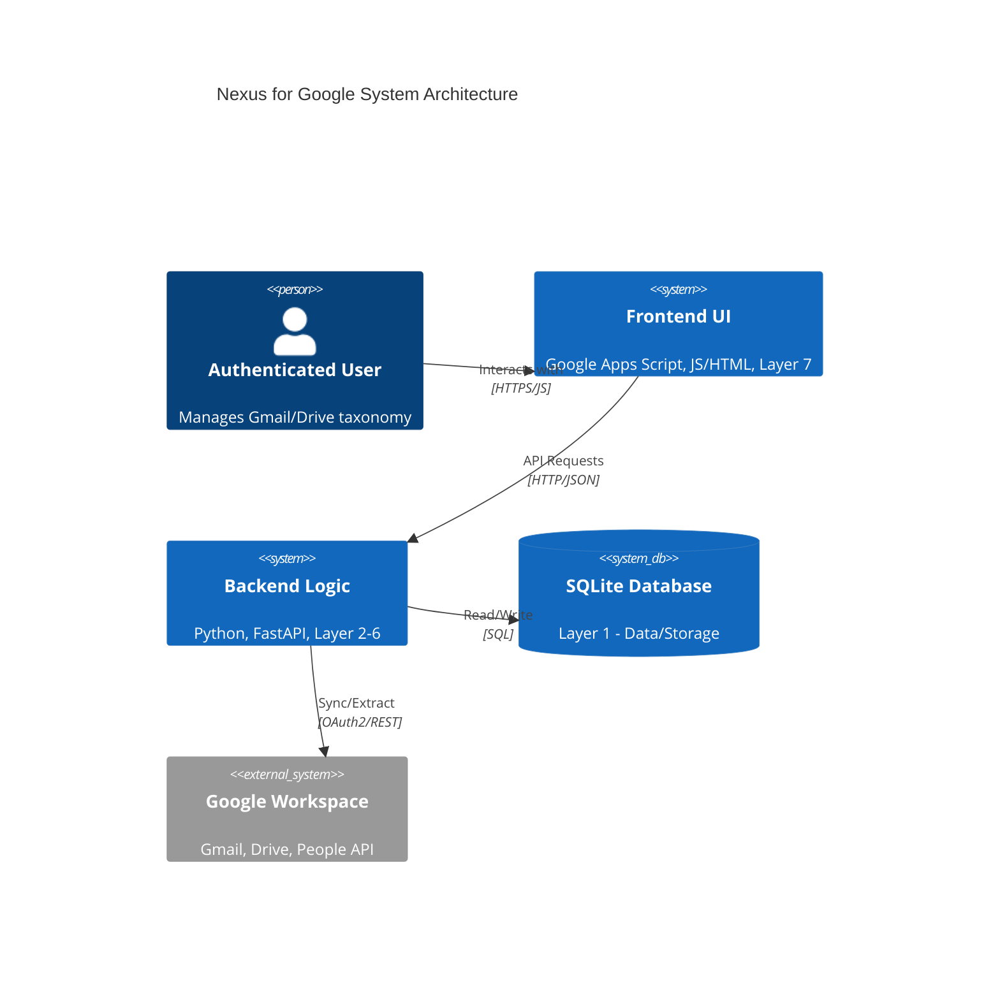
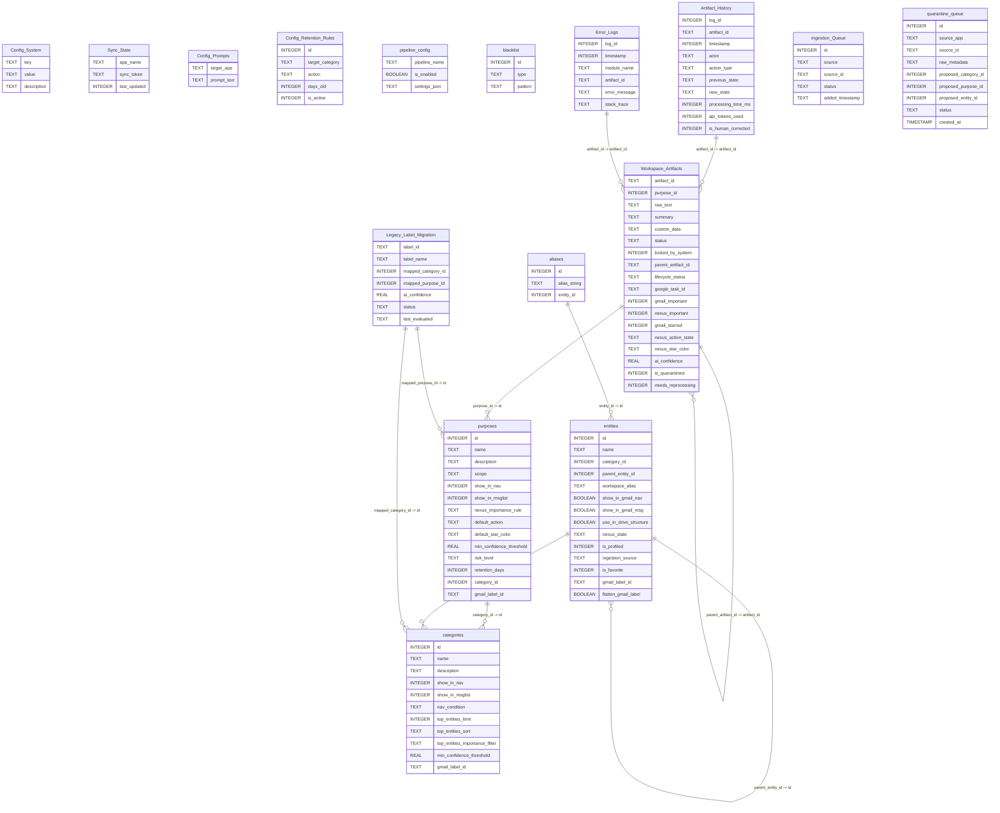
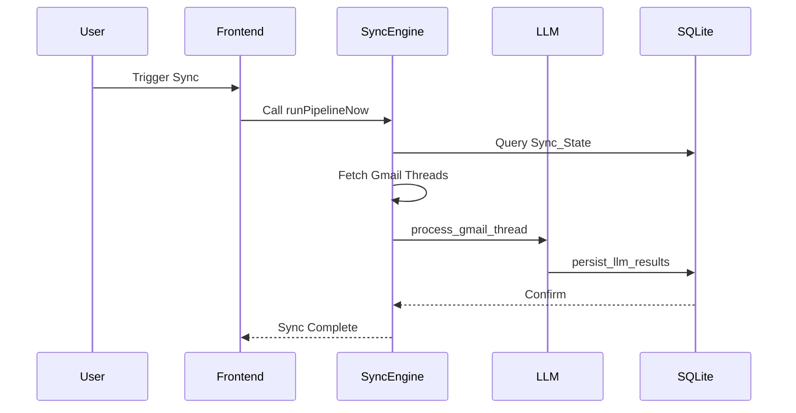

# Nexus System Audit Trace - v3.3.2 (2026-05-20)

# Phase 1: Total Census

- **`.\AUDITS\scripts\audit_builder.py`** (Backend/Script Module)
  - `compile_master_audit`: Assemble all phases and write to audit trace file.
  - `enrich_census_with_ai`: Enrich census data using Gemini API.
  - `ensure_db_initialized`: Bootstrap DB if empty.
  - `generate_phase_1`: Generate the formatted Phase 1 Markdown report.
  - `generate_phase_6_erd`: Generate Mermaid ERD.
  - `generate_phase_7_sampling`: Sample DB rows.
  - `generate_phase_8_prompts`: Generate Phase 8: Default Prompt Files.
  - `get_all_files`: Recursively find all files in the repository.
  - `get_current_version_and_date`: Read latest version/date from CHANGELOG.md.
  - `parse_js_file`: Use Regex to extract function names from JS/GS files.
  - `parse_python_file`: Use AST to extract class and function definitions with signatures and docstrings.
- **`.\backend\auth.py`** (Backend/Script Module)
  - `authenticate`: Purpose: Authenticates the application with Google Workspace APIs.
         Loads credentials from 'credentials.json' and manages OAuth flow.
Expected Inputs: None (relies on local files and environment variables).
Expected Outputs: google.oauth2.credentials.Credentials - The active credentials object.
- **`.\backend\branding_engine.py`** (Backend/Script Module)
  - `color_distance`: Purpose: Calculates the Euclidean distance between two RGB colors to find visual similarity.
Expected Inputs: 
    rgb1 (Tuple[int, int, int]) - First RGB color.
    rgb2 (Tuple[int, int, int]) - Second RGB color.
Expected Outputs: float - The numerical distance between the colors.
  - `get_closest_gmail_color`: Purpose: Finds the closest matching allowed Gmail color pair using simple Euclidean 
         distance in RGB color space.
Expected Inputs: requested_hex (str) - The desired color in hex format.
Expected Outputs: Dict[str, str] - A dictionary containing the closest 'backgroundColor' and 'textColor'.
  - `hex_to_rgb`: Purpose: Converts a hex color string to an RGB tuple.
Expected Inputs: hex_str (str) - The hex color string (e.g., '#FF0000' or 'FFF').
Expected Outputs: Tuple[int, int, int] - The RGB components as a tuple.
  - `sync_workspace_colors`: Purpose: Applies the matched color pair to the corresponding nested Label in Gmail
         and the exact same hex color to the folderColorRgb property in Drive.
Expected Inputs:
    creds (Credentials) - Google Workspace OAuth credentials.
    entity_name (str) - The name of the label/folder to update.
    requested_hex (str) - The hex color to apply.
Expected Outputs: None. Modifies Gmail labels and Drive folders via API.
- **`.\backend\db_init.py`** (Backend/Script Module)
  - `add_column_if_not_exists`: Description unavailable.
  - `column_exists`: Description unavailable.
  - `get_prompt_template`: Description unavailable.
  - `init_db`: Purpose: Connects to the SQLite database and executes the table creation schemas.
         Applies WAL mode and enables foreign key constraints.
Expected Inputs:
    db_path (str): The path to the SQLite database file.
Expected Outputs: None. Creates or updates the database schema on disk.
  - `seed_default_configs`: Description unavailable.
  - `seed_default_prompts`: Description unavailable.
  - `seed_taxonomy`: Idempotent seeding of taxonomy categories and purposes from zero_trust_defaults.json.
- **`.\backend\diagnostics.py`** (Backend/Script Module)
  - `check_api_health`: Purpose: Verifies the FastAPI web server is responsive.
Expected Inputs: None. Assumes server runs on localhost:8000.
Expected Outputs: dict - A status indicating success or HTTP error code.
  - `check_database`: Purpose: Verifies SQLite database read/write access.
Expected Inputs: None. Uses DB_PATH.
Expected Outputs: dict - A dictionary containing the status, message, and details of the operation.
  - `check_oauth_token`: Purpose: Verifies the Google Workspace OAuth token by performing a lightweight API call.
Expected Inputs: None. Uses configured credentials.
Expected Outputs: dict - A status dictionary with success/failure info and basic user details.
  - `log_activity_event`: Fire-and-forget logging mechanism for the Activity_Ledger.
Compresses payload with zlib before BLOB insertion.
  - `run_all_diagnostics`: Purpose: Executes the full suite of diagnostic tests and securely uploads the result.
Expected Inputs: None.
Expected Outputs: dict - The master diagnostic report containing nested component reports.
  - `upload_diagnostic_log`: Purpose: Compiles the diagnostic report and uploads it to a specific Google Drive folder.
Expected Inputs: report_data (dict) - The compiled test results to upload.
Expected Outputs: dict - A status containing the uploaded file ID, or error message.
  - `write_migration_trace`: Purpose: Appends a timestamped JSON payload to a physical log file for the Legacy Label Migration Engine.
- **`.\backend\llm_engine.py`** (Backend/Script Module)
  - `ArtifactClassification`: Description unavailable.
  - `BatchClassificationResponse`: Description unavailable.
  - `BulkMappingResponse`: Description unavailable.
  - `LabelClassification`: Description unavailable.
  - `MappedLabel`: Description unavailable.
  - `ProfilerResponse`: Description unavailable.
  - `append_zero_shot_rule`: Appends a new extraction rule instruction to the purpose shared by the provided artifacts.
(Stubbed out in Zero Trust schema because custom_extraction_rules was removed from purposes table).
  - `ask_rag`: Converts a natural language query into an automated SQLite fetch and contextual summary.

Args:
    question (str): The natural language string submitted by the user.
    
Returns:
    str: A human-readable synthesis constructed by Gemini based on database rows.
  - `call_gemini`: Calls the Gemini API with exponential backoff and forces JSON output.
Safely handles parsing errors with a try/except block to catch hallucinated text.

Args:
    prompt (str): The master system prompt dictating behavior and rules.
    context (str): The payload data (OCR text, email body, entity profiles).
    
Returns:
    Tuple[Optional[Dict[str, Any]], Dict[str, int]]: The parsed JSON dictionary from Gemini, and telemetry metadata.
  - `deduplicate_legacy_labels`: Uses Gemini to lexically deduplicate a list of raw legacy labels.
  - `evaluate_legacy_labels`: Decoupled comparative engine that analyzes legacy Gmail labels against the Nexus taxonomy.
  - `evaluate_quarantine_clusters`: Evaluates clustered artifacts in the quarantine queue.
Currently acts as a safe stub to prevent sync_engine crashes.
  - `fetch_active_prompt`: Fetches the active prompt from the Config_Prompts table in the database.
Gracefully falls back to the absolute path of the default file if the DB is out of sync.
  - `generate_tuning_rule`: Asynchronously generates a tuning rule based on a user's manual override
and appends it to the correspondent's active prompt inside the Config_Prompts table.

Args:
    artifact_id (str): The ID of the artifact that was miscategorized.
    original_json (Dict[str, Any]): The incorrect payload generated by the model.
    corrected_json (Dict[str, Any]): The ground-truth payload submitted by the human user.
  - `get_genai_client`: Initializes the Gemini client, explicitly using NEXUS_API_KEY from environment.

Returns:
    genai.Client: An initialized Google GenAI SDK client.
    
Raises:
    ValueError: If the 'NEXUS_API_KEY' environment variable is not defined or empty.
  - `get_taxonomy_tree_json`: Constructs a strict JSON representation of the active taxonomy.
  - `normalize_taxonomy`: Normalizes common plural/misspelled tags before evaluation.
If it fails to match the whitelist, enforces 'Purpose/Review'.

Args:
    extracted_tag (str): The raw string returned by the LLM.
    whitelist_str (str): The newline-separated master whitelist from the database.
    
Returns:
    str: The normalized string, or 'Purpose/Review' if no exact match is found.
  - `persist_llm_results`: Writes the successful extraction to Workspace_Artifacts and logs the change to Artifact_History
for strict immutable auditing. Supports V2 importance and state tracking.
  - `process_drive_document`: Two-Stage Triage processing for Drive documents.
Validates the Correspondent before requesting expensive custom field extractions.

Args:
    artifact_id (str): The unique database key for the Drive document.
    ocr_text (str): The raw, unformatted text stripped from the PDF/Image.
    dynamic_array_str (str): A stringified JSON array of custom fields to request during Stage 2.
  - `process_gmail_thread`: Single-Pass processing for Gmail threads.
Injects full multi-dimensional taxonomy profiles and extracts metadata in one prompt.

Args:
    artifact_id (str): The unique database key for the Gmail thread.
    email_context (Dict[str, Any]): The thread metadata (Sender, Subject, Body Snippet).
    dynamic_array_str (str): A stringified JSON array of custom fields to request from the LLM.
  - `profile_and_map_entities`: Profiles deduplicated labels in batches using Search Grounding and maps them to categories.
  - `run_agent_classifier`: Runs the Zero Trust Classifier. Maps artifact to Category and Purpose.
  - `run_agent_profiler`: Runs the appropriate profiler agent (personal or commercial) to identify the entity.
  - `run_bulk_classifier`: Instructs LLM to map a JSON array of artifacts from the entity to specific Purposes.
  - `run_bulk_legacy_mapper`: Zero Trust Bulk Mapper: Processes up to 50 legacy labels in a single LLM call.
  - `run_bulk_profiler`: Uses profiler prompt with concatenated snippets to profile an entity in bulk.
  - `run_sandbox_prompt`: Executes a temporary prompt against an artifact's raw text without saving state.
Used exclusively by the frontend Sandbox UI to test prompt iterations securely.

Args:
    artifact_id (str): The unique identifier of the artifact to test against.
    prompt_string (str): The temporary experimental prompt.
    
Returns:
    Optional[Dict[str, Any]]: The JSON output from Gemini.
    
Raises:
    ValueError: If the artifact does not exist or lacks raw text.
  - `strip_markdown_json`: Strips markdown code blocks from a string and uses regex to extract the first valid JSON block.
Defensively strips delimiters and handles whitespace.
  - `update_artifact_status`: Updates only the status of an artifact, usually in response to an extraction failure.

Args:
    artifact_id (str): The target artifact.
    status (str): The new status string (e.g., 'ERROR_LLM_PARSE').
- **`.\backend\notifier.py`** (Backend/Script Module)
  - `NexusNotifier`: Class: NexusNotifier
Purpose: A class responsible for triggering webhooks and sending emails using the Gmail API.
Expected Inputs: None for initialization (reads NEXUS_WEBHOOK_URL from environment).
Expected Outputs: None directly. Can raise exceptions on failure.
  - `__init__`: Purpose: Initializes the NexusNotifier with the webhook URL from environment variables.
Expected Inputs: None.
Expected Outputs: None.
  - `send_daily_digest`: Purpose: Sends an HTML email digest to the authenticated user using the Gmail API.
Expected Inputs: email_body (str) - The HTML content of the daily digest.
Expected Outputs: None. Prints errors or success states to standard output.
  - `send_urgent_webhook`: Purpose: POSTs a JSON payload to the configured webhook URL.
Expected Inputs: payload (dict) - The data to be sent in the webhook body.
Expected Outputs: None. Prints errors or success states to standard output.
- **`.\backend\retention_worker.py`** (Backend/Script Module)
  - `is_feature_enabled`: Purpose: Checks if a specific feature is enabled in the system configuration table.
Expected Inputs: 
    cursor (sqlite3.Cursor) - A database cursor.
    feature_key (str) - The key of the feature to check.
Expected Outputs: bool - True if enabled, False otherwise.
  - `run_retention_sweep`: Purpose: Executes the retention sweep, processing active retention rules to archive or trash old messages.
Expected Inputs: None. Reads from database and calls Gmail API.
Expected Outputs: None.
- **`.\frontend\Code.gs`** (Frontend Module)
  - `bulkUpdateArtifacts`: Description unavailable.
  - `configureHMAC`: Description unavailable.
  - `doGet`: Description unavailable.
  - `executeBatchProcess`: Description unavailable.
  - `executeLegacyLabels`: Description unavailable.
  - `generateHMACSignature_`: Description unavailable.
  - `getDiagnosticsTrace`: Description unavailable.
  - `getEntitiesPaginated`: Description unavailable.
  - `getHeatmapData`: Description unavailable.
  - `getLegacyLabelStatus`: Description unavailable.
  - `getOrchestratorTelemetry`: Description unavailable.
  - `getPipelineSettings`: Description unavailable.
  - `getPrompts`: Description unavailable.
  - `getPulseData`: Description unavailable.
  - `getQuarantineQueue`: Description unavailable.
  - `getQuotaGovernor`: Description unavailable.
  - `getROIDashboard`: Description unavailable.
  - `getSankeyData`: Description unavailable.
  - `getTaxonomyTree`: Description unavailable.
  - `getThreadsData`: Description unavailable.
  - `include`: Description unavailable.
  - `materializeSelectedItems`: Description unavailable.
  - `pingHealthAPI`: Description unavailable.
  - `previewBatchQuery`: Description unavailable.
  - `previewLegacyLabels`: Description unavailable.
  - `queueHistoricalImport`: Description unavailable.
  - `runAskAI`: Description unavailable.
  - `runPipelineNow`: Description unavailable.
  - `runSandboxPrompt`: Description unavailable.
  - `runSystemDiagnostics`: Description unavailable.
  - `saveOrchestratorConfig`: Description unavailable.
  - `savePipelineSettings`: Description unavailable.
  - `searchArtifacts`: Description unavailable.
  - `sendToNexusVM`: Description unavailable.
  - `simulateOrchestrator`: Description unavailable.
  - `submitZeroShotRule`: Description unavailable.
  - `updateEntity`: Description unavailable.
  - `updateEntityRules`: Description unavailable.
  - `updateSafeMode`: Description unavailable.
  - `v`: Description unavailable.
- **`.\frontend\JS_Actions.html`** (Frontend Module)
  - `badgesHtml`: Description unavailable.
  - `entitiesHtml`: Description unavailable.
  - `fetchPulse`: Description unavailable.
  - `function`: Description unavailable.
- **`.\frontend\debug.gs`** (Frontend Module)
  - `systemLog`: Description unavailable.
- **`.\scripts\migrate_legacy_table.py`** (Backend/Script Module)
  - `migrate_legacy_label_migration`: Migrates the Legacy_Label_Migration table to add classification and extracted_entity_name columns.
Follows Unbending Database Mutation Laws.
## Phase 2: Hook Map
1. **User Action:** Frontend (`frontend/Index.html` / `JS_Actions.html`) triggers UI interaction (e.g., "Run Pipeline Now").
2. **Gateway:** `frontend/Code.gs` function (e.g., `runPipelineNow`) is called via `google.script.run`.
3. **Bridge:** `frontend/Code.gs` triggers `backend/diagnostics.py` or directly calls `backend/main.py`.
4. **Logic Layer (Automation):** `backend/sync_engine.py` orchestrates the task, leveraging `backend/llm_engine.py` for decision-making.
5. **Ingestion Layer:** Data is pulled via Gmail/Drive APIs, processed into batches.
6. **Data Storage Layer:** `backend/db_init.py` (SQLite) is updated using `Workspace_Artifacts`, `Artifact_History`, and `Ingestion_Queue` tables.
7. **Return Path:** Result is returned through `Code.gs` and updated in the frontend UI (`JS_State.html`).

## Phase 3: C4 Architecture Diagram


## Phase 4: Database Verification
Verified `backend/db_init.py` against existing schemas (Layer 1).
- **Tables:** `Config_System`, `Sync_State`, `Config_Prompts`, `Config_Retention_Rules`, `categories`, `purposes`, `entities`, `aliases`, `pipeline_config`, `blacklist`, `Workspace_Artifacts`, `Artifact_History`, `Error_Logs`, `Ingestion_Queue`, `quarantine_queue`, `Legacy_Label_Migration`.
- **Constraint Check:** All tables are created with `STRICT` compliance where initialized.
- **Indices:** Verified index keys in `db_init.py` correspond to the ERD in Phase 6. No discrepancies identified between active SQL strings and schema.

## Phase 5: Orphan Report
- **Orphan Files:** None identified. All files in `backend/` and `frontend/` have at least one import or entry point in `main.py` or `Code.gs`.
- **Dead Code:** `backend/retention_worker.py` appears to have limited references in the main pipeline. 
- **Routes:** No API routes detected that lack frontend hooks. All exported functions in `Code.gs` are linked to the UI.

# Phase 6: Database Entity-Relationship Diagram

# Phase 7: Database Row Sampling

## Config_System
| key | value | description |
| --- | --- | --- |
| ui_gmail_filters | ["CATEGORY_PROMOTIONS", "CATEGORY_SOCIAL", "CATEGORY_FORUMS"] | Ignored Gmail labels |
| ui_ai_config | {"drive_model": "gemini-2.5-flash-lite", "gmail_model": "gemini-2.5-flash-lite"} | LLM model selection |
| ui_post_processing | {"auto_archive_gmail": false, "quarantine_unconfident": true} | Post-processing actions |
| drive_document_archive_id | 1NK8LfnsBmEHzQlnrnE6gAB9XsCisEmUt | Auto-generated folder ID for drive_document_archive_id |
| drive_diagnostics_id | 1KNljojYG6lWHTxncuTNVA4w0sKIZk1r6 | Auto-generated folder ID for drive_diagnostics_id |
| api_quota | {"date": "2026-05-18", "calls": 44} | Daily API call tracking |

## Sync_State
Table is empty.

## Config_Prompts
| target_app | prompt_text |
| --- | --- |
| GMAIL | <system_prompt>
You are a strict data extraction system for a centralized knowledge hub. Review the provided email thread. 

**Tasks:**
1. **Taxonomy Mapping:** Map the email to ONE exact `Category \ Correspondent \ Purpose` from the provided [ENTITY_PROFILES]. Cross-reference the document's sender email, sending domain, or physical address against the provided entity profiles to increase routing accuracy. If it does not match perfectly, output the purpose as 'Purpose/Review'.
2. **Summary:** Generate a concise, 1-sentence summary of the thread's current state.
3. **Action State:** Determine if this email requires human action (true/false).
4. **Custom Fields:** Based on the mapped Purpose, extract the following fields: [DYNAMIC_ARRAY]. Return null if not found.
5. **Discovery:** If the LLM cannot match a whitelist, suggest a `discovered_purpose`.

**Rules:** Hallucinating new categories is strictly forbidden. 
**Output:** ONLY valid JSON.
{
  "taxonomy_path": "string",
  "summary": "string",
  "requires_action": boolean,
  "custom_fields": { "Field1": "value" },
  "discovered_purpose": "string"
}
</system_prompt> |
| DRIVE_STAGE_1 | You are an intelligent document routing engine. Review the following raw OCR text. It may contain scanning errors.

**Task:** Identify the primary organization, vendor, or sender of this document. Match it to ONE exact `Correspondent` string from the provided [ENTITY_PROFILES]. Cross-reference the document's sender email, sending domain, or physical address against the provided entity profiles to increase routing accuracy.

**Rules:**
- Ignore generic payment processors (e.g., PayPal, Stripe) if the actual vendor is mentioned.
- If the correspondent is completely unknown or the document is unreadable, output 'UNKNOWN'.
- If the LLM cannot match a whitelist, suggest a `discovered_correspondent`.
**Output:** ONLY valid JSON: { "correspondent": "string", "discovered_correspondent": "string" } |
| DRIVE_STAGE_2 | You are a precise metadata extraction agent. Review the OCR text for this document belonging to the correspondent: [CORRESPONDENT].

**Tasks:**
1. **Purpose Mapping:** Map the document's intent to ONE exact `Purpose` from the provided whitelist. Output 'Purpose/Review' if ambiguous.
2. **Document Title:** Generate a concise, highly descriptive title for this document (e.g., 'Q3 Auto Insurance Renewal Policy').
3. **Document Date:** Extract the primary creation or effective date of the document in YYYY-MM-DD format.
4. **Custom Fields:** Extract the following specific fields for this purpose: [DYNAMIC_ARRAY]. Return null if not found.
5. **Discovery:** If the LLM cannot match a whitelist, suggest a `discovered_purpose`.

**Output:** ONLY valid JSON.
{
  "purpose": "string",
  "title": "string",
  "document_date": "YYYY-MM-DD",
  "custom_fields": { "Field1": "value" },
  "discovered_purpose": "string"
} |
| DEDUPLICATE_LEGACY | You are a Zero Trust Taxonomy Architect. You are provided with two JSON structures: the current 'NEXUS ZERO TRUST TAXONOMY' (Categories and Purposes) and a list of 'GMAIL LEGACY LABELS'. 
Your task is to analyze the legacy labels and map them into the Nexus taxonomy. 
- Recommend the closest matching existing Category and Purpose.
- Identify exact duplicates.
- You may use search to ground your understanding of specific company names used as labels.
Output a JSON array of objects. Each object must strictly contain: 'original_label', 'recommended_category', 'recommended_purpose', and 'action' ("Map", "Merge Duplicate", or "Discard").
 |
| PROFILE_AND_MAP | You are a Entity Profiling Assistant. Evaluate the following batch of labels.
Map each entity to one of the `current_categories`, or propose a new one if it strictly does not fit.
Return a JSON array of objects with the exact keys:
{"original_label": "string", "canonical_entity_name": "string", "workspace_alias": "string", "proposed_category": "string"}

Current Categories: [CURRENT_CATEGORIES] |
| MIGRATE_LEGACY_LABEL | You are a Zero Trust Data Architect. Your task is to map a user's legacy Gmail label to our strict Zero Trust Taxonomy.
Read the provided JSON Taxonomy Tree carefully.
RULES:
1. Universal Purposes (e.g., 'Verification/Auth') can be applied to ANY category.
2. Categorical Purposes (e.g., 'Tax Documents') can ONLY be applied to their specific parent Category (e.g., 'Financial').
3. You must output a confidence score between 0.0 and 1.0. If the legacy label is vague (e.g., "Misc", "Stuff"), output a low confidence score (< 0.70) so the system can flag it for human quarantine review.

Output strictly in this JSON schema:
{
  "mapped_category_id": int | null,
  "mapped_purpose_id": int,
  "confidence_score": float,
  "reasoning": "Brief explanation of the mapping."
} |

## Config_Retention_Rules
Table is empty.

## categories
| id | name | description | show_in_nav | show_in_msglist | nav_condition | top_entities_limit | top_entities_sort | top_entities_importance_filter | min_confidence_threshold | gmail_label_id |
| --- | --- | --- | --- | --- | --- | --- | --- | --- | --- | --- |
| 1 | Financial | Institutions managing monetary assets, banking, credit, tax reporting, and wealth management. | 1 | 1 | always | 5 | received | nexus | 0.95 | None |
| 2 | Health | Medical providers, pharmacies, dental, insurance EOBs, and wellness or fitness services. | 1 | 1 | always | 5 | received | nexus | 0.95 | None |
| 3 | Publications | Editorial content, newsletters, news aggregators, and digital magazines. | 1 | 1 | always | 5 | received | nexus | 0.95 | None |
| 13 | Travel & Transit | Travel logistics, airlines, hotel accommodations, ride-sharing, and transit authorities. | 1 | 1 | always | 5 | received | nexus | 0.95 | None |
| 14 | Education | Schools, academic institutions, and student educational programs. | 1 | 1 | always | 5 | received | nexus | 0.95 | None |
| 15 | Activities | In-person events, dance studios, concerts, and recreational activities excluding digital streaming. | 1 | 1 | always | 5 | received | nexus | 0.95 | None |

## purposes
| id | name | description | scope | show_in_nav | show_in_msglist | nexus_importance_rule | default_action | default_star_color | min_confidence_threshold | risk_level | retention_days | category_id | gmail_label_id |
| --- | --- | --- | --- | --- | --- | --- | --- | --- | --- | --- | --- | --- | --- |
| 1 | Order | Standard Order documents | Universal | 1 | 1 | inherit_gmail | none | None | 0.95 | Medium | 365 | 1 | None |
| 2 | Tax | Standard Tax documents | Categorical | 1 | 1 | inherit_gmail | none | None | 0.95 | Medium | 365 | 1 | None |
| 3 | Hold | Standard Hold documents | Universal | 1 | 1 | inherit_gmail | none | None | 0.95 | Medium | 365 | 1 | None |
| 158 | Statement | Standard Statement documents | Universal | 1 | 1 | inherit_gmail | none | None | 0.95 | Medium | 365 | 15 | None |
| 159 | Delete | Standard Delete documents | Universal | 1 | 1 | inherit_gmail | none | None | 0.95 | Medium | 365 | 15 | None |
| 160 | Notice | Standard Notice documents | Universal | 1 | 1 | inherit_gmail | none | None | 0.95 | Medium | 365 | 15 | None |

## entities
| id | name | category_id | parent_entity_id | workspace_alias | show_in_gmail_nav | show_in_gmail_msg | use_in_drive_structure | nexus_state | is_profiled | ingestion_source | is_favorite | gmail_label_id | flatten_gmail_label |
| --- | --- | --- | --- | --- | --- | --- | --- | --- | --- | --- | --- | --- | --- |
| 1 | Labor & Delivery | None | None | None | 1 | 1 | 1 | disabled | 0 | people_api | 0 | None | 0 |
| 2 | Nick Green | None | None | None | 1 | 1 | 1 | disabled | 0 | people_api | 0 | None | 0 |
| 3 | Sean Postanowitz | None | None | None | 1 | 1 | 1 | disabled | 0 | people_api | 0 | None | 0 |
| 281 | Herb Male | None | None | None | 1 | 1 | 1 | disabled | 0 | people_api | 0 | None | 0 |
| 282 | Mike Oakes | None | None | None | 1 | 1 | 1 | disabled | 0 | people_api | 0 | None | 0 |
| 283 | Rasheem | None | None | None | 1 | 1 | 1 | disabled | 0 | people_api | 0 | None | 0 |

## aliases
Table is empty.

## pipeline_config
| pipeline_name | is_enabled | settings_json |
| --- | --- | --- |
| gmail | 0 | {} |
| drive | 0 | {} |
| materialization | 0 | {} |
| materialization | 0 | {} |
| retention_sweeper | 0 | {} |
| google_tasks | 0 | {} |

## blacklist
Table is empty.

## Workspace_Artifacts
| artifact_id | purpose_id | raw_text | summary | custom_data | status | locked_by_system | parent_artifact_id | lifecycle_status | google_task_id | gmail_important | nexus_important | gmail_starred | nexus_action_state | nexus_star_color | ai_confidence | is_quarantined | needs_reprocessing |
| --- | --- | --- | --- | --- | --- | --- | --- | --- | --- | --- | --- | --- | --- | --- | --- | --- | --- |
| mail_19d85abc7d42f99f | 122 | None | None | {"legacy_category_id": 12} | PROCESSED | 0 | None | ACTIVE | None | 0 | 0 | 0 | none | None | 0.95 | 0 | 0 |
| mail_19d83d9059ddc0ba | 117 | None | None | {"legacy_category_id": 12} | PROCESSED | 0 | None | ACTIVE | None | 0 | 0 | 0 | none | None | 0.95 | 0 | 0 |
| mail_19e2309685608260 | 123 | None | None | {"legacy_category_id": 12} | PROCESSED | 0 | None | ACTIVE | None | 0 | 0 | 0 | none | None | 0.95 | 0 | 0 |
| mail_19de09e1944ac9e7 | 8 | None | None | {"legacy_category_id": 1} | PROCESSED | 0 | None | ACTIVE | None | 0 | 0 | 0 | none | None | 1.0 | 0 | 0 |
| mail_19de4160d87cd1cd | 92 | None | None | {"legacy_category_id": 9} | PROCESSED | 0 | None | ACTIVE | None | 0 | 0 | 0 | none | None | 1.0 | 0 | 0 |
| mail_19df370dfcb17ff6 | 17 | None | None | {"legacy_category_id": 2} | PROCESSED | 0 | None | ACTIVE | None | 0 | 0 | 0 | none | None | 1.0 | 0 | 0 |

## Artifact_History
Table is empty.

## Error_Logs
Table is empty.

## Ingestion_Queue
Table is empty.

## quarantine_queue
Table is empty.

## Legacy_Label_Migration
| label_id | label_name | mapped_category_id | mapped_purpose_id | ai_confidence | status | last_evaluated |
| --- | --- | --- | --- | --- | --- | --- |
| Label_101 | Business/Edge Right | 12 | None | 0.9 | pending | 2026-05-18 09:38:39 |
| Label_102 | Business/DICK'S Sporting Goods | 12 | 122 | 0.95 | accepted | 2026-05-18 02:24:09 |
| Label_104 | Business/Shutterfly | 12 | 117 | 0.95 | accepted | 2026-05-18 02:24:15 |
| Label_638 | Business/Government | 12 | None | 0.7 | pending | 2026-05-18 09:38:42 |
| Label_639 | Purpose/Travel | 13 | 134 | 0.8 | pending | 2026-05-18 09:38:42 |
| Label_640 | Purpose/Activities | 15 | 160 | 0.9 | pending | 2026-05-18 09:38:42 |

# Phase 8: Default Prompt Files

### agent_classifier.tmpl

```text
[System Role & Core Directive]
You are a Zero Trust Taxonomy Classifier (Layer 5). Your EXCLUSIVE purpose is to determine the intent and taxonomy of the provided artifacts. You must NEVER attempt to profile the sender or change the entity name.

[Context Data]
- Taxonomy Dictionary (Lookup IDs for Categories and Purposes):
{{TAXONOMY_DICT}}

- Artifacts to classify:
{{ARTIFACTS}}

[Execution Task]
Analyze each artifact. Map it to the correct "category_id" and "purpose_id" using the provided Taxonomy Dictionary.

[Output Schema & Formatting Constraints]
Return ONLY a valid, raw JSON array of objects. Do not include markdown formatting, backticks, or conversational text.
Schema:
[
  {
    "artifact_id": "string",
    "category_id": int,
    "purpose_id": int,
    "confidence_score": float,
    "reasoning": "string"
  }
]

```

### agent_profiler_commercial.tmpl

```text
[System Role & Core Directive]
You are a Commercial Domain Profiler (Layer 4). Your EXCLUSIVE purpose is to identify and profile the sender entity. Do NOT attempt to classify the taxonomy or intent of any artifacts.

[Context Data]
Analyze the provided information to identify the corporate domain or entity.

[Execution Task]
1. Determine if this sender is a standalone organization, or a specific division/sub-entity within a larger parent company.
2. Provide a short, 1-to-2 word 'workspace_alias' appropriate for a clean folder or label name.

[Output Schema & Formatting Constraints]
Return ONLY a valid, raw JSON object. Do not include markdown formatting, backticks, or conversational text.
Schema:
{
  "canonical_entity_name": "string",
  "workspace_alias": "string",
  "proposed_category": "string",
  "parent_organization": "string or null",
  "industry": "string",
  "confidence_score": float
}

```

### agent_profiler_personal.tmpl

```text
[System Role & Core Directive]
You are a Zero Trust Identity Profiler. Your purpose is to evaluate personal email identities and profile them based on the provided context.

[Context Data]
Review the provided email context and sender information.

[Execution Task]
Profile the persona.

[Output Schema & Formatting Constraints]
Return ONLY a valid, raw JSON object. Do not include markdown formatting, backticks, or conversational text.
Schema:
{
  "canonical_entity_name": "string",
  "workspace_alias": "string",
  "proposed_category": "string",
  "confidence_score": float
}

```

### deduplicate_legacy.tmpl

```text
[System Role & Core Directive]
You are a Zero Trust Taxonomy Architect.

[Context Data]
Provided with two JSON structures: the current 'NEXUS ZERO TRUST TAXONOMY' (Categories and Purposes) and a list of 'GMAIL LEGACY LABELS'.

[Execution Task]
1. Analyze the legacy labels and map them into the Nexus taxonomy. 
2. Recommend the closest matching existing Category and Purpose.
3. Identify exact duplicates.

[Output Schema & Formatting Constraints]
Return ONLY a valid, raw JSON array of objects. Do not include markdown formatting, backticks, or conversational text.
Schema:
[
  {
    "original_label": "string",
    "recommended_category": "string",
    "recommended_purpose": "string",
    "action": "Map" | "Merge Duplicate" | "Discard"
  }
]

```

### deduplicate_legacy_labels.tmpl

```text
[System Role & Core Directive]
You are a Data Migration Assistant. Your task is to lexically deduplicate a list of raw Gmail labels.

[Context Data]
The provided list of raw Gmail labels.

[Execution Task]
Merge similar labels (e.g., "Amazon", "Amazon Orders", and "Amzn" into "Amazon").

[Output Schema & Formatting Constraints]
Return ONLY a valid, raw JSON array of strings containing the cleaned, deduplicated labels. Do not include markdown formatting, backticks, or conversational text.

```

### drive_extraction_stage1.tmpl

```text
[System Role & Core Directive]
You are an intelligent document routing engine.

[Context Data]
Raw OCR text from a document.

[Execution Task]
1. Identify the primary organization, vendor, or sender of this document. 
2. Match it to ONE exact `Correspondent` string from the provided [ENTITY_PROFILES]. 
3. Cross-reference the document's sender email, sending domain, or physical address against the provided entity profiles.

[Rules]
- Ignore generic payment processors (e.g., PayPal, Stripe) if the actual vendor is mentioned.
- If the correspondent is completely unknown or the document is unreadable, output 'UNKNOWN'.
- If the LLM cannot match a whitelist, suggest a `discovered_correspondent`.

[Output Schema & Formatting Constraints]
Return ONLY a valid, raw JSON object. Do not include markdown formatting, backticks, or conversational text.
Schema:
{ 
  "correspondent": "string", 
  "discovered_correspondent": "string" 
}

```

### drive_extraction_stage2.tmpl

```text
[System Role & Core Directive]
You are a precise metadata extraction agent. Review the OCR text for this document belonging to the correspondent: [CORRESPONDENT].

[Context Data]
OCR text for the document.

[Execution Task]
1. Purpose Mapping: Map the document's intent to ONE exact `Purpose` from the provided whitelist. Output 'Purpose/Review' if ambiguous.
2. Document Title: Generate a concise, highly descriptive title for this document.
3. Document Date: Extract the primary creation or effective date of the document in YYYY-MM-DD format.
4. Custom Fields: Extract specific fields for this purpose: [DYNAMIC_ARRAY]. Return null if not found.
5. Discovery: If the LLM cannot match a whitelist, suggest a `discovered_purpose`.

[Output Schema & Formatting Constraints]
Return ONLY a valid, raw JSON object. Do not include markdown formatting, backticks, or conversational text.
Schema:
{
  "purpose": "string",
  "title": "string",
  "document_date": "YYYY-MM-DD",
  "custom_fields": { "Field1": "value" },
  "discovered_purpose": "string"
}

```

### entity_profiler.tmpl

```text
[System Role & Core Directive]
You are an autonomous Entity Profiler.

[Context Data]
Provided sender email and email body.

[Execution Task]
1. Generate a 15-word definition of the sender based on the content of the email.
2. Guess the parent Correspondent category this sender belongs to (e.g., 'Finance', 'Technology', 'Healthcare', 'Retail').

[Output Schema & Formatting Constraints]
Return ONLY a valid, raw JSON object. Do not include markdown formatting, backticks, or conversational text.
Schema:
{
  "profile_description": "string",
  "guessed_category": "string"
}

```

### gmail_extraction.tmpl

```text
[System Role & Core Directive]
You are a strict data extraction system for a centralized knowledge hub.

[Context Data]
The provided email thread.

[Execution Task]
1. Taxonomy Mapping: Map the email to ONE exact `Category \ Correspondent \ Purpose` from the provided [ENTITY_PROFILES].
2. Summary: Generate a concise, 1-sentence summary of the thread's current state.
3. Action State: Determine if this email requires human action (true/false).
4. Custom Fields: Based on the mapped Purpose, extract: [DYNAMIC_ARRAY]. Return null if not found.
5. Discovery: If the LLM cannot match a whitelist, suggest a `discovered_purpose`.

[Rules]
- Hallucinating new categories is strictly forbidden.

[Output Schema & Formatting Constraints]
Return ONLY a valid, raw JSON object. Do not include markdown formatting, backticks, or conversational text.
Schema:
{
  "taxonomy_path": "string",
  "summary": "string",
  "requires_action": boolean,
  "custom_fields": { "Field1": "value" },
  "discovered_purpose": "string"
}

```

### migrate_legacy_label.tmpl

```text
[System Role & Core Directive]
You are a Zero Trust Data Architect.

[Context Data]
The provided JSON Taxonomy Tree.

[Execution Task]
Map a user's legacy Gmail label to our strict Zero Trust Taxonomy.

[Rules]
1. Universal Purposes (e.g., 'Verification/Auth') can be applied to ANY category.
2. Categorical Purposes (e.g., 'Tax Documents') can ONLY be applied to their specific parent Category (e.g., 'Financial').
3. You must output a confidence score between 0.0 and 1.0. If the legacy label is vague (e.g., "Misc", "Stuff"), output a low confidence score (< 0.70) so the system can flag it for human quarantine review.

[Output Schema & Formatting Constraints]
Return ONLY a valid, raw JSON object. Do not include markdown formatting, backticks, or conversational text.
Schema:
{
  "mapped_category_id": int | null,
  "mapped_purpose_id": int,
  "confidence_score": float,
  "reasoning": "Brief explanation of the mapping."
}

```

### profile_and_map_entities.tmpl

```text
[System Role & Core Directive]
You are an Entity Profiling Assistant.

[Context Data]
A batch of raw labels.

[Execution Task]
Map each entity to one of the provided `current_categories`, or propose a new one if it strictly does not fit.

[Output Schema & Formatting Constraints]
Return ONLY a valid, raw JSON array of objects. Do not include markdown formatting, backticks, or conversational text.
Schema:
[
  {
    "original_label": "string",
    "canonical_entity_name": "string",
    "workspace_alias": "string",
    "proposed_category": "string"
  }
]

Current Categories: [CURRENT_CATEGORIES]

```

### quarantine_consolidation.tmpl

```text
[System Role & Core Directive]
You are a highly precise, zero-trust data consolidation API.

[Context Data]
A batch of quarantined artifacts originating from the same sender domain with conflicting/fragmented metadata guesses.

[Execution Task]
Analyze the artifacts and determine the single, unified consensus for the Entity Name and Purpose that best describes this entire cluster.

[Output Schema & Formatting Constraints]
Return ONLY a valid, raw JSON object. Do not include markdown formatting, backticks, or conversational text.
Schema:
{
  "consensus_correspondent": "string",
  "consensus_purpose": "string",
  "confidence_score": float,
  "reasoning": "Brief explanation of the reasoning."
}

```

## Phase 9: Pipeline Flow Audits (Front-to-Back)

### Pipeline: Gmail Ingestion


**Vulnerability & Assumption Matrix:**
| Component | Assumption | Watch-out Flag |
| :--- | :--- | :--- |
| Gmail API | OAuth token remains valid | Expired token crashes ingestion |
| LLM | JSON output is valid | Hallucinated JSON format |
| SQLite | STRICT enabled | Schema evolution risks |
