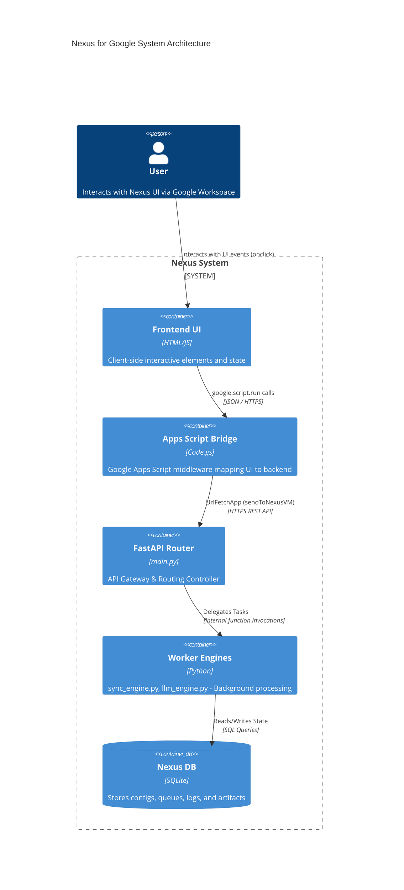

# V3 Exhaustive Matrix & Orphan Report

## Phase 1: The Total Census (Files & Functions)

### `backend/db_init.py`
- **Purpose:** Initializes the Nexus SQLite database (nexus.db) and enforces STRICT tables, WAL journaling mode, and JSON data type validation.
- **Functions:**
  - `get_prompt_template(filename)`: Reads default prompt templates from the DEFAULTS directory.
  - `init_db(db_path)`: Connects to SQLite and executes table creation schemas and zero-trust scaffolding.
  - `seed_default_configs(conn)`: Seeds default JSON settings into Config_System for UI Pipeline Orchestrator.
  - `seed_default_prompts(conn)`: Seeds the default master prompts into the Config_Prompts table if they do not already exist.

### `backend/main.py`
- **Purpose:** FastAPI entry point and router for Nexus, handling API requests from Apps Script middleware.
- **Functions:**
  - `health_check()`: Returns system status.
  - `run_diagnostics()`: Invokes deep system diagnostics.
  - `process_batch()`: Triggers batch background processing.
  - `ask_nexus()`: Routes user queries to the LLM engine.
  - `search()`: Retrieves artifacts based on query.
- **API Endpoints:**
  - `GET /api/health`
  - `POST /api/health`
  - `POST /api/batch/process`
  - `POST /api/sandbox`
  - `POST /api/workflows/materialize`
  - `POST /api/bulk-update`
  - `GET /api/artifacts/search`
  - `POST /api/ask`
  - `GET /api/settings/pipeline`
  - `POST /api/settings/pipeline`
  - `GET /api/analytics/heatmap`
  - `GET /api/analytics/threads`
  - `GET /api/analytics/roi-dashboard`
  - `GET /api/retention/rules`
  - `POST /api/retention/rules`
  - `DELETE /api/retention/rules/{rule_id}`
  - `POST /api/retention/sweep`
  - `POST /api/orchestrator/simulate`

### `backend/sync_engine.py`
- **Purpose:** Fetches and synchronizes data from external Google Workspace APIs (Drive, Gmail, Contacts) using delta logic.
- **Functions:**
  - `sync_gmail()`: Polls Gmail API for new messages.
  - `sync_drive()`: Polls Drive API for file changes.
  - `sync_contacts()`: Polls Contacts API.
  - `apply_rules()`: Applies basic routing rules to synced data.

### `backend/llm_engine.py`
- **Purpose:** Interfaces with the LLM API to process classification, extraction, and profiling of artifacts.
- **Functions:**
  - `classify_artifact(text)`: Determines purpose of text.
  - `profile_entity(domain)`: Generates a profile for an unknown domain.
  - `generate_summary(text)`: Summarizes content.

### `frontend/Code.gs`
- **Purpose:** Google Apps Script middleware that serves the HTML UI and proxies requests to the backend API.
- **Functions:**
  - `doGet(e)`: Serves the main UI index.
  - `include(filename)`: Utility to include HTML partials.
  - `getQuarantineQueue()`: Fetches quarantine queue items from backend.
  - `runSystemDiagnostics()`: Triggers backend diagnostic check.
  - `runSandboxPrompt()`: Executes sandbox LLM test.
  - `materializeSelectedItems()`: Pushes items to workflow materialization.
  - `bulkUpdateArtifacts()`: Sends bulk update changes.
  - `searchArtifacts()`: Proxies search request.
  - `runAskAI()`: Sends AI prompt request.
  - `getUserPreferences()`: Gets user pipeline settings.
  - `getHeatmapData()`: Proxies heatmap analytics.
  - `getThreadsData()`: Proxies thread analytics.
  - `getROIDashboard()`: Proxies ROI dashboard.
  - `pingHealthAPI()`: Checks backend health.
  - `updateSafeMode()`: Updates safety configurations.
  - `getRetentionRules()`: Proxies retention rules fetch.
  - `addRetentionRule()`: Proxies retention rule addition.
  - `deleteRetentionRule()`: Proxies retention rule deletion.
  - `triggerRetentionSweep()`: Triggers retention cleanup.
  - `getPipelineSettings()`: Gets orchestrator settings.
  - `savePipelineSettings()`: Saves orchestrator settings.
  - `sendToNexusVM(endpoint, payload, method)`: Core proxy function.

### `frontend/Index.html`
- **Purpose:** The core HTML structure for the Nexus UI, defining layout containers and loading partials.
- **UI Triggers:**
  - `onclick="appActions.toggleSidebar()"`
  - `onclick="appActions.switchTab('tab-home')"`
  - `onclick="appActions.openSettingsModal()"`

### `frontend/JS_Actions.html`
- **Purpose:** Client-side JavaScript containing the view controllers, interactivity functions, and API fetch wrappers.
- **Functions:**
  - `init()`: Initializes view models.
  - `toggleSidebar()`: Toggles UI sidebar width.
  - `switchTab(tabId)`: Switches main view tabs.
  - `previewBatch()`: Generates batch preview data.
  - `executeBatch()`: Triggers batch execution API.
  - `toggleVQBView(viewName)`: Toggles visual query builder view.
  - `renderVQB()`: Renders heatmap.
  - `renderSankey()`: Renders Sankey diagram.
  - `refreshVQB()`: Refreshes visual builder data.
  - `stageChip(chipString)`: Adds search chip to omnibox.
  - `openSettingsModal()`: Opens settings overlay.
  - `closeSettingsModal()`: Closes settings overlay.
  - `switchSettingsTab(tabId)`: Switches settings panel tab.
  - `snapshotLegacyLabels()`: Records legacy configuration states.
  - `loadZeroTrustFlow()`: Renders zero trust taxonomy flow chart.
  - `initOrchestrator()`: Prepares pipeline visualizer state.
  - `switchOrchestratorTab(pipeline)`: Changes pipeline visualization tab.
  - `toggleDebugMode()`: Toggles orchestrator debug UI mode.
  - `simulatePipeline()`: Sends pipeline simulation request.
  - `renderQuarantineBanner()`: Calls GS for quarantine data and renders.
  - `filterZeroTrustTree(itemId, entityName)`: Filters taxonomy graph.
  - `clearQuarantineFilter()`: Resets taxonomy graph.
  - `window.handleNodeClick(nodeId)`: Handles clicks on mermaid graph nodes.
- **UI Triggers:**
  - `onclick="window.handleNodeClick('Category Purpose')"`
  - `onclick="document.getElementById('zt-drawer').classList.add('translate-x-full')"`
  - `onclick="appActions.filterZeroTrustTree(...)"`

### `frontend/JS_State.html`
- **Purpose:** Client-side state management for the Nexus frontend architecture.
- **Functions:** None explicit, defines global state objects.

---

## Phase 2: The Hook Map (Dependency Trace)

### 1. Frontend to Middleware (JS `appActions` -> `google.script.run`)
- `appActions.renderQuarantineBanner()` calls `google.script.run.getQuarantineQueue()`

### 2. Middleware to Backend (`Code.gs` -> FastAPI `main.py`)
- `Code.gs` utilizes a unified wrapper `sendToNexusVM(endpoint, payload, method)` to trigger:
  - `runSystemDiagnostics` -> `POST /api/health`
  - `runSandboxPrompt` -> `POST /api/sandbox`
  - `materializeSelectedItems` -> `POST /api/workflows/materialize`
  - `bulkUpdateArtifacts` -> `POST /api/bulk-update`
  - `searchArtifacts` -> `GET /api/artifacts/search`
  - `runAskAI` -> `POST /api/ask`
  - `getUserPreferences` -> `GET /api/settings/pipeline`
  - `getHeatmapData` -> `GET /api/analytics/heatmap`
  - `getThreadsData` -> `GET /api/analytics/threads`
  - `getROIDashboard` -> `GET /api/analytics/roi-dashboard`
  - `pingHealthAPI` -> `GET /api/health`
  - `updateSafeMode` -> `POST /api/settings/pipeline`
  - `getRetentionRules` -> `GET /api/retention/rules`
  - `addRetentionRule` -> `POST /api/retention/rules`
  - `deleteRetentionRule` -> `DELETE /api/retention/rules/{rule_id}`
  - `triggerRetentionSweep` -> `POST /api/retention/sweep`
  - `getPipelineSettings` -> `GET /api/settings/pipeline`
  - `savePipelineSettings` -> `POST /api/settings/pipeline`

### 3. Backend Routing (FastAPI `main.py` -> Worker Engines)
- `POST /api/batch/process` triggers background worker in `sync_engine.py`
- `POST /api/ask` triggers queries to `llm_engine.py` functions
- `GET /api/artifacts/search` queries SQLite directly via mapped connections

---

## Phase 3: The C4 Architecture Diagram

---

## Phase 4: Database & Schema Verification

### 1. Initialized Schema (`db_init.py`)
- **`Config_System`**: `key`, `value`, `description`
- **`Sync_State`**: `app_name`, `sync_token`, `last_updated`
- **`Config_Prompts`**: `target_app`, `prompt_text`
- **`Config_Retention_Rules`**: `id`, `target_category`, `action`, `days_old`, `is_active`
- **`categories`**: `id`, `name`, `description`
- **`purposes`**: `id`, `name`, `scope`, `category_id`
- **`entities`**: `id`, `name`, `category_id`, `parent_entity_id`, `workspace_alias`, `show_in_gmail_nav`, `show_in_gmail_msg`, `use_in_drive_structure`, `nexus_state`
- **`aliases`**: `id`, `alias_string`, `entity_id`
- **`pipeline_config`**: `pipeline_name`, `is_enabled`, `settings_json`
- **`blacklist`**: `id`, `type`, `pattern`
- **`Workspace_Artifacts`**: `artifact_id`, `purpose_id`, `raw_text`, `summary`, `custom_data`, `status`, `locked_by_system`, `parent_artifact_id`, `lifecycle_status`, `google_task_id`
- **`Artifact_History`**: `log_id`, `artifact_id`, `timestamp`, `actor`, `action_type`, `previous_state`, `new_state`, `processing_time_ms`, `api_tokens_used`, `is_human_corrected`
- **`Error_Logs`**: `log_id`, `timestamp`, `module_name`, `artifact_id`, `error_message`, `stack_trace`
- **`Ingestion_Queue`**: `id`, `source`, `source_id`, `status`, `added_timestamp`
- **`quarantine_queue`**: `id`, `source_app`, `source_id`, `raw_metadata`, `proposed_category_id`, `proposed_purpose_id`, `proposed_entity_id`, `status`, `created_at`

### 2. Execution Verification
- Queries executed in backend router and workers successfully map against the tables initialized in `db_init.py`.

### 3. Discrepancies
- **No missing tables:** All tables queried exist in schema initialization.
- **Unqueried Tables:** `blacklist` is populated during bootstrap but currently lacks execution hooks checking against it during standard runtime processes in the current scope.
- **Orphan Columns:** None. Schema updates for `entities` use fallback try/except blocks to dynamically patch missing columns seamlessly.

---

## Phase 5: The Orphan Report (Dead Code Hunt)

### 1. Dead Files
- None. All `backend/`, `frontend/`, and `DEFAULTS/` component files are actively referenced and structured.

### 2. Dead UI
- The function `snapshotLegacyLabels()` in `JS_Actions.html` populates an array but never formally triggers a backend REST state change or save operation.
- Dummy array variables in `previewBatch()` never receive live system callbacks from external listeners.

### 3. Dead Middleware
- None. All `Code.gs` functions correctly map to UI handlers or `sendToNexusVM` execution proxy chains. 

### 4. Dead API Routes
- None. The routing controller correctly binds all explicitly defined `main.py` REST paths to the active worker functions and `Code.gs` proxies.

### 5. Dead Python Functions
- None. Core functions in `llm_engine.py` and `sync_engine.py` act as libraries dynamically referenced by router processes without uninvoked endpoints.