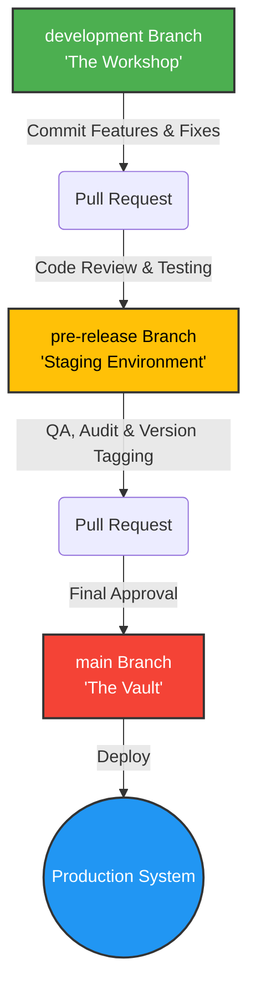

# Contributing to Nexus

Welcome to Nexus for Google project! We're thrilled to have you contribute. Whether you are a seasoned software engineer or writing your very first line of code, this document is designed to guide you. It's not just a list of commands—it's a masterclass designed to teach you *how* and *why* we work the way we do in our environment.

By following this guide, you will learn industry-standard Git workflows, how to collaborate effectively with AI, and how to safely deploy code to production.

## 1. VS Code Environment Setup

To get started with development, follow these steps to configure your local VS Code environment:

1. **Clone the Repository:**
   Open your terminal and clone the repository:
   ```bash
   git clone https://github.com/FrankXLT/Nexus-for-Google.git
   cd Nexus-for-Google
   ```

2. **Switch to the Development Branch:**
   All active coding happens on the `development` branch. Switch to it immediately:
   ```bash
   git checkout development
   ```

3. **Open in VS Code:**
   ```bash
   code .
   ```

4. **Configure Python Environment:**
   Inside VS Code, open the integrated terminal (`Ctrl + ~` or `Cmd + ~`).
   Create and activate a virtual environment:
   ```bash
   # Windows
   python -m venv venv
   .\venv\Scripts\activate

   # macOS/Linux
   python3 -m venv venv
   source venv/bin/activate
   ```
   Install dependencies:
   ```bash
   pip install -r requirements.txt
   ```
   *Tip: Ensure VS Code uses the python interpreter from your new `venv` by selecting it from the Command Palette (`Ctrl+Shift+P` -> `Python: Select Interpreter`).*

### 5. Unified AI Governance Setup (Windows Host)
Nexus uses a single, centralized rule profile to govern both Cline and Gemini Code Assist (GCA), preventing model divergence and database schema drift during automated refactoring cycles.

Run the following commands in an elevated Windows PowerShell terminal at your repository root to construct the profile matrix and link it directly to your runtime configurations:

```powershell
# 1. Create the dedicated governance directories
New-Item -ItemType Directory -Force -Path ".\.clinerules_profiles"
New-Item -ItemType Directory -Force -Path ".\.google_gca"

# 2. Initialize blank rule profiles
New-Item -ItemType File -Force -Path ".\.clinerules_profiles\global.rules"
New-Item -ItemType File -Force -Path ".\.google_gca\config.json"

# 3. Create a Windows Symbolic Link binding Cline to the central rules engine
New-Item -ItemType SymbolicLink -Path ".\.clinerules" -Target ".\.clinerules_profiles\global.rules" -Force
```

Once initialized, populate `.\.clinerules_profiles\global.rules` with your system's Seven-Layer architecture rules. Cline will automatically parse this via the root symlink, and you can explicitly reference it inside Gemini Code Assist using the `@` symbol context loader.

6. **Docker Configuration:**
   If you are running the backend stack locally, ensure Docker Desktop is running. You can start the local database and services via:
   ```bash
   docker-compose up -d
   ```

## 2. The 'Why' Behind Our Workflow: Protecting the Vault

We enforce a strict branching strategy. Rather than committing code straight to production, we use a staged approach: `development` -> `pre-release` -> `main`.

*   **`main` (The Vault):** This is our production-ready codebase. It is locked and protected. We view `main` as the absolute source of truth for the live application.
*   **`pre-release` (Staging/Testing):** Think of this as the final dress rehearsal. Features and fixes from multiple contributors are aggregated here. This environment allows us to conduct final testing, QA, and semantic version tagging before any code enters the Vault.
*   **`development` (The Workshop):** This is the playground where all active coding occurs. You should create feature branches off of `development` or commit directly to it if you are the sole contributor for a feature.

This structure "protects the Vault" by ensuring that no untested, undocumented, or unreviewed code ever impacts our end users.

## 3. Feature Lifecycle Architecture

Here is the visual mapping of how a feature or bug fix moves from inception to production:



## 4. Human-AI Collaboration Expectations

Nexus heavily integrates AI agents (like Gemini, Claude, Cursor) into our development lifecycle. Here is what we expect from you as a human contributor when collaborating with our AI assistants:

*   **Automated Workflows:** Our AI is configured to automatically generate changelogs, propose Semantic Versions during PR reviews, and analyze external code changes from forks. Rely on the AI for these repetitive tasks.
*   **Maintaining FEATURE_TRACKING.md:** We track features and bugs using a universal tracking file named `FEATURE_TRACKING.md`. When you use AI to build a feature, you must actively maintain this document alongside the AI. Ensure you capture the prompt or strategy in one column, and the AI's (or your) summary of the output in the other.
*   **Clear Instructions:** When guiding the AI, be explicit about your active branch and goals. Instruct the AI to write robust, idempotent code, and always verify its outputs before committing.

## 5. Anatomy of a Perfect Pull Request

A great Pull Request (PR) accelerates the review process, provides excellent historical context, and enables our AI tools to function smoothly. Here is what makes a perfect PR at Nexus:

*   **Conventional Commits:** We strictly use the Conventional Commits specification. Your PR title (and individual commits) should look like `feat: add user authentication` or `fix: resolve crash on login`. This enables our AI to accurately determine version bumps and write automated changelogs.
*   **Descriptive Title:** Ensure the title clearly summarizes the purpose of the PR at a glance.
*   **Comprehensive Description:** Your PR description should answer:
    *   **What** does this PR do?
    *   **Why** is this change necessary?
    *   **How** was it implemented (briefly)?
*   **Linking Issues:** Always link the PR to any related issues or tracking tasks in `FEATURE_TRACKING.md`.

## 6. Database Safety Protocols

Because Nexus relies heavily on a structured SQLite (WAL mode) database, database integrity is paramount.

Any deployment, feature, or script that modifies the database schema or bulk data **MUST** adhere to the following safety protocols:

1. **Idempotent SQL Scripts:** All database migration scripts (e.g., running from `/migrations` during startup) must be idempotent. Use `CREATE TABLE IF NOT EXISTS` and check for column existence before running `ALTER TABLE`. The script should be safe to run multiple times without causing errors.
2. **Transaction Blocks:** Any query that modifies data (INSERT, UPDATE, DELETE) or schema (ALTER, CREATE) must be strictly wrapped within a SQL transaction block:
   ```sql
   BEGIN TRANSACTION;
   -- Your queries here
   COMMIT;
   ```
   If a script is executed via Python, rely on the connection context managers or explicitly call `.commit()` only upon successful execution of all commands, rolling back on failure.
3. **Automated Snapshots:** Before deploying a migration to production, ensure that an automated snapshot of the `.db` files has been captured. Do not manually manipulate database state on production servers without a verifiable backup strategy in place.

## 7. Versioning, Changelogs, & Tracking

*   **Automated Changelog Generation:** The `CHANGELOG.md` file must be automatically maintained during Pull Requests. It is organized into two primary sections:
    *   **Development to Pre-Release:** A detailed log of all changes transitioning from the development branch into the pre-release testing environment.
    *   **Pre-Release to Main:** The finalized, official release notes detailing exactly what is being merged into the stable main branch.
*   **FEATURE_TRACKING.md Format:** This universal tracker must be sectioned by the current Feature or Epic being worked on (using `##` headers). Under each section, there must be a Markdown table with exactly two columns: `Prompts or Strategy` and `Prompt Audit or Author Summary`.
*   **Bug Tracking and Hotfixes:** All bugs must be documented in `FEATURE_TRACKING.md` under a `## Bugs & Hotfixes` header.
    *   **Development Bugs:** Fixed directly in `development`.
    *   **Pre-Release Bugs:** Fixed in `development` and merged into `pre-release` via a new PR. The `pre-release` branch is never modified directly.
    *   **Production Hotfixes (Main):** Fixed on a temporary `hotfix-[version]` branch created directly from `main`. Once merged into `main` (with a Patch version bump), the updated `main` branch must immediately be merged back down into `pre-release` and `development` to prevent regression.

## 8. Expanded Git Dictionary

To ensure everyone is speaking the same language, here are clear definitions of key Git concepts and terminology used in our repository:

*   **Merge vs. Rebase:**
    *   *Merge:* Takes the contents of a source branch and integrates them with a target branch, creating a new "merge commit". It preserves the exact history of both branches but can make the commit graph messy.
    *   *Rebase:* Moves the entire feature branch to begin on the tip of the `main` (or target) branch. It rewrites history to create a clean, linear commit graph without merge commits.
*   **Squash Merge:** Combines all the commits of a feature branch into a single, cohesive commit before adding it to the target branch. This keeps the target branch history very clean, as a feature with 20 tiny commits becomes just 1 meaningful commit.
*   **Origin vs. Upstream:** (Crucial when working from Forks)
    *   *Origin:* The remote repository that your local copy is directly linked to. If you fork our project, your fork on GitHub is your `origin`.
    *   *Upstream:* The original, primary repository (Nexus) that you originally forked from. You fetch from `upstream` to keep your fork up to date.
*   **Feature Branch vs. Release Branch:**
    *   *Feature Branch:* A temporary, short-lived branch created (usually off `development`) to work on a specific new feature or bug fix.
    *   *Release Branch:* A stabilizing branch (like our `pre-release`) where code is polished, tested, and frozen before being deployed to production.
*   **Branch:** An isolated workspace inside this repository used for daily work.
*   **Clone:** A copy of the repository downloaded to your local computer's hard drive (used by local IDEs like VS Code).
*   **Fork:** A copy of the repository living on GitHub under a completely different user's account (used by outside contributors who want to submit Pull Requests to this repository).