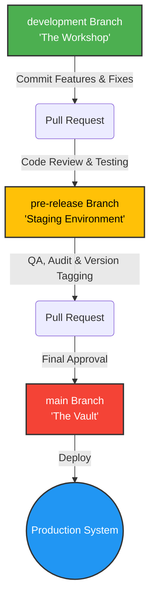

# Contributing to Nexus Hub

Welcome to the Nexus Hub project! We're excited to have you contribute. This document will guide you through our standard workflow, from setting up your local environment to understanding our branching and database safety rules.

## 1. VS Code Environment Setup

To get started with development, follow these steps to configure your local VS Code environment:

1. **Clone the Repository:**
   Open your terminal and clone the repository:
   ```bash
   git clone https://github.com/FrankXLT/Nexus-Hub-for-Google.git
   cd Nexus-Hub-for-Google
   ```

2. **Switch to the Development Branch:**
   All active coding happens on the `development` branch. Switch to it immediately:
   ```bash
   git checkout development
   ```

3. **Open in VS Code:**
   ```bash
   code .
   ```

4. **Configure Python Environment:**
   Inside VS Code, open the integrated terminal (`Ctrl + ~` or `Cmd + ~`).
   Create and activate a virtual environment:
   ```bash
   # Windows
   python -m venv venv
   .\venv\Scripts\activate

   # macOS/Linux
   python3 -m venv venv
   source venv/bin/activate
   ```
   Install dependencies:
   ```bash
   pip install -r requirements.txt
   ```
   *Tip: Ensure VS Code uses the python interpreter from your new `venv` by selecting it from the Command Palette (`Ctrl+Shift+P` -> `Python: Select Interpreter`).*

5. **Docker Configuration:**
   If you are running the backend stack locally, ensure Docker Desktop is running. You can start the local database and services via:
   ```bash
   docker-compose up -d
   ```

## 2. Branching Strategy

We enforce a strict branching strategy to protect the stability of the application.

*   **`main` (The Vault):** This is the production-ready code. It is locked and protected. Code only enters `main` via an approved Pull Request from `pre-release`.
*   **`pre-release` (Staging/Testing):** This branch acts as our staging environment. Features and fixes are aggregated here for final testing, SemVer versioning, and QA before moving to `main`.
*   **`development` (The Workshop):** This is where all active coding occurs. You should create feature branches off of `development` or commit directly to it if you are the sole contributor for a feature.

## 3. Feature Lifecycle Architecture

Here is the visual mapping of how a feature moves from inception to production:



## 4. Database Safety Protocols

Because Nexus Hub relies heavily on a structured SQLite (WAL mode) database, database integrity is paramount.

Any deployment, feature, or script that modifies the database schema or bulk data **MUST** adhere to the following safety protocols:

1. **Idempotent SQL Scripts:** All database migration scripts (e.g., running from `/migrations` during startup) must be idempotent. Use `CREATE TABLE IF NOT EXISTS` and check for column existence before running `ALTER TABLE`. The script should be safe to run multiple times without causing errors.
2. **Transaction Blocks:** Any query that modifies data (INSERT, UPDATE, DELETE) or schema (ALTER, CREATE) must be strictly wrapped within a SQL transaction block:
   ```sql
   BEGIN TRANSACTION;
   -- Your queries here
   COMMIT;
   ```
   If a script is executed via Python, rely on the connection context managers or explicitly call `.commit()` only upon successful execution of all commands, rolling back on failure.
3. **Automated Snapshots:** Before deploying a migration to production, ensure that an automated snapshot of the `.db` files has been captured. Do not manually manipulate database state on production servers without a verifiable backup strategy in place.
