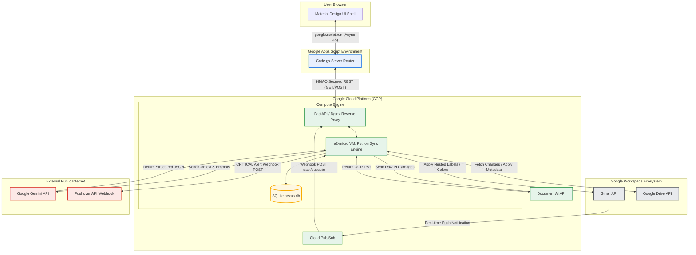
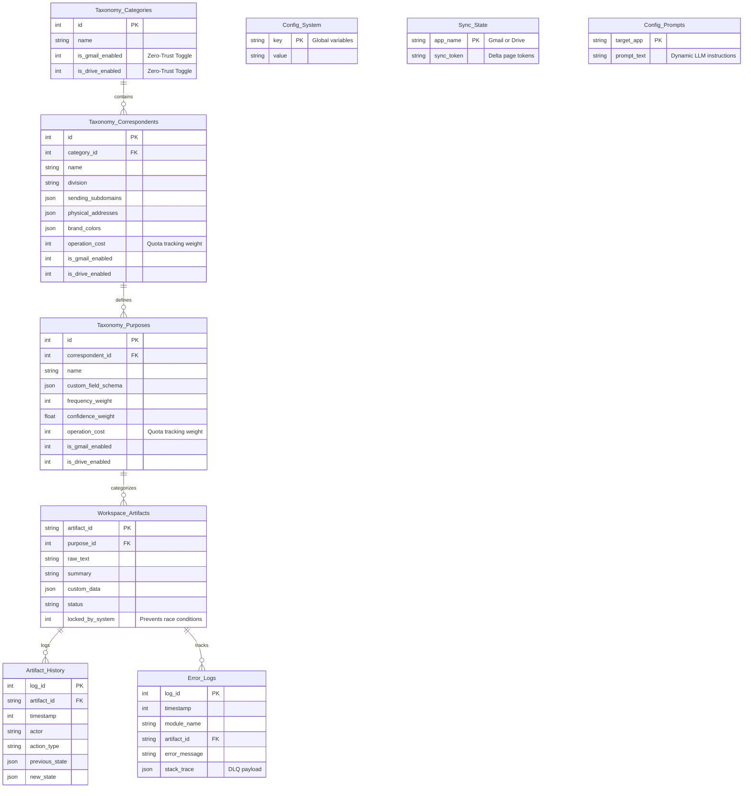
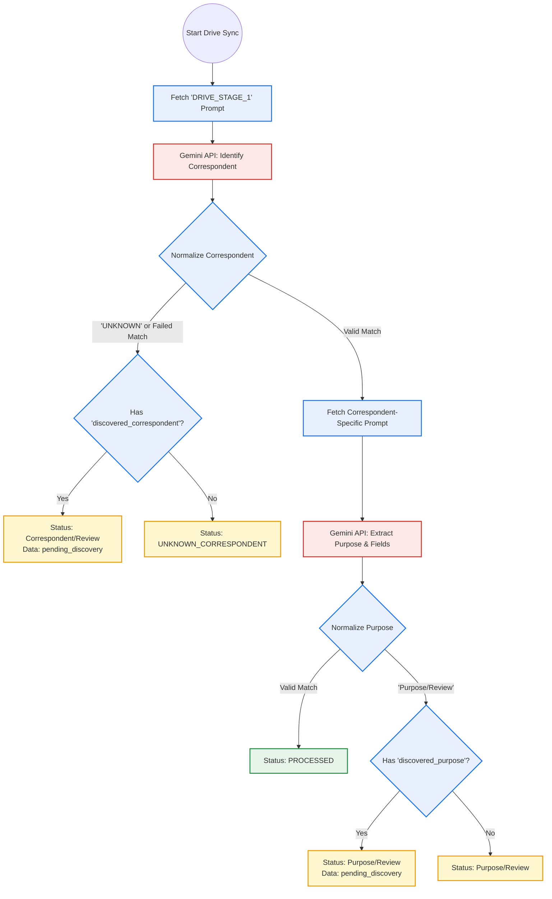
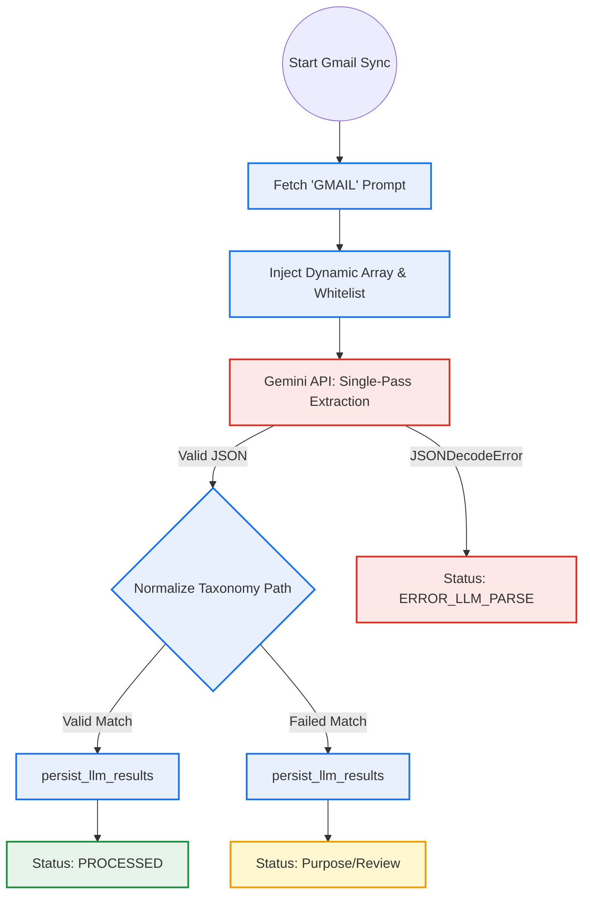
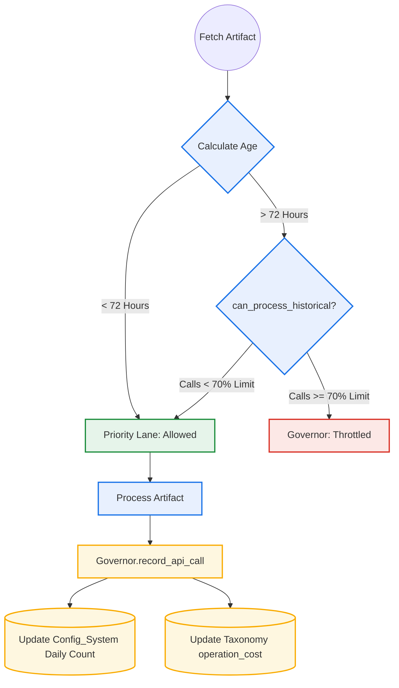

# HOW NEXUS WORKS: Master Software Requirements & Architecture Specification

## 1. Executive Summary & Core Features

### The Zero-Inbox Philosophy
Nexus operates on the principle of a "zero-inbox" philosophy, acting as the spiritual successor to Google Inbox. Instead of relying on manual sorting or rigid keyword algorithms, the system employs Large Language Models (LLMs) to semantically comprehend unstructured documents and emails. It categorizes, extracts custom data, and routes these artifacts into a unified, centralized relational database (`nexus.db`). By automating the organizational overhead, Nexus transforms a chaotic digital workspace into a highly organized, task-oriented knowledge graph.

**File Reference:**
* `db_init.py` - Initializes the centralized SQLite `nexus.db` engine that makes zero-inbox tracking possible.

### Core Features
* **Zero-Touch Autonomy:** Natively monitors Gmail and Google Drive via delta-syncs and Pub/Sub webhooks, automatically tagging and sorting without manual intervention.
* **Three-Tier Hierarchical Taxonomy:** Enforces logical grouping (`Category` -> `Correspondent` -> `Purpose`) to prevent directory sprawl.
* **Intelligent Quota Governor:** Defends daily Google API limits by throttling historical batch processing while prioritizing real-time emails.
* **Entity Bootstrapping:** Transforms your Google Contacts into deterministic AI routing profiles.
* **Dynamic AI Pipelines:** Inject multi-dimensional context (subdomains, physical addresses) to ensure deterministic LLM routing.
* **RAG Knowledge Retrieval:** Provides natural language Chat-to-SQL capabilities.
* **Diagnostic Watchdog & Alerting:** Self-monitors and pushes critical failure alerts to mobile devices.

---

## 2. Infrastructure & Multi-Level Topology

Nexus bridges the serverless convenience of Google Apps Script with the computational power of a dedicated Python Virtual Machine (VM). 

### The Three Levels of Architecture
* **Service Level (GCP VM vs. Apps Script):** 
  The frontend is completely serverless, deployed via Google Apps Script to provide a zero-dependency, zero-maintenance UI. The backend runs persistently on a Google Cloud Platform (GCP) `e2-micro` VM to sidestep the strict 6-minute execution limits of Apps Script.
* **Software/API Level:** 
  The VM runs a containerized Python application utilizing Docker. `FastAPI` acts as the webhook receiver and router. The Python sync and LLM engines communicate securely with the `Gemini API` (for data extraction) and `Google Workspace APIs` (for fetching emails and files).
* **User Data Level:** 
  Raw data (emails, PDFs) is pulled from Google servers, stripped of heavy metadata via Document AI OCR, and processed by the LLM. The extracted structured data (Summary, Taxonomy, Custom Fields) is written to the local SQLite index on the VM.

**File References:**
* `docker-compose.yml` - Orchestrates the two Python microservices natively on the VM.
* `main.py` - The FastAPI entry point for incoming webhook and API requests.
* `sync_engine.py` - Actively fetches changes from Google services.
* `llm_engine.py` - Interfaces with the Gemini AI to extract user data.

### Macro Topology Diagram



---

## 3. The Frontend User Interface (UI)

The UI is a decoupled Single-Page Application (SPA) utilizing vanilla HTML, CSS, and JS served natively from Google Apps Script. 

### Features & Layout
The interface utilizes a split-pane Material Design layout. 
* **Data Grid:** A sortable, filterable list of artifacts.
* **Zero-Trust Review Queue:** Displays explicitly quarantined items (newly discovered senders) pending user approval.
* **Manual Overrides & Bulk AI Correction:** Users can correct LLM classifications, triggering asynchronous background tasks that tune the AI prompts.
* **RAG Chat & Sandbox:** A conversational UI allowing users to execute "Dry Run" prompts against specific files or run natural language queries across their entire document base.

### The HMAC-SHA256 Webhook Bridge
Apps Script communicates with the FastAPI backend over a cryptographically secured bridge. When a user updates data, Apps Script attaches a UNIX timestamp, signs the payload with a shared secret using HMAC-SHA256, and dispatches the POST request. The Python backend validates the hash and verifies the timestamp is within 5 minutes to prevent replay attacks.

**File References:**
* `Index.html` - The core frontend shell template.
* `JS_Actions.html` - Handles DOM manipulation, asynchronous `google.script.run` actions, and RAG chat.
* `JS_State.html` - In-memory client state management to handle high-performance rendering.
* `Code.gs` - The Apps Script server router handling HMAC signing and payload delivery to the VM.
* `main.py` - Validates the HMAC signature via FastAPI middleware before accepting updates.

---

## 4. Database Schema & Multi-Dimensional Taxonomy

### SQLite WAL & Relational Integrity
The engine uses SQLite configured with Write-Ahead Logging (`PRAGMA journal_mode=WAL;`). This is critical because it allows the FastAPI webhook threads to read the database simultaneously while the background `sync_engine` is writing bulk document updates, preventing database lock exceptions.

### The 3-Tier Hierarchy
Nexus abandons flat labeling for a strict hierarchical path: `Category` -> `Correspondent/Division` -> `Purpose`. The `Workspace_Artifacts` table uses `purpose_id` as its sole foreign key constraint. Because a Purpose intrinsically belongs to a specific Correspondent and Category, this cascading structure allows administrators to rename or shift nodes without requiring expensive bulk updates to the artifact rows themselves.

### Entity Bootstrapping & Zero-Trust Quarantine
* **Drive Seed Ingestion:** A background process detects `taxonomy_seed.json` in Google Drive to import bulk configurations.
* **Google Contacts API:** Transforms personal contacts into deterministic `Taxonomy_Correspondents` records.
* **Zero-Trust Quarantine:** Whenever a new entity is discovered by the LLM or ingested via Contacts/Seed, the system forces `is_gmail_enabled = 0` and `is_drive_enabled = 0`. These entities sit in the Zero-Trust Review Queue and act as a blacklist preventing autonomous routing until a human explicitly reviews and enables them.

**File References:**
* `db_init.py` - Sets up the SQLite schema, constraints, and PRAGMAs.
* `sync_engine.py` - Handles the logic for Drive seed parsing and Google Contacts ingestion into the Taxonomy tables.

### Entity Relationship Diagram



---

## 5. The Synchronization Engine

The synchronization engine implements distinct processing strategies tailored to the input data type.

### Drive Two-Stage Triage Logic
Google Drive documents (PDFs, images) are unstructured and noisy even after OCR. Feeding massive whitelists into the LLM simultaneously dilutes instructions. 
* **Stage 1 (Triage):** Identifies the Vendor/Correspondent from the OCR text.
* **Stage 2 (Enforce & Extract):** Constructs a hyper-focused prompt containing only the specific Purposes valid for that identified Correspondent, requesting deep extraction of custom schema fields.

**File References:**
* `sync_engine.py` - Fetches the documents from Drive.
* `llm_engine.py` - Executes `process_drive_document()` for the Two-Stage Triage.



### Gmail Single-Pass Logic
Because emails arrive with highly structured metadata (verified Sender Email, Subject Line), the LLM can confidently determine the exact Purpose and extract Custom Fields in a single request. 

**File References:**
* `sync_engine.py` - Fetches delta histories using Gmail historyId.
* `llm_engine.py` - Executes `process_gmail_thread()` for the Single-Pass extraction.



---

## 6. The Intelligent Quota Governor

To prevent Google API exhaustion and ensure real-time responsiveness, Nexus features an intelligent `QuotaGovernor`. 

### 72-Hour Priority Lane Math
For every artifact fetched during a sync, the governor calculates its age. If it was generated within the last 72 hours, it skips throttling entirely—utilizing a reserved 30% API budget. Artifacts older than 72 hours (historical backlog) are subjected to the throttle; if the daily API calls exceed the remaining 70% limit, processing halts. This ensures urgent daily tasks are never starved by massive mailbox migrations.

**File Reference:**
* `sync_engine.py` - Contains the `QuotaGovernor` class and `process_file_with_governor()` logic tracking the `operation_cost`.



---

## 7. The AI & Dynamic Prompt Pipeline

Nexus abandons hardcoded system prompts in favor of a dynamic, database-driven tuning loop.

* **Dynamic `Config_Prompts`:** Core system roles and tuning rules are stored in SQLite. Administrators can modify AI behavior on-the-fly via the UI without editing Python code or redeploying Docker containers.
* **Context-Aware Injection:** Rather than passing flat "whitelist" names, the system dynamically generates an `[ENTITY_PROFILES]` dictionary containing the known `sending_subdomains` and `physical_addresses` of correspondents. The LLM cross-references the raw document against these profiles for incredibly deterministic routing.
* **RAG Text-to-SQL:** The RAG interface limits API token costs by avoiding semantic vector searches. It implements a Text-to-SQL logic, generating a read-only query against the SQLite metadata, returning the rows, and feeding them to the LLM to synthesize a natural language response.

**File References:**
* `db_init.py` - Seeds the baseline prompts and `[ENTITY_PROFILES]` placeholders.
* `llm_engine.py` - Joins taxonomy strings to inject the dictionary schemas, generates self-tuning rules, and executes the RAG Text-to-SQL logic (`ask_rag()`).
* `main.py` - Exposes `GET /api/prompts` and `POST /api/prompts` to the frontend.

---

## 8. VM Lifecycle & Containerization

The architecture enforces strict containerization using Docker for reproducibility and security.

* **Multi-Stage Build:** The `Dockerfile` uses a `builder` stage that temporarily installs `build-essential` to compile Python dependencies into `.whl` files. The final `runner` stage strictly copies those pre-compiled wheels, stripping the image of heavy, vulnerable compilation tools.
* **Orchestration:** `docker-compose.yml` orchestrates two distinct services: `nexus-api` (the web server) and `nexus-sync-engine` (the background processor). Both mount the same persistent volume (`/data`) containing `nexus.db`.
* **Deployment Automation:** `setup.sh` installs the necessary system prerequisites (Docker, Node.js, clasp) safely on an Ubuntu VM, while `update.sh` manages git pulls, database migrations, and safe container restarts.

**File References:**
* `Dockerfile` - The Multi-Stage image definitions.
* `docker-compose.yml` - Defines the microservices and mounted volumes.
* `setup.sh` / `update.sh` - Automated lifecycle bash scripts.

---

## 9. Telemetry, Diagnostics & Notifications

Nexus is deeply observable, equipped with an alerting matrix to protect automated infrastructure.

### Error Logs (DLQ)
If an API crashes or the Gemini LLM hallucinates malformed JSON, the stack trace and payload are logged directly into the `Error_Logs` table. This serves as a Dead-Letter Queue (DLQ) for later retry or administrator review.

### 15-Minute Watchdog & Alerts
A host-level cron job automatically invokes `diagnostics.py` every 15 minutes within the `nexus-sync-engine` container.
* It evaluates three layers: It writes to the Database to ensure the disk is not locked, checks the headless OAuth `token.json` for expiration, and executes a `curl` against `http://nexus-api:8000/api/health` to confirm the internal FastAPI server is responsive.
* If any layer fails, `notifier.py` skips the database entirely and sends a CRITICAL HTTP POST webhook to Pushover for mobile notifications. Non-critical warnings (quarantined entities or errors) are digested into an HTML report and sent via Gmail every 24 hours.

**File References:**
* `db_init.py` - Schema definition for the `Error_Logs` table.
* `diagnostics.py` - The three-layer health check script.
* `setup.sh` - Installs the cron tab logic.
* `notifier.py` - Exposes Pushover webhook triggers and Gmail Digest functions.

### Diagnostic Watchdog Flowchart

```mermaid
flowchart TB
    classDef appsScript fill:#e8f0fe,stroke:#1a73e8,stroke-width:2px;
    classDef gcp fill:#e6f4ea,stroke:#1e8e3e,stroke-width:2px;
    classDef database fill:#fef7e0,stroke:#f9ab00,stroke-width:2px;
    classDef googleApi fill:#e8eaed,stroke:#5f6368,stroke-width:2px;
    classDef external fill:#fce8e6,stroke:#d93025,stroke-width:2px;

    subgraph Execution Triggers
        Cron[Host VM: 15-Min Cron Job]
        UI[Apps Script UI: Manual Run]
    end
    class Cron,UI appsScript

    subgraph GCP Compute Engine (Local VM)
        WH[nexus-api: FastAPI]
        Diag[nexus-sync-engine: diagnostics.py]
        DB[(nexus.db SQLite)]
        Notif[notifier.py]

        UI -- "HMAC Webhook" --> WH
        WH -- "Triggers" --> Diag
        Cron -- "docker run" --> Diag

        Diag -- "1. Test R/W Lock" --> DB
        Diag -- "2. Ping /api/health" --> WH
        Diag -- "If Any Check Fails" --> Notif
    end
    class WH,Diag,Notif gcp
    class DB database

    subgraph External Ecosystem
        Auth[Google OAuth]
        Drive[Google Drive]
        Push[Pushover API]

        Diag -- "3. Verify token.json" --> Auth
        Diag -- "4. Upload JSON Report" --> Drive
        Notif -- "Send CRITICAL Mobile Alert" --> Push
    end
    class Auth,Drive googleApi
    class Push external
```

---

## 10. Acronym Glossary

* **API (Application Programming Interface):** The interface allowing Nexus to fetch data from external services (Gmail, Drive).
* **DLQ (Dead-Letter Queue):** A queue (in this case, `Error_Logs`) where messages or tasks that fail to process are safely routed for analysis.
* **GCP (Google Cloud Platform):** Google's infrastructure offering, where the persistent e2-micro VM resides.
* **HMAC (Hash-Based Message Authentication Code):** A cryptographic signature utilizing a shared secret to verify both data integrity and authenticity.
* **LLM (Large Language Model):** The Gemini AI model used to comprehend unstructured data semantics.
* **OCR (Optical Character Recognition):** Document AI's process of turning PDFs and images into readable text.
* **RAG (Retrieval-Augmented Generation):** Enhancing LLM outputs by feeding them relevant retrieved documents; implemented here via Text-to-SQL.
* **SPA (Single Page Application):** A web architecture where content is loaded dynamically without full page reloads.
* **STP (Straight-Through Processing):** Automated handling of a task from initiation to conclusion without human intervention.
* **UI (User Interface):** The visual, interactive dashboard presented in the browser.
* **VM (Virtual Machine):** The dedicated server running Ubuntu Linux executing the Docker containers.
* **WAL (Write-Ahead Logging):** An SQLite journaling mode that enables extremely fast concurrency (allowing simultaneous reading and writing without locking).
* **WCAG (Web Content Accessibility Guidelines):** Contrast requirements to ensure branded colors remain readable on the UI and inside Gmail labels.