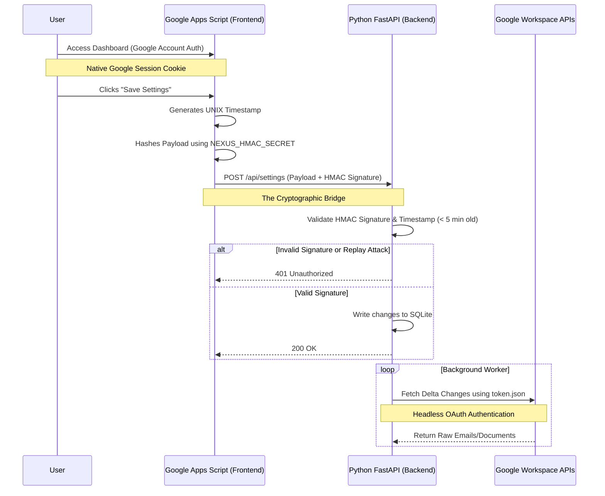
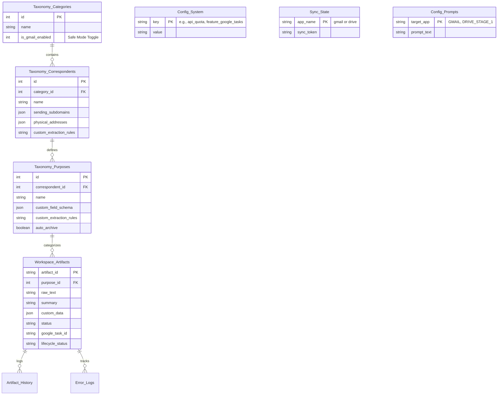

# Nexus Hub for Google


Nexus Hub is a self-hosted, AI-powered knowledge management system that unifies your Google Workspace ecosystem. Acting as the spiritual successor to Google Inbox, it transforms unstructured emails and Google Drive documents into a centralized, queryable relational database.

By leveraging Google's Gemini Large Language Models (LLMs) and a strictly governed Zero-Trust Taxonomy, Nexus Hub autonomously categorizes, extracts, and organizes your digital life. 

---

## 1. Executive Summary

### The Zero-Inbox Philosophy
Nexus Hub abandons legacy folder-sorting and rigid keyword algorithms. Instead, it employs Semantic AI to comprehend the *intent* of unstructured documents and emails. It automatically categorizes them, extracts custom metadata fields, and routes these artifacts into a unified relational database ([`nexus.db`](./nexus.db)). By automating organizational overhead, Nexus Hub transforms a chaotic digital workspace into a highly organized, task-oriented knowledge graph.

### The Privacy Guarantee: Your Data, Your Walled Garden
> 🧠 **Knowledge Point: What is a Walled Garden?**
> A "Walled Garden" is a closed ecosystem. Many AI startups require you to forward your private emails to their proprietary servers. Nexus Hub is deployed *entirely* within your personal Google Cloud Platform (GCP) project. Your data never transits a third-party server, and because we utilize Google's Enterprise Gemini API, your private documents are **never** used to train public foundation models.

---

## Table of Contents
* [1. Executive Summary](#1-executive-summary)
* [2. Version History](#2-version-history)
* [3. System Architecture & Topology](#3-system-architecture--topology)
* [4. Authentication & Security Boundaries](#4-authentication--security-boundaries)
* [5. Database Architecture & Taxonomy Schema](#5-database-architecture--taxonomy-schema)
* [6. Core Engines: What Files Do What](#6-core-engines-what-files-do-what)
* [7. Infrastructure as Code (IaC)](#7-infrastructure-as-code-iac)
* [8. AI-Assisted Development CONOPS](#8-ai-assisted-development-conops)
* [9. Acronym Glossary](#9-acronym-glossary)

**Table of Figures**
* [Figure 1: Macro Topology & Communication Paths](#figure-1-macro-topology--communication-paths)
* [Figure 2: Dual-Authentication & HMAC Handshake](#figure-2-dual-authentication--hmac-handshake)
* [Figure 3: Entity Relationship Diagram](#figure-3-entity-relationship-diagram)

---

## 2. Version History

Development is tracked via Architectural Epics following a `YYYY.Epic.Major.Minor` schema. 

| Version | Epic | Description |
| :--- | :--- | :--- |
| **v2026.6.0.0** | Epic 6.0 | Deprecated Docker to free system resources, upgraded IaC scripts to interactive wizards, and completely rewrote the Installation Manual for beginners. |
| **v2026.5.3.0** | Epic 5.3 | Executed Melding Audit Remediation: Wired dead Omnibox buttons and restored access to the Workflow Hub modal. |
| **v2026.5.0.0** | Epic 5.0 | Executed Pre-Flight Remediation: Patched Google Tasks schema crashes, injected Safe Mode gatekeepers, and wired missing Code.gs bridges. |
| **v2026.4.2.0** | Epic 4.2 | Engineered the CI/CD deploy script integrating clasp and gcloud, officially deprecating legacy shell scripts. |
| **v2026.4.1.0** | Epic 4.1 | Built the Zero-Touch Provisioner for automated GCP VM deployment and deprecated manual setup scripts. |
| **v2026.3.8.0** | Epic 3.8 | Finalized the collapsible sidebar, consolidated all existing modals into the navigation tree, and configured dynamic boot routing. |
| **v2026.3.7.0** | Epic 3.7 | Implemented the Threads UI Sankey diagram with interactive routing and color weaving. |
| **v2026.3.6.0** | Epic 3.6 | Implemented the System Analytics Dashboard using Chart.js. |
| **v2026.3.5.0** | Epic 3.5 | Built the global 'Select All' UX pattern for massive query-based bulk operations. |
| **v2026.3.4.0** | Epic 3.4 | Implemented the Aggregate Context Drawer supporting bulk Zero-Shot Rule generation. |
| **v2026.3.3.0** | Epic 3.3 | Upgraded the Omnibox with interactive AST chips and Tab-autocomplete prediction. |
| **v2026.3.2.0** | Epic 3.2 | Adapted the existing artifact data renderer into the responsive, metadata-first Knowledge Grid. |
| **v2026.2.7.0** | Epic 2.7 | Built the Zero-Shot Rule generation API for bulk UI tuning. |
| **v2026.2.5.0** | Epic 2.5 | Engineered Mission Control API with SQLite temporal grouping. |
| **v2026.2.4.0** | Epic 2.4 | Engineered the Threads API with long-tail grouping and brand color injection. |
| **v2026.2.3.0** | Epic 2.3 | Engineered the Backend Search AST supporting exclusions, temporal parsing, and pagination. |
| **v2026.1.8.0** | Epic 1.8 | Engineered the Google Tasks Action Engine for autonomous workflow generation. |
| **v2026.1.7.0** | Epic 1.7 | Engineered the Materialization Pipeline, Lineage Tracking, and Workflow Hub. |
| **v2026.0.45.0**| Epic 0 | Baseline Webhook and Architecture completed, integrating Google Apps Script UI with Python VM. |

*(For full historical logs, consult the `AUDIT` and `ROADMAP` directories.)*

---

## 3. System Architecture & Topology

Nexus Hub operates on a serverless-hybrid 3-Tier architecture, combining the zero-maintenance benefits of Google Apps Script with the computational depth of a persistent cloud Virtual Machine.

> 🧠 **Knowledge Point: Why an e2-micro VM instead of Docker/Cloud Run?**
> Google Cloud offers a free-tier `e2-micro` VM. By managing the Python environment natively via `systemd` rather than heavy Docker containers, we preserve the limited 1GB of RAM entirely for the SQLite database engine and the FastAPI worker loops, ensuring lightning-fast performance for absolutely zero cost.

<a id="figure-1-macro-topology--communication-paths"></a>
### Figure 1: Macro Topology & Communication Paths

```mermaid
flowchart TB
    classDef browser fill:#f9f9f9,stroke:#333,stroke-width:2px;
    classDef gas fill:#e8f0fe,stroke:#1a73e8,stroke-width:2px;
    classDef gcp fill:#e6f4ea,stroke:#1e8e3e,stroke-width:2px;
    classDef external fill:#fce8e6,stroke:#d93025,stroke-width:2px;
    classDef db fill:#fef7e0,stroke:#f9ab00,stroke-width:2px;

    subgraph Client Browser
        UI[Material Design SPA\n(Index.html, JS_Actions.html)]
    end
    class UI browser

    subgraph Serverless Frontend
        GS[Code.gs Bridge]
    end
    class GS gas

    subgraph "GCP e2-micro VM (Backend)"
        API[FastAPI Router\n(main.py)]
        Worker[Background Tasks\n(sync_engine.py)]
        DB[(SQLite nexus.db)]
        
        API <--> DB
        Worker <--> DB
    end
    class API,Worker gcp
    class DB db

    subgraph Google Workspace APIs
        Gmail[Gmail Push/History]
        Drive[Google Drive Delta]
        Tasks[Google Tasks]
    end
    class Gmail,Drive,Tasks external

    subgraph External Intelligence
        Gemini[Gemini API]
        Pushover[Mobile Webhooks]
    end
    class Gemini,Pushover external

    %% Connections
    UI -- "google.script.run" <--> GS
    GS -- "HMAC-Secured POST" <--> API
    
    Gmail -- "Pub/Sub Webhooks" --> API
    Worker -- "Delta Sync Fetch" <--> Gmail
    Worker -- "Download/Relocate" <--> Drive
    Worker -- "Create To-Dos" --> Tasks
    
    Worker -- "Prompts & Context" <--> Gemini
    Worker -- "Critical Alerts" --> Pushover
```

---

## 4. Authentication & Security Boundaries

Security in Nexus Hub relies on a strict separation of concerns. The visual interface (Frontend) and the automated workers (Backend) authenticate through entirely different mechanisms.

> 🧠 **Knowledge Point: What is HMAC-SHA256?**
> Hash-Based Message Authentication Code (HMAC) is a cryptographic handshake. Because the Python backend API is open to the internet on Port 8000, anyone could technically send a payload to it. To prevent this, both the UI and the Backend share a secret password (`NEXUS_HMAC_SECRET`). When the UI sends a command, it mathematically signs the payload. The Backend validates this signature and instantly drops any unauthorized traffic.

<a id="figure-2-dual-authentication--hmac-handshake"></a>
### Figure 2: Dual-Authentication & HMAC Handshake



---

## 5. Database Architecture & Taxonomy Schema

### The Anti-Folder Philosophy
Nexus Hub avoids nested folders to prevent "directory sprawl." Because SQLite permanently tracks immutable `artifact_id`s, a document can reside anywhere in your Google Drive without breaking the system. We map these artifacts relationally using a 3-Tier structure: `Category` → `Correspondent` → `Purpose`.

> 🧠 **Knowledge Point: What is SQLite WAL Mode?**
> By default, SQLite locks the *entire* database whenever it writes data. If the AI is busy writing a massive email summary, the UI would freeze if it tried to read data simultaneously. We use `PRAGMA journal_mode=WAL;` (Write-Ahead Logging), which allows our background `sync_engine.py` to write gigabytes of data while the frontend `main.py` serves search queries to the user perfectly concurrently.

<a id="figure-3-entity-relationship-diagram"></a>
### Figure 3: Entity Relationship Diagram



---

## 6. Core Engines: What Files Do What

Nexus Hub's codebase is meticulously organized into discrete engines.

### The Backend Brains (Python)
* **`db_init.py`:** Initializes the SQLite schema, enforces JSON data validation, and seeds the default system configurations, safe-mode gatekeepers, and global LLM prompts.
* **`main.py`:** The FastAPI application. It is the central nervous system that listens for Pub/Sub webhooks and HMAC-secured requests from the UI. It hosts the Advanced Search AST parser and the Analytics API endpoints.
* **`sync_engine.py`:** The massive background worker. It manages the **Quota Governor**, fetches delta changes from Gmail/Drive, integrates with Google Contacts for Entity Bootstrapping, and automatically provisions Google Tasks for actionable artifacts.
* **`llm_engine.py`:** Handles Gemini API interactions. It contains the logic for **Two-Stage Triage** (optimizing massive OCR payloads by identifying the vendor before requesting exact fields) and **Zero-Shot Rule Generation**.
* **`retention_worker.py`:** The "Inbox Sweeper." Evaluates user-defined rules to permanently auto-archive or trash aging promotional and social emails safely.
* **`diagnostics.py`:** The 15-minute Watchdog. Natively ensures the database isn't locked, the OAuth tokens aren't expired, and the internal API is responsive, bridging alerts directly to mobile devices via Pushover.

### The Serverless UI Shell (HTML/JS)
* **`Index.html`:** The core DOM Blueprint. Provides the Material Design split-pane workspace, sidebar mechanics, Modals, and Chart.js `<canvas>` integrations.
* **`CSS_Styles.html`:** Contains all the styling logic and dark-mode CSS variables (`--bg-panel`, `--accent-blue`).
* **`JS_State.html`:** Manages client-side browser memory. It handles the `Set()` logic for massive multi-row selections without lagging the browser.
* **`JS_Actions.html`:** The interaction layer. Converts UI clicks into backend API calls, renders the Knowledge Grid, instantiates the Chart.js graphs, and handles the AST Search omnibox autocomplete.
* **`Code.gs`:** The cryptographic bridge. Deployed on Google servers, it houses the `sendToNexusVM()` function that appends UNIX timestamps and signs the payload with HMAC-SHA256 before securely transmitting it to your cloud VM.

---

## 7. Infrastructure as Code (IaC)

We have abandoned manual server configuration in favor of a **Zero-Touch Provisioning** model utilizing the Google Cloud CLI (`gcloud`).

By executing a single script from your local machine, the infrastructure perfectly aligns itself. 

* **`scripts/provision.sh`:** Creates the `e2-micro` VM, punches the TCP port 8000 firewall hole, automatically enables all required Google APIs, and injects a metadata startup script that silently installs Python 3, SQLite, and configures the `systemd` daemon, pausing only to guide the user through required browser OAuth clicks.
* **`scripts/deploy.sh`:** A robust CI/CD executor. It runs `clasp push` to sync your frontend UI securely into your Google Account, then uses `gcloud compute ssh` to remotely pull git updates, refresh pip dependencies, execute database schema migrations, and smoothly restart the background daemon.

### 📚 Installation Instructions
For a highly detailed, beginner-friendly walkthrough on configuring your Walled Garden and running the deployers, please consult the **[Installation Manual (INSTRUCTIONS.md)](./INSTRUCTIONS.md)**.

---

## 8. AI-Assisted Development CONOPS

Nexus Hub is designed to be maintained by Human-AI pairs. To ensure absolute stability in a multi-developer environment, all contributors must strictly adhere to the following Concept of Operations (CONOPS):

### 8.1 The Prompt Engineering & Audit Pipeline
To maintain an immutable audit trail of *why* and *how* code was generated, developers must use a two-agent system. 
1. **The Architect (Gemini Pro/Advanced):** Use a conversational LLM to brainstorm features, review pseudocode, and generate the final execution prompt. 
2. **The Executor (Gemini Code Assist / IDE Agent):** Feed the finalized prompt to your IDE agent to silently execute the file updates.

Before executing any code changes, the finalized execution prompt **MUST** be committed to [`ROADMAP/PROMPT_ROADMAP.md`](./ROADMAP/PROMPT_ROADMAP.md). This acts as our source code for AI behavior.

### 8.2 The Continuous Documentation Protocol
Documentation compiles alongside the code. Every execution prompt fed to the IDE agent must include a standard footer mandating the AI to instantly update `README.md` and insert HTML anchors to the `PROMPT_ROADMAP.md` Version History.

---

## 9. Acronym Glossary

| Term | Definition |
| :--- | :--- |
| **API** | **Application Programming Interface:** The communication protocol allowing Nexus Hub to fetch raw data from external services (Gmail, Drive) programmatically. |
| **AST** | **Abstract Syntax Tree:** The logic Nexus Hub uses to parse complex omnibox search queries (e.g., `Purpose:Receipt AND !Date:>2026-03`) into safe SQLite commands. |
| **DLQ** | **Dead-Letter Queue:** An isolated database table (`Error_Logs`) where messages or AI extractions that fail to process are safely caught for human review instead of crashing the system. |
| **GCP** | **Google Cloud Platform:** Google's cloud computing infrastructure, where the `e2-micro` Virtual Machine persistently resides. |
| **HMAC** | **Hash-Based Message Authentication Code:** A cryptographic mathematical signature utilizing a shared secret password to verify that incoming webhook data is authentic and untampered. |
| **IaC** | **Infrastructure as Code:** The practice of managing and provisioning servers through code (our `provision.sh` script) rather than clicking through manual configuration menus. |
| **LLM** | **Large Language Model:** The Gemini AI model used to comprehend unstructured data semantics. |
| **OCR** | **Optical Character Recognition:** Document AI's process of stripping PDFs and images into raw, readable text. |
| **RAG** | **Retrieval-Augmented Generation:** Enhancing LLM outputs by feeding them relevant retrieved documents. Nexus Hub implements this via a secure Text-to-SQL logic engine. |
| **SPA** | **Single Page Application:** A web architecture where content (like the `#tab-grid` or `#tab-analytics`) is swapped dynamically without causing full browser page reloads. |
| **WAL** | **Write-Ahead Logging:** An SQLite journaling mode that enables extremely fast concurrency, allowing the FastAPI webserver to read data instantly even while the background worker is writing it. |

