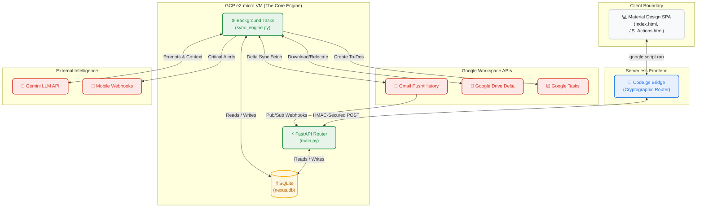
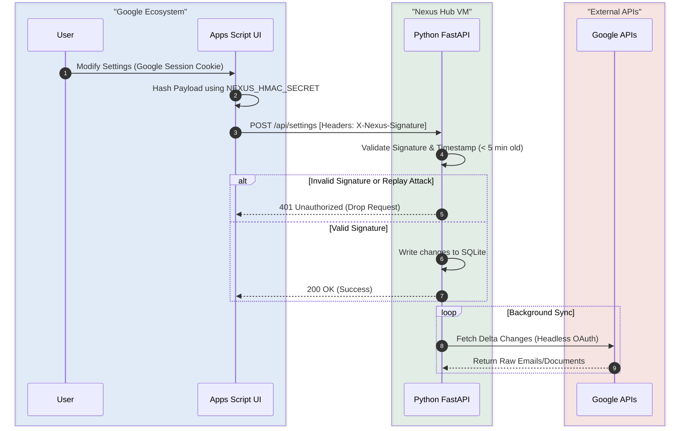
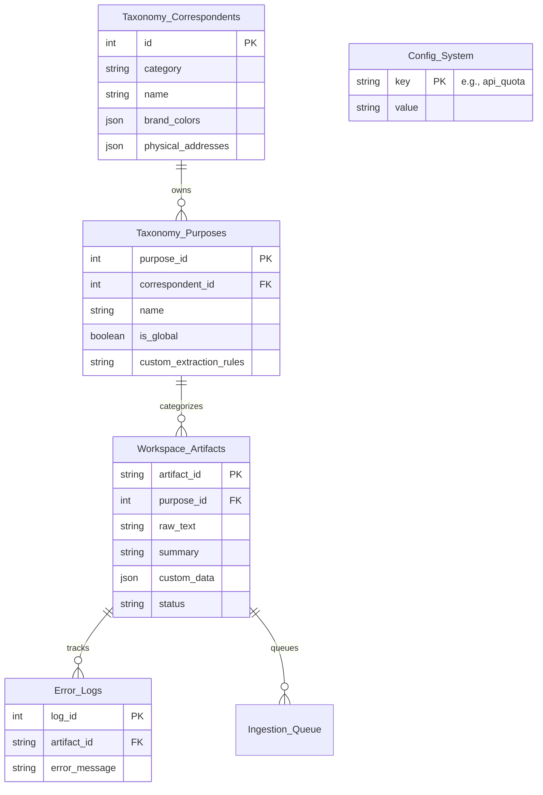
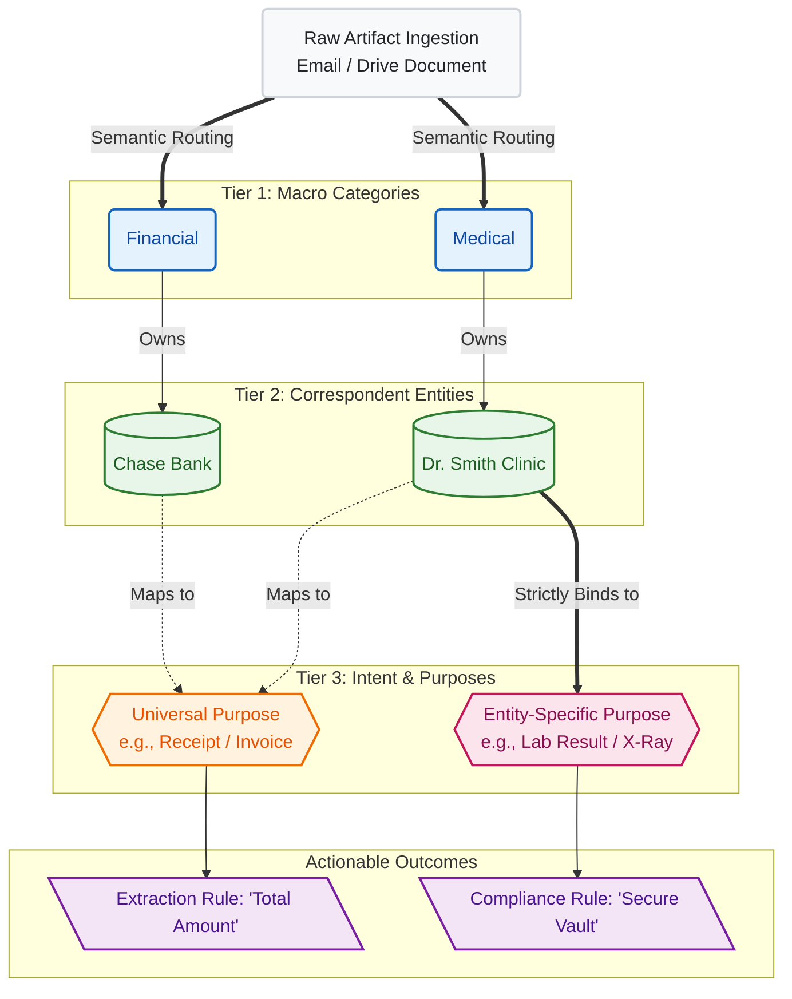
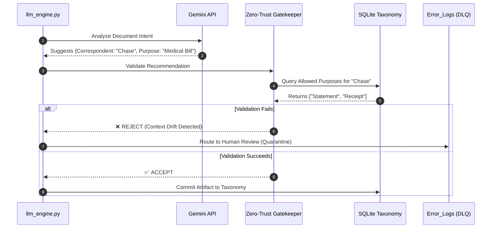
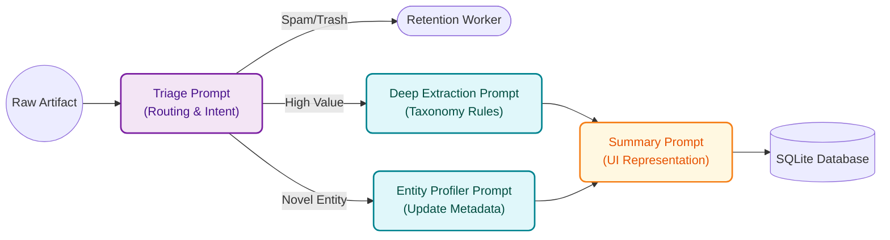

# Nexus Hub for Google


Welcome to the **Nexus Hub**, a self-hosted, AI-powered knowledge management system unifying your Google Workspace ecosystem. Acting as the spiritual successor to Google Inbox, it transforms unstructured emails and Google Drive documents into a centralized, queryable relational database.

By leveraging Google's Gemini Large Language Models (LLMs) and a strictly governed Zero-Trust Taxonomy, Nexus Hub autonomously categorizes, extracts, and organizes your digital life.

---

## 1. Executive Summary

### The Zero-Inbox Philosophy
Nexus Hub abandons legacy folder-sorting and rigid keyword algorithms. Instead, it employs Semantic AI to comprehend the *intent* of unstructured documents and emails. It automatically categorizes them, extracts custom metadata fields, and routes these artifacts into a unified relational database. By automating organizational overhead, Nexus Hub transforms a chaotic digital workspace into a highly organized, task-oriented knowledge graph.

> 🧠 **Knowledge Point: Semantic AI vs. Lexical Search**
> Traditional (lexical) search looks for exact keyword matches (e.g., finding the word "Invoice"). Semantic AI understands context and relationships. Nexus Hub can identify a document as an invoice even if the word "Invoice" is never explicitly written, vastly outperforming legacy folder rules.

### The Privacy Guarantee: Your Data, Your Walled Garden
> 🧠 **Knowledge Point: What is a Walled Garden?**
> A "Walled Garden" is a closed ecosystem. Many AI startups require you to forward your private emails to their proprietary servers. Nexus Hub is deployed *entirely* within your personal Google Cloud Platform (GCP) project. Your data never transits a third-party server, and because we utilize Google's Enterprise API terms, your private documents are **never** used to train public foundation models.

---

## 2. Table of Contents
1. [Executive Summary](#1-executive-summary)
2. [Table of Contents](#2-table-of-contents)
3. [System Architecture & Macro Topology](#3-system-architecture--macro-topology)
4. [Authentication & Security Boundaries](#4-authentication--security-boundaries)
5. [The Database & Data Ontology](#5-the-database--data-ontology)
6. [Zero-Trust AI & Sprawl Prevention](#6-zero-trust-ai--sprawl-prevention)
7. [AI Prompt Ecosystem & Pipeline](#7-ai-prompt-ecosystem--pipeline)
8. [Core Engines (Codebase Map)](#8-core-engines-codebase-map)
9. [Infrastructure as Code (IaC)](#9-infrastructure-as-code-iac)
10. [Diagnostics & Debug Logging](#10-diagnostics--debug-logging)
11. [AI-Assisted Development CONOPS](#11-ai-assisted-development-conops)
12. [Acronym Glossary](#12-acronym-glossary)
13. [Version History](#13-version-history)

---

## 3. System Architecture & Macro Topology

Nexus Hub operates on a serverless-hybrid 3-Tier architecture. It perfectly balances the zero-maintenance benefits of Google Apps Script with the computational depth of a persistent cloud Virtual Machine.

> 🧠 **Knowledge Point: Why an e2-micro VM instead of Docker/Cloud Run?**
> Google Cloud offers a free-tier `e2-micro` VM. By managing the Python environment natively via `systemd` rather than spinning up heavy, ephemeral Docker containers for every webhook, we preserve the limited 1GB of RAM entirely for the SQLite database engine and the FastAPI worker loops. This ensures lightning-fast performance for absolutely zero recurring cloud costs.

<a id="figure-1-macro-topology--communication-paths"></a>
### Figure 1: Macro Topology & Communication Paths



---

## 4. Authentication & Security Boundaries

Security in Nexus Hub relies on a strict separation of concerns. The visual interface (Frontend) and the automated workers (Backend) authenticate through entirely different mechanisms to minimize attack surfaces.

### Webhook Authentication (The HMAC Handshake)
> 🧠 **Knowledge Point: Why use HMAC-SHA256?**
> Hash-Based Message Authentication Code (HMAC) is a cryptographic handshake. Because the Python backend API is open to the internet on Port 8000, anyone could technically send a payload to it. Both the UI and Backend share a secret password (`NEXUS_HMAC_SECRET`). When the UI sends a command, it mathematically signs the payload. The Backend validates this signature and instantly drops any unauthorized traffic, securing the endpoint perfectly without requiring complex, stateful OAuth logins.

### OAuth Boundaries & Scope Justification
The background workers operate headlessly. They utilize a `credentials.json` stored securely behind the VM's firewall.
* `gmail.modify`: Required to read incoming emails, extract payloads, and subsequently apply the 'ARCHIVED' or processed labels to achieve the Zero-Inbox state.
* `drive`: Required to download newly uploaded PDFs for Document AI OCR, and to move files between the 'Nexus Dropbox' and permanent storage.
* `contacts.readonly`: Required solely for the Entity Bootstrapping phase to securely transform personal contacts into taxonomy correspondents.

<a id="figure-2-dual-authentication--hmac-handshake"></a>
### Figure 2: The Cryptographic Bridge



---

## 5. The Database & Data Ontology

The structural foundation of the Nexus Hub relies on a rigorously defined Data Ontology to eliminate chaos and bring absolute order to your artifacts.

> 🏛️ **Architecture Principle: The Anti-Folder Philosophy**
> Nexus Hub natively avoids traditional nested folders. Instead of forcing an artifact into a rigid filesystem path, our engine maps semantic intent to a strict relational hierarchy. The artifact simply exists in the void, organized entirely by its metadata relationships.

> 🧠 **Knowledge Point: What is SQLite WAL Mode?**
> By default, SQLite locks the *entire* database whenever it writes data. If the AI is busy writing a massive email summary, the UI would freeze if it tried to read data simultaneously. We use `PRAGMA journal_mode=WAL;` (Write-Ahead Logging), enabling extremely fast concurrency. Our background worker can write gigabytes of data while the frontend serves search queries perfectly simultaneously.

### Taxonomy Flow Design & Terminology

| Taxonomic Tier | Definition | Examples |
| :--- | :--- | :--- |
| **Category** | The macro-level domain or operational ecosystem the artifact belongs to. It acts as the primary partition. | `Financial`, `Medical`, `Household` |
| **Correspondent** *(Entity)* | The specific sender, vendor, institution, or individual generating the artifact. Correspondents are treated as dynamic entities with evolving metadata profiles. | `Chase Bank`, `Dr. Smith`, `State Farm` |
| **Purpose** | The actionable intent, semantic nature, or document type of the artifact. | `Monthly Statement`, `Lab Result`, `Invoice` |

### Universal vs. Entity-Specific Purposes
* **Universal Purposes:** Broad, globally recognized intents that span across multiple categories (e.g., `Receipt` or `Invoice`). They are bound to the "Global" Correspondent.
* **Entity-Specific Purposes:** Tightly coupled, specialized intents bound to certain entity types (e.g., `Lab Result` is strictly tied to a `Healthcare Provider`). The system actively prevents the AI from assigning an illogical purpose.

<a id="figure-3-entity-relationship-diagram"></a>
### Figure 3: Entity Relationship Diagram



<a id="figure-4-the-taxonomy-data-ontology-map"></a>
### Figure 4: The Taxonomy Mapping Flow



---

## 6. Zero-Trust AI & Sprawl Prevention

The taxonomy flow strictly enforces data hygiene. To completely eliminate AI hallucinations and "directory sprawl," Nexus Hub employs a **Zero-Trust Architecture** for all AI taxonomy recommendations. We treat the Large Language Model as an untrusted agent.

> 🧠 **Knowledge Point: Context Drift & Directory Sprawl**
> If you give an AI free rein to tag documents, it will create "Amazon", "Amazon.com", and "Amzn" as three separate folders (Directory Sprawl). Over time, its definition of what belongs where shifts (Context Drift). Zero-Trust AI means the AI can only select from pre-approved databases, or its suggestions are quarantined.

### The Mechanism
1. **The LLM Proposes:** The AI evaluates a document and outputs a suggested `Correspondent` and `Purpose`.
2. **The Gatekeeper Validates:** The system intercepts the recommendation and rigorously cross-references it against the definitive SQLite `Taxonomy` tables.
3. **The Absolute Boundary:** If the AI suggests an Entity-Specific `Purpose` that is not explicitly linked to that `Correspondent`, the recommendation is instantly rejected and routed to the Dead-Letter Queue (DLQ) for human review.

<a id="figure-5-zero-trust-ai-gatekeeper"></a>
### Figure 5: Zero-Trust Gatekeeper Sequence



---

## 7. AI Prompt Ecosystem & Pipeline

Nexus Hub does not use one massive "Do Everything" prompt. It utilizes a highly orchestrated pipeline of smaller, specialized prompts to optimize token usage, minimize context windows, and maximize extraction accuracy. 

> 🧠 **Knowledge Point: Retrieval-Augmented Generation (RAG)**
> When you use the "AI Assistant" in the UI, Nexus Hub uses RAG. It doesn't rely on the AI's general memory. Instead, it converts your question into a SQL query, *Retrieves* the exact rows from your SQLite database, and feeds them to the LLM to *Augment* its *Generation* of the answer.

### The Pipeline Phases
1. **The Triage Prompt (Zero-Shot):** This lightweight frontline dispatcher quickly assesses if the artifact is actionable (needs a Google Task), spam (auto-archive), or requires deep extraction.
2. **The Entity Profiler Prompt:** Triggered if the Triage Prompt identifies a novel sender. It maps extracted raw data against the existing database to seed a new Correspondent, building an evolving metadata profile.
3. **The Deep Extraction Prompt:** Summoned only for high-value artifacts (e.g., invoices). It utilizes specific `extraction_rules` defined in the Taxonomy (like finding "Total Amount") to perform surgical data extraction.
4. **The Summary Generation Prompt:** A final pass that synthesizes a concise, human-readable summary for the UI Knowledge Grid.

<a id="figure-6-ai-prompt-ecosystem"></a>
### Figure 6: AI Prompt Ecosystem Pipeline



---

## 8. Core Engines (Codebase Map)

Nexus Hub's codebase is meticulously organized into discrete engines:

### The Backend Brains (Python)
* **[`main.py`](./main.py):** The FastAPI application. It is the central nervous system that listens for Pub/Sub webhooks and HMAC-secured requests from the UI. It hosts the **Advanced Search AST parser** and Analytics endpoints.
* **[`llm_engine.py`](./llm_engine.py):** Handles Gemini API interactions, **Zero-Shot Rule Generation**, and Entity Profiling.
* **[`sync_engine.py`](./sync_engine.py):** The massive background worker. It manages the **Quota Governor**, fetches delta changes from Gmail/Drive, integrates **Drive Relocation**, and automatically provisions Google Tasks via the **Materialization Pipeline**.
* **[`retention_worker.py`](./retention_worker.py):** The "Inbox Sweeper." Evaluates user-defined rules to permanently auto-archive or trash aging emails safely.

### The Serverless UI Shell (HTML/JS)
* **[`Index.html`](./Index.html):** The core DOM Blueprint. Provides the Material Design split-pane workspace, sidebar mechanics, Modals, and Chart.js integrations.
* **[`JS_Actions.html`](./JS_Actions.html):** The interaction layer. Converts UI clicks into backend API calls, renders the Knowledge Grid, and handles AST Search autocomplete.
* **[`Code.gs`](./Code.gs):** The cryptographic bridge. Deployed on Google servers, it securely transmits payloads to your cloud VM via HMAC-SHA256.

---

## 9. Infrastructure as Code (IaC)

We have abandoned manual server configuration and deprecated Docker in favor of a **Zero-Touch Provisioning** model utilizing native `systemd` daemon management on the Google Cloud CLI (`gcloud`). 

* **[`scripts/provision.sh`](./scripts/provision.sh):** Creates the `e2-micro` VM, automatically enables all required Google APIs, and configures the `systemd` daemon.
* **[`scripts/deploy.sh`](./scripts/deploy.sh):** A robust CI/CD executor to push code to Google Apps Script and pull updates to the VM.

### 📚 Installation Instructions
For a detailed walkthrough on configuring your Walled Garden and running the deployers, consult the **[Installation Manual (INSTRUCTIONS.md)](./INSTRUCTIONS.md)**.

---

## 10. Diagnostics & Debug Logging

Nexus Hub features a resilient, distributed logging architecture to ensure system observability even when the UI is inaccessible.

* **Active Monitoring:** The backend continuously syncs critical errors and state changes to Drive, making it easy to review system health without SSH access.
* **Dead-Letter Queue Integration:** Unhandled exceptions or AI hallucination failures are routed to the `Error_Logs` table (DLQ) and subsequently summarized in the Drive diagnostic dumps.
* **Cloud Infrastructure Fallback:** If the web UI loses connection to the VM, you can SSH into the GCP VM (`gcloud compute ssh`) and inspect the `systemd` journals using `journalctl -u nexus-hub.service`.

---

## 11. AI-Assisted Development CONOPS

Nexus Hub is designed to be maintained by Human-AI pairs. To ensure absolute stability in a multi-developer environment, all contributors must strictly adhere to the following Concept of Operations (CONOPS):

### The Prompt Engineering & Audit Pipeline
1. **The Architect (Gemini Pro/Advanced):** Use a conversational LLM to brainstorm features, review pseudocode, and generate the final execution prompt. 
2. **The Executor (Gemini Code Assist / IDE Agent):** Feed the finalized prompt to your IDE agent to silently execute the file updates.

Before executing any code changes, the finalized execution prompt **MUST** be committed to [`ROADMAP/PROMPT_ROADMAP.md`](./ROADMAP/PROMPT_ROADMAP.md). This acts as our source code for AI behavior.

### The Continuous Documentation Protocol
Every execution prompt fed to the IDE agent must include a standard footer mandating the AI to instantly update `README.md` and insert HTML anchors to the `PROMPT_ROADMAP.md` Version History.

---

## 12. Acronym Glossary

| Term | Definition |
| :--- | :--- |
| **API** | **Application Programming Interface:** Protocol allowing Nexus Hub to fetch raw data. |
| **AST** | **Abstract Syntax Tree:** Logic used to parse complex omnibox search queries into safe SQLite commands. |
| **DLQ** | **Dead-Letter Queue:** An isolated database table (`Error_Logs`) where failed messages are safely caught for human review. |
| **GCP** | **Google Cloud Platform:** Google's infrastructure hosting the `e2-micro` Virtual Machine. |
| **HMAC** | **Hash-Based Message Authentication Code:** Cryptographic signature verifying webhook authenticity. |
| **IaC** | **Infrastructure as Code:** Managing and provisioning servers through code scripts. |
| **LLM** | **Large Language Model:** The Gemini AI model used to comprehend unstructured data semantics. |
| **RAG** | **Retrieval-Augmented Generation:** Enhancing LLM outputs by retrieving relevant database rows. |
| **STP** | **Straight-Through Processing:** Automated workflow processing from ingestion to task completion. |
| **WAL** | **Write-Ahead Logging:** An SQLite journaling mode enabling extremely fast concurrency. |

---

## 13. Version History

Development is tracked via Architectural Epics following a `YYYY.Epic.Major.Minor` schema.

| Version | Epic | Description |
| :--- | :--- | :--- |
| **v2026.6.0.0** | Epic 6.0 | Deprecated Docker to free system resources, upgraded IaC scripts to interactive wizards. |
| **v2026.5.3.0** | Epic 5.3 | Executed Melding Audit Remediation: Wired dead Omnibox buttons and Workflow Hub. |
| **v2026.5.0.0** | Epic 5.0 | Executed Pre-Flight Remediation: Patched schemas, Safe Mode gatekeepers. |
| **v2026.4.2.0** | Epic 4.2 | Engineered CI/CD deploy script integrating clasp and gcloud. |
| **v2026.4.1.0** | Epic 4.1 | Built the Zero-Touch Provisioner for automated GCP VM deployment. |
| **v2026.3.8.0** | Epic 3.8 | Finalized the collapsible sidebar, consolidated modals, dynamic boot routing. |
| **v2026.3.7.0** | Epic 3.7 | Implemented the Threads UI Sankey diagram with interactive routing. |
| **v2026.3.6.0** | Epic 3.6 | Implemented the System Analytics Dashboard using Chart.js. |
| **v2026.2.7.0** | Epic 2.7 | Built the Zero-Shot Rule generation API for bulk UI tuning. |
| **v2026.1.8.0** | Epic 1.8 | Engineered the Google Tasks Action Engine. |
| **v2026.0.45.0**| Epic 0 | Baseline Webhook and Architecture completed. |

*(For full historical logs, consult the `AUDIT` and `ROADMAP` directories.)*
```