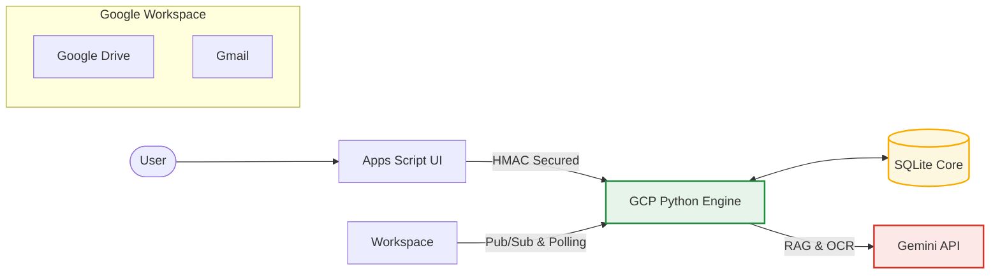
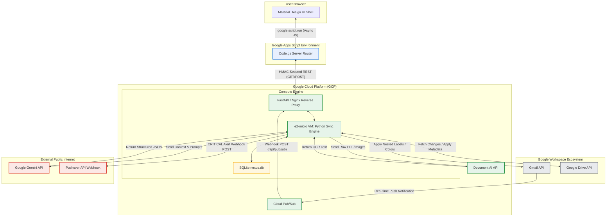
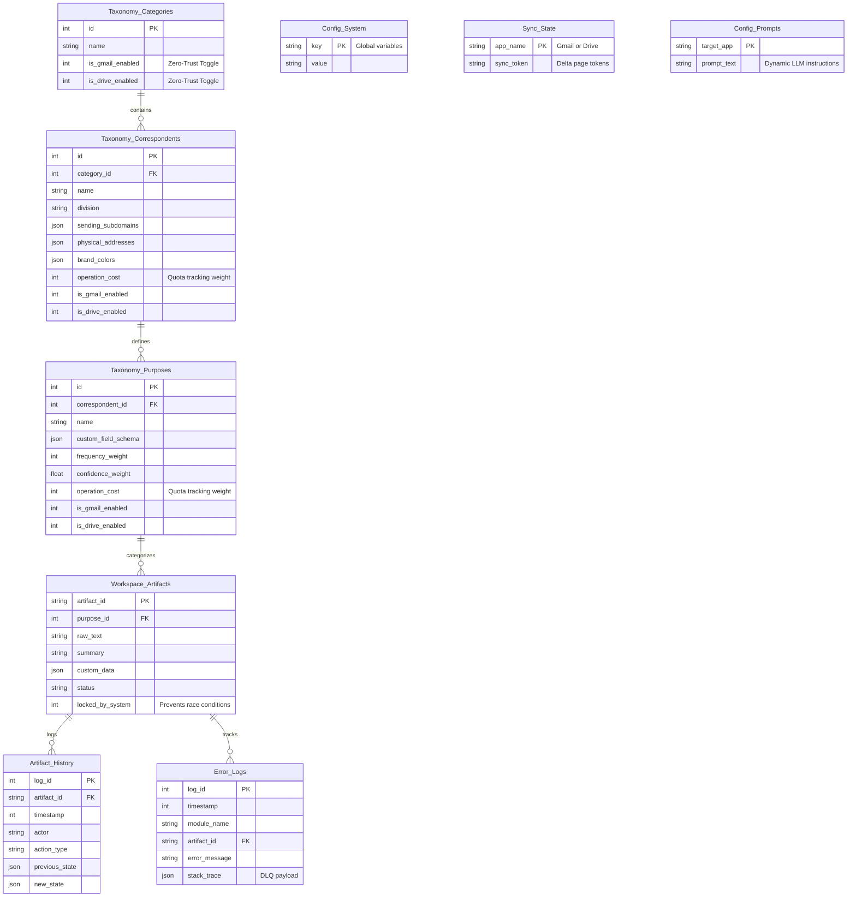
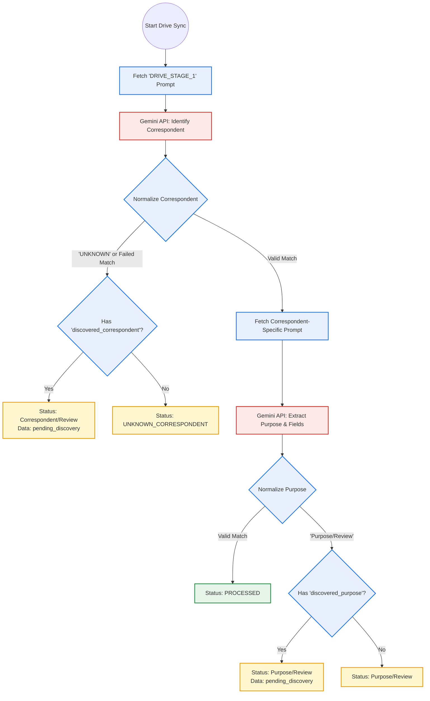
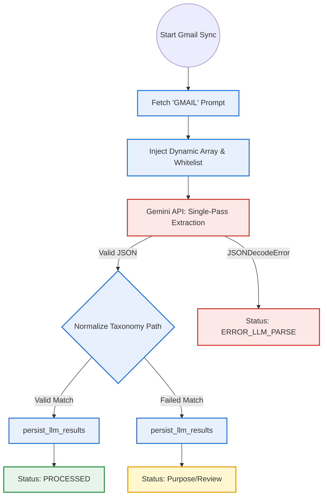
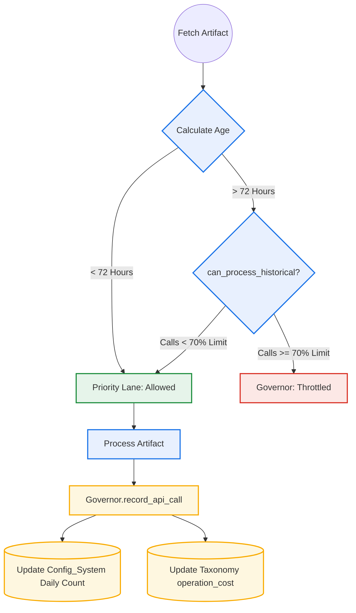
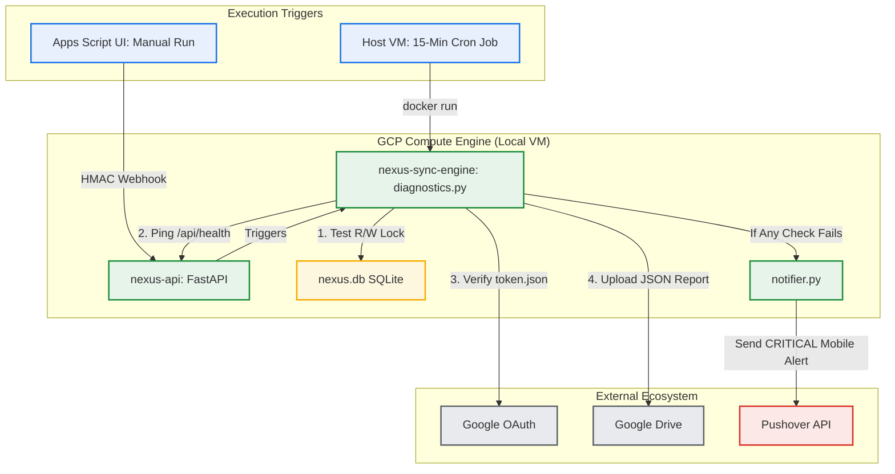
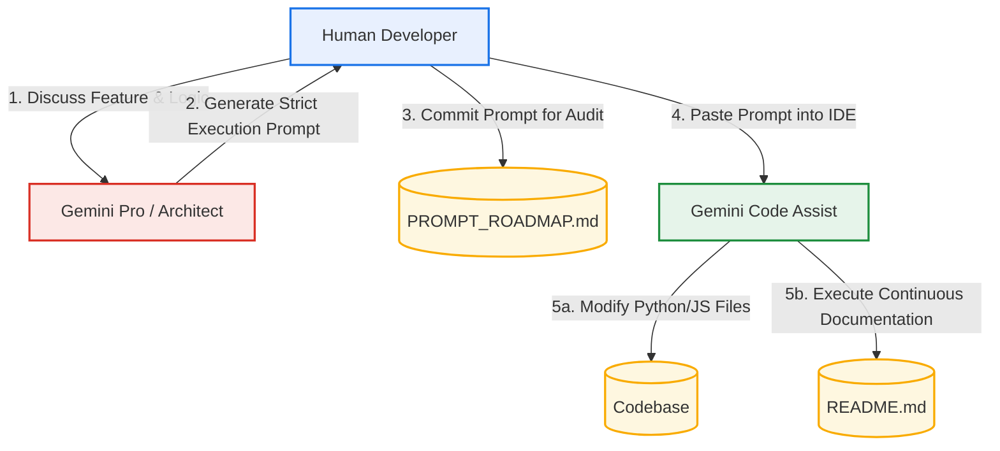

# Nexus Hub for Google

Nexus Hub is a self-hosted, AI-powered knowledge management system that unifies your Google Workspace ecosystem. Acting as the spiritual successor to Google Inbox, it transforms unstructured emails and Google Drive documents into a centralized, queryable relational database.

By leveraging Google's Gemini Large Language Models (LLMs) and a strictly governed Zero-Trust Taxonomy, Nexus Hub autonomously categorizes, extracts, and organizes your digital life while keeping your data entirely within your personal Google Cloud environment.

**Version History**
- **v1.9.1:** [Phase 45](./audit/PROMPT_ROADMAP.md#stage-45) - Built the Quota Governor Dashboard in the Apps Script UI to visualize daily API burn rates and throttling status.
- **v1.9.0:** [Phase 44](./audit/PROMPT_ROADMAP.md#stage-44) - Refactored installation scripts into a Fail-Fast architecture with direct documentation traceability and mobile webhook alerts.
- **v1.8.3:** [Phase 43](./audit/PROMPT_ROADMAP.md#stage-43) - Performed a UI tooltip sweep on all AI pipeline controls and updated the AI CONOPS to mandate the Continuous UX Protocol.
- **v1.8.2:** [Phase 42](./audit/PROMPT_ROADMAP.md#stage-42) - Documented OAuth scope justifications and token management security protocols.
- **v1.8.1:** [Phase 41](./audit/PROMPT_ROADMAP.md#stage-41) - Added a dedicated Security Architecture section detailing HMAC webhook verification and VM network isolation.
- **v1.8.0:** [Phase 40](./audit/PROMPT_ROADMAP.md#stage-40) - Documented the 'Walled Garden' Privacy Guarantee and enterprise AI data protection policies.
- **v1.7.1:** [Phase 39](./audit/PROMPT_ROADMAP.md#stage-39) - Built the Entity Management UI, introducing grouped taxonomy dropdowns and no-code AI prompt tuning text areas.
- **v1.7.0:** [Phase 38](./audit/PROMPT_ROADMAP.md#stage-38) - Upgraded SQLite schema to support Global Purposes and dynamic AI Tuning Hooks.
- **v1.6.1:** [Phase 37](./audit/PROMPT_ROADMAP.md#stage-37) - Built the Material Design 3-Phase Vertical Stepper in the Apps Script UI to control the pipeline.
- **v1.6.0:** [Phase 36](./audit/PROMPT_ROADMAP.md#stage-36) - Built the Backend Bridge for the UI Pipeline Orchestrator, dynamically linking UI configs to the Python engines.
- **v1.5.2:** [Phase 35](./audit/PROMPT_ROADMAP.md#stage-35) - Defined the Anti-Folder philosophy and established standard nomenclature for the two operational Drive folders.
- **v1.5.1:** [Phase 34](./audit/PROMPT_ROADMAP.md#stage-34) - Implemented hard-coded Pre-AI filtering in the Gmail Sync Engine to drop junk mail before LLM processing.
- **v1.5.0:** [Phase 33](./audit/PROMPT_ROADMAP.md#stage-33) - Established AI-Assisted Development CONOPS, prompt governance, and Continuous Documentation protocols.
- **v1.4.0:** [Phase 29](./audit/PROMPT_ROADMAP.md#stage-29) - Integrated Google People API for autonomous Contact Bootstrapping and multi-dimensional profile mapping.
- **v1.3.0:** [Phase 28](./audit/PROMPT_ROADMAP.md#stage-28) - Telemetry & Alerting Matrix with Pushover webhook notifications and Gmail Daily Digests.
- **v1.2.0:** [Phase 22-26](./audit/PROMPT_ROADMAP.md#stage-22) - Added Three-Tier Taxonomy Hierarchy, Zero-Trust UI Review Queues, RAG Query engine, and Quota Governor.
- **v1.0.0:** [Phase 19-21](./audit/PROMPT_ROADMAP.md#stage-19) - Decoupled hardcoded LLM prompts to SQLite, implemented FastAPI BackgroundTasks for the AI Self-Tuning loop, and finalized documentation.
- **v0.11.0:** [Phase 16-18](./audit/PROMPT_ROADMAP.md#stage-16) - Containerized the Python backend via Docker Compose, added the Dead-Letter Queue, and implemented taxonomy normalization.
- **v0.10.0:** [Phase 11-15](./audit/PROMPT_ROADMAP.md#stage-11) - Refactored database row factories, implemented programmatic visual branding, and deployed the Help Center tooltips.
- **v0.9.0:** [Phase 9](./audit/PROMPT_ROADMAP.md#stage-9) - Implemented the zero-dependency Material Design UI (HTML/CSS/JS) via Apps Script templates.
- **v0.8.0:** [Phase 8](./audit/PROMPT_ROADMAP.md#stage-8) - Implemented [`llm_engine.py`](./llm_engine.py) to handle Gemini AI data extraction and artifact DB logging.
- **v0.7.0:** [Phase 7](./audit/PROMPT_ROADMAP.md#stage-7) - Implemented [`sync_engine.py`](./sync_engine.py) Delta Synchronization Engine for Gmail & Drive.
- **v0.6.0:** [Phase 6](./audit/PROMPT_ROADMAP.md#stage-6) - Implemented [`diagnostics.py`](./diagnostics.py) and diagnostic ping routing.
- **v0.5.0:** [Phase 5](./audit/PROMPT_ROADMAP.md#stage-5) - Implemented [`auth.py`](./auth.py) for Google Workspace headless authentication.
- **v0.4.0:** [Phase 4](./audit/PROMPT_ROADMAP.md#stage-4) - Implemented [`Code.gs`](./Code.gs) Apps Script Router & Cryptographic Webhook Client.
- **v0.3.0:** [Phase 3](./audit/PROMPT_ROADMAP.md#stage-3) - Implemented [`main.py`](./main.py) Webhook Receiver with HMAC Signature & Replay Protection.
- **v0.2.0:** [Phase 2](./audit/PROMPT_ROADMAP.md#stage-2) - Implemented Database Initialization ([`db_init.py`](./db_init.py)) with STRICT and JSON validation constraints.
- **v0.1.0:** [Phase 1](./audit/PROMPT_ROADMAP.md#stage-1) - VM Infrastructure and CI/CD Pipeline implemented ([`setup.sh`](./setup.sh), [`update.sh`](./update.sh)).

**Documentation**

- [Prompt Audit Log](audit/PROMPT_AUDIT.md)
- [Step-by-Step Instructions](INSTRUCTIONS.md)

**License**

Licensed under the **GNU General Public License, Version 3.0 (GPLv3)**. See the `LICENSE` file for details.

# Master Software Requirements & Architecture Specification

**Table of Contents**

* [1. Executive Summary & High-Level Architecture](#1-executive-summary-high-level-architecture)
  * [The Privacy Guarantee: Your Data, Your Walled Garden](#the-privacy-guarantee-your-data-your-walled-garden)
* [2. Infrastructure & Multi-Level Topology](#2-infrastructure-multi-level-topology)
* [3. The Frontend User Interface (UI)](#3-the-frontend-user-interface-ui)
  * [3.1 The Pipeline Orchestrator](#31-the-pipeline-orchestrator)
  * [3.2 Entity Management & Prompt Tuning UI](#32-entity-management--prompt-tuning-ui)
* [4. Database Schema & Multi-Dimensional Taxonomy](#4-database-schema-multi-dimensional-taxonomy)
  * [4.1 The Anti-Folder Philosophy & Drive Topology](#41-the-anti-folder-philosophy--drive-topology)
  * [4.2 Global Purposes & AI Tuning Hooks](#42-global-purposes--ai-tuning-hooks)
* [5. The Synchronization Engine](#5-the-synchronization-engine)
* [6. The Intelligent Quota Governor](#6-the-intelligent-quota-governor)
* [7. The AI & Dynamic Prompt Pipeline](#7-the-ai-dynamic-prompt-pipeline)
* [8. VM Lifecycle & Containerization](#8-vm-lifecycle-containerization)
  * [8.1 Fail-Fast Provisioning](#81-fail-fast-provisioning)
* [9. Telemetry, Diagnostics & Notifications](#9-telemetry-diagnostics-notifications)
* [10. Security Architecture & Network Boundaries](#10-security-architecture--network-boundaries)
  * [10.1 OAuth Boundaries & Scope Justification](#101-oauth-boundaries--scope-justification)
* [11. AI-Assisted Development CONOPS & Governance](#11-ai-assisted-development-conops--governance)
  * [11.1 The Prompt Engineering & Audit Pipeline](#111-the-prompt-engineering--audit-pipeline)
  * [11.2 The Continuous Documentation Protocol](#112-the-continuous-documentation-protocol)
  * [11.3 Multi-Developer Synchronization](#113-multi-developer-synchronization)
  * [11.4 The Standard Execution Prompt Template (Example)](#114-the-standard-execution-prompt-template-example)
* [12. Acronym Glossary](#12-acronym-glossary)

**Table of Figures**

* [High-Level Architecture](#figure-1)
* [Macro Topology Diagram](#figure-2)
* [Entity Relationship Diagram](#figure-3)
* [Drive Two-Stage Triage Logic](#figure-4)
* [Gmail Single-Pass Logic](#figure-5)
* [Intelligent Quota Governor Flowchart](#figure-6)
* [Diagnostic Watchdog Flowchart](#figure-7)
* [The AI-Assisted Development Workflow](#figure-8)

## 1. Executive Summary & High-Level Architecture

### The Zero-Inbox Philosophy
Nexus Hub operates on the principle of a "zero-inbox" philosophy, acting as the spiritual successor to Google Inbox. Instead of relying on manual sorting or rigid keyword algorithms, the system employs Large Language Models (LLMs) to semantically comprehend unstructured documents and emails. It categorizes, extracts custom data, and routes these artifacts into a unified, centralized relational database ([`nexus.db`](./nexus.db)). By automating the organizational overhead, Nexus Hub transforms a chaotic digital workspace into a highly organized, task-oriented knowledge graph.

**File Reference:**
* [`db_init.py`](./db_init.py) - Initializes the centralized SQLite [`nexus.db`](./nexus.db) engine that makes zero-inbox tracking possible.

### The Privacy Guarantee: Your Data, Your Walled Garden
Nexus Hub is built on absolute data sovereignty. Because it is self-hosted entirely within the user's Google Workspace and GCP environment, data never transits a third-party server. The Gemini API is used under Google Cloud's enterprise terms, meaning private documents and emails are **never** used to train public foundation models.

### High-Level Architecture

Nexus Hub operates on a hybrid architecture:
1. **Frontend (Google Apps Script):** A secure, zero-trust web app serving the Material Design UI and acting as a secure webhook router.
2. **Backend (GCP e2-micro VM):** A persistent stateful engine running Python (FastAPI/Sync Engine), Docker, and a centralized SQLite index ([`nexus.db`](./nexus.db)).
3. **AI Pipeline:** Uses Document AI for OCR and Gemini API for complex RAG/Semantic categorization.

**Figure 1: High-Level Architecture**

### Core Features
* **Zero-Touch Autonomy:** Natively monitors Gmail and Google Drive via delta-syncs and Pub/Sub webhooks, automatically tagging and sorting incoming artifacts without manual intervention.
* **Three-Tier Hierarchical Taxonomy:** Enforces logical grouping (`Category` -> `Correspondent` -> `Purpose`) to prevent directory sprawl and label bloat.
* **Intelligent Quota Governor:** Defends your daily Google API limits by prioritizing real-time emails (last 72 hours) and throttling historical batch processing.
* **Entity Bootstrapping:** Automatically transforms your personal Google Contacts (names, emails, physical addresses) into deterministic AI routing profiles.
* **Dynamic AI Pipelines:** Inject multi-dimensional context (subdomains, physical addresses) to ensure deterministic LLM routing.
* **Zero-Trust Security & Quarantine:** Newly discovered vendors and document types are quarantined in a disabled state until manually approved by the user.
* **RAG Knowledge Retrieval:** Features a natural language AI Assistant that queries your extracted SQLite metadata to answer complex questions about your documents and spending.
* **Cross-Ecosystem Visual Branding:** Synchronizes WCAG-compliant brand colors across both Gmail nested labels and Google Drive folders.
* **Diagnostic Watchdog & Alerting:** Self-monitors and pushes critical failure alerts to mobile devices via Pushover, while emailing daily digests of quarantined items.

## 2. Infrastructure & Multi-Level Topology

Nexus Hub bridges the serverless convenience of Google Apps Script with the computational power of a dedicated Python Virtual Machine (VM). 

### The Three Levels of Architecture
* **Service Level (GCP VM vs. Apps Script):** 
  The frontend is completely serverless, deployed via Google Apps Script to provide a zero-dependency, zero-maintenance UI. The backend runs persistently on a Google Cloud Platform (GCP) `e2-micro` VM to sidestep the strict 6-minute execution limits of Apps Script.
* **Software/API Level:** 
  The VM runs a containerized Python application utilizing Docker. `FastAPI` acts as the webhook receiver and router. The Python sync and LLM engines communicate securely with the `Gemini API` (for data extraction) and `Google Workspace APIs` (for fetching emails and files).
* **User Data Level:** 
  Raw data (emails, PDFs) is pulled from Google servers, stripped of heavy metadata via Document AI OCR, and processed by the LLM. The extracted structured data (Summary, Taxonomy, Custom Fields) is written to the local SQLite index on the VM.

**File References:**
* [`docker-compose.yml`](./docker-compose.yml) - Orchestrates the two Python microservices natively on the VM.
* [`main.py`](./main.py) - The FastAPI entry point for incoming webhook and API requests.
* [`sync_engine.py`](./sync_engine.py) - Actively fetches changes from Google services.
* [`llm_engine.py`](./llm_engine.py) - Interfaces with the Gemini AI to extract user data.

### Macro Topology Diagram

**Figure 2: Macro Topology Diagram**

## 3. The Frontend User Interface (UI)

The UI is a decoupled Single-Page Application (SPA) utilizing vanilla HTML, CSS, and JS served natively from Google Apps Script. 

**Why Google Apps Script:** Utilizing Apps Script rather than a traditional React/Node frontend eliminates hosting overhead and CORS complexities. Most importantly, it inherits Google's native authentication layer, instantly securing the dashboard behind Google credentials without managing session cookies.

### Features & Layout
The interface utilizes a split-pane Material Design layout. 
* **Data Grid:** A sortable, filterable list of artifacts.
* **Zero-Trust Review Queue:** Displays explicitly quarantined items (newly discovered senders) pending user approval.
* **Manual Overrides & Bulk AI Correction:** Users can correct LLM classifications, triggering asynchronous background tasks that tune the AI prompts.
* **RAG Chat & Sandbox:** A conversational UI allowing users to execute "Dry Run" prompts against specific files or run natural language queries across their entire document base.

### 3.1 The Pipeline Orchestrator
[`main.py`](./main.py) exposes endpoints that save UI configurations directly into SQLite. [`sync_engine.py`](./sync_engine.py) dynamically reads these at runtime, replacing hard-coded logic (such as dropping specific Gmail labels or adjusting LLM temperatures), effectively turning the frontend into a dynamic Pipeline Orchestrator.

The visual interface is built into the Apps Script UI using a Material Design 3-Phase vertical layout:
* **Phase 1: Ingestion Filters:** Checkboxes bound to Gmail labels (`CATEGORY_PROMOTIONS`, etc.) to silently drop junk mail before reaching the AI.
* **Phase 2: AI Config:** Dropdowns to select target LLM models (e.g., `gemini-1.5-pro` vs `gemini-1.5-flash`) for specific processing pipelines.
* **Phase 3: Post-Processing:** Automated actions for processed artifacts, such as auto-archiving Gmail threads or holding unconfident inferences in Quarantine.

This 3-phase layout empowers the user to visually dictate the AI's behavior and routing logic without altering code.

### 3.2 Entity Management & Prompt Tuning UI
To support the dynamic AI tuning hooks, the Apps Script UI features an Entity Management tab. This interface provides direct, no-code text areas where users can author `custom_extraction_rules` for specific Correspondents or Purposes. When saved, these constraints are transmitted to the FastAPI backend and instantly injected into the active prompt pipeline for that specific vendor.

Furthermore, the manual review modal groups taxonomy dropdowns dynamically. Universal rules are clustered under a "Global Purposes" group at the top of the list, visually segregating them from "Category-Specific" purposes, preventing taxonomy bloat and improving manual routing speed.

### The HMAC-SHA256 Webhook Bridge
Apps Script communicates with the FastAPI backend over a cryptographically secured bridge. When a user updates data, Apps Script attaches a UNIX timestamp, signs the payload with a shared secret using HMAC-SHA256, and dispatches the POST request. The Python backend validates the hash and verifies the timestamp is within 5 minutes to prevent replay attacks.

**Why HMAC-SHA256:** Symmetric cryptographic hashing is used for the webhook because it is extremely fast and lightweight. It guarantees the payload hasn't been tampered with in transit and, by appending a UNIX timestamp, prevents replay attacks.

**File References:**
* [`Index.html`](./Index.html) - The core frontend shell template.
* [`JS_Actions.html`](./JS_Actions.html) - Handles DOM manipulation, asynchronous `google.script.run` actions, and RAG chat.
* [`JS_State.html`](./JS_State.html) - In-memory client state management to handle high-performance rendering.
* [`Code.gs`](./Code.gs) - The Apps Script server router handling HMAC signing and payload delivery to the VM.
* [`main.py`](./main.py) - Validates the HMAC signature via FastAPI middleware before accepting updates.

## 4. Database Schema & Multi-Dimensional Taxonomy

### 4.1 The Anti-Folder Philosophy & Drive Topology
- **The Anti-Folder Philosophy:** Nexus Hub avoids complex, nested folders to prevent "directory sprawl." SQLite tracks immutable File IDs, meaning files can live anywhere in the user's Drive.
- **Operational Topology:** The system only uses two folders: `Nexus Dropbox` (for ingestion/seed files) and `Nexus Diagnostic Logs` (where [`diagnostics.py`](./diagnostics.py) uploads health reports).

### 4.2 Global Purposes & AI Tuning Hooks
To prevent taxonomy bloat, Nexus Hub differentiates between Domain-Specific Purposes (e.g., an AWS 'Invoice') and Global Purposes (e.g., 'Receipt / Invoice', 'Bill / Statement', 'Policy / Terms Update'). Global purposes are evaluated universally regardless of the identified Correspondent. 

Additionally, both Correspondents and Purposes support `custom_extraction_rules`. These fields allow users to inject rule-based constraints (e.g., "Always extract the total amount without the currency symbol") directly into the [`llm_engine.py`](./llm_engine.py) prompt at runtime without modifying the underlying Python code.

### SQLite WAL & Relational Integrity
The engine uses SQLite configured with Write-Ahead Logging (`PRAGMA journal_mode=WAL;`). This is critical because it allows the FastAPI webhook threads to read the database simultaneously while the background `sync_engine` is writing bulk document updates, preventing database lock exceptions.

**Why SQLite in WAL Mode:** Traditional SQLite locks the entire database file during a write operation. Write-Ahead Logging (WAL) bypasses this by writing changes to a separate log file first. This allows the FastAPI frontend to execute concurrent reads while the Python worker is simultaneously writing heavy OCR data, eliminating "database is locked" crashes.

### The 3-Tier Hierarchy
Nexus Hub abandons flat labeling for a strict hierarchical path: `Category` -> `Correspondent/Division` -> `Purpose`. The `Workspace_Artifacts` table uses `purpose_id` as its sole foreign key constraint. Because a Purpose intrinsically belongs to a specific Correspondent and Category, this cascading structure allows administrators to rename or shift nodes without requiring expensive bulk updates to the artifact rows themselves.

### Entity Bootstrapping & Zero-Trust Quarantine
* **Drive Seed Ingestion:** A background process detects [`taxonomy_seed.json`](./taxonomy_seed.json) in Google Drive to import bulk configurations.
* **Google Contacts API:** Transforms personal contacts into deterministic `Taxonomy_Correspondents` records.
* **Zero-Trust Quarantine:** Whenever a new entity is discovered by the LLM or ingested via Contacts/Seed, the system forces `is_gmail_enabled = 0` and `is_drive_enabled = 0`. These entities sit in the Zero-Trust Review Queue and act as a blacklist preventing autonomous routing until a human explicitly reviews and enables them.

**File References:**
* [`db_init.py`](./db_init.py) - Sets up the SQLite schema, constraints, and PRAGMAs.
* [`sync_engine.py`](./sync_engine.py) - Handles the logic for Drive seed parsing and Google Contacts ingestion into the Taxonomy tables.

### Entity Relationship Diagram

**Figure 3: Entity Relationship Diagram**

## 5. The Synchronization Engine

The synchronization engine implements distinct processing strategies tailored to the input data type.

### Drive Two-Stage Triage Logic
Google Drive documents (PDFs, images) are unstructured and noisy even after OCR. Feeding massive whitelists into the LLM simultaneously dilutes instructions. 
* **Stage 1 (Triage):** Identifies the Vendor/Correspondent from the OCR text.
* **Stage 2 (Enforce & Extract):** Constructs a hyper-focused prompt containing only the specific Purposes valid for that identified Correspondent, requesting deep extraction of custom schema fields.

**File References:**
* [`sync_engine.py`](./sync_engine.py) - Fetches the documents from Drive.
* [`llm_engine.py`](./llm_engine.py) - Executes `process_drive_document()` for the Two-Stage Triage.

**Figure 4: Drive Two-Stage Triage Logic**

### Gmail Single-Pass Logic
Because emails arrive with highly structured metadata (verified Sender Email, Subject Line), the LLM can confidently determine the exact Purpose and extract Custom Fields in a single request.

**Pre-AI Filtering & Label Exclusion:**
Before any email is passed to the AI pipeline, [`sync_engine.py`](./sync_engine.py) natively inspects the Gmail `labelIds`. Messages flagged as Spam, Trash, Drafts, Promotions, Social, or Forums are hard-dropped to protect the Quota Governor.

**File References:*** [`sync_engine.py`](./sync_engine.py) - Fetches delta histories using Gmail historyId.
* [`llm_engine.py`](./llm_engine.py) - Executes `process_gmail_thread()` for the Single-Pass extraction.

**Figure 5: Gmail Single-Pass Logic**

## 6. The Intelligent Quota Governor

To prevent Google API exhaustion and ensure real-time responsiveness, Nexus Hub features an intelligent `QuotaGovernor`. 

### 72-Hour Priority Lane Math
For every artifact fetched during a sync, the governor calculates its age. If it was generated within the last 72 hours, it skips throttling entirely—utilizing a reserved 30% API budget. Artifacts older than 72 hours (historical backlog) are subjected to the throttle; if the daily API calls exceed the remaining 70% limit, processing halts. This ensures urgent daily tasks are never starved by massive mailbox migrations.

**File Reference:**
* [`sync_engine.py`](./sync_engine.py) - Contains the `QuotaGovernor` class and `process_file_with_governor()` logic tracking the `operation_cost`.

**Figure 6: Intelligent Quota Governor Flowchart**

The frontend UI features a live Quota Governor dashboard that visualizes the daily API burn rate. This allows the user to see exactly when the system enters a protective throttled state without needing to check backend logs, pulling data dynamically via [`main.py`](./main.py).

## 7. The AI & Dynamic Prompt Pipeline

Nexus Hub abandons hardcoded system prompts in favor of a dynamic, database-driven tuning loop.

* **Dynamic `Config_Prompts`:** Core system roles and tuning rules are stored in SQLite. Administrators can modify AI behavior on-the-fly via the UI without editing Python code or redeploying Docker containers.
* **Context-Aware Injection:** Rather than passing flat "whitelist" names, the system dynamically generates an `[ENTITY_PROFILES]` dictionary containing the known `sending_subdomains` and `physical_addresses` of correspondents. The LLM cross-references the raw document against these profiles for incredibly deterministic routing.
* **RAG Text-to-SQL:** The RAG interface limits API token costs by avoiding semantic vector searches. It implements a Text-to-SQL logic, generating a read-only query against the SQLite metadata, returning the rows, and feeding them to the LLM to synthesize a natural language response.

**File References:**
* [`db_init.py`](./db_init.py) - Seeds the baseline prompts and `[ENTITY_PROFILES]` placeholders.
* [`llm_engine.py`](./llm_engine.py) - Joins taxonomy strings to inject the dictionary schemas, generates self-tuning rules, and executes the RAG Text-to-SQL logic (`ask_rag()`).
* [`main.py`](./main.py) - Exposes `GET /api/prompts` and `POST /api/prompts` to the frontend.

## 8. VM Lifecycle & Containerization

The architecture enforces strict containerization using Docker for reproducibility and security.

* **Multi-Stage Build:** The [`Dockerfile`](./Dockerfile) uses a `builder` stage that temporarily installs `build-essential` to compile Python dependencies into `.whl` files. The final `runner` stage strictly copies those pre-compiled wheels, stripping the image of heavy, vulnerable compilation tools.
  * **Why Docker Multi-Stage Builds:** Python environments often require heavy C-compilers (like `gcc`) to build dependencies. A multi-stage build compiles these in a temporary image and only copies the finished binaries to the final container. This shrinks the image size and drastically reduces the security attack surface—if a container is ever compromised, there are no compilers available to build malicious tools.
* **Orchestration:** [`docker-compose.yml`](./docker-compose.yml) orchestrates two distinct services: `nexus-api` (the web server) and `nexus-sync-engine` (the background processor). Both mount the same persistent volume (`/data`) containing [`nexus.db`](./nexus.db).
* **Deployment Automation:** [`setup.sh`](./setup.sh) installs the necessary system prerequisites (Docker, Node.js, clasp) safely on an Ubuntu VM, while [`update.sh`](./update.sh) manages git pulls, database migrations, and safe container restarts.

### 8.1 Fail-Fast Provisioning
[`setup.sh`](./setup.sh) and [`update.sh`](./update.sh) utilize a fail-fast architecture. If a dependency or configuration is missing (like an absent `.env` or `token.json` failure), the script halts immediately, references the exact fix in [`INSTRUCTIONS.md`](./INSTRUCTIONS.md), and pushes a notification to the user's mobile device via the Pushover webhook while saving a local `setup_diagnostics.log`. These assert-driven checkpoints include user-friendly CLI tooltips pointing directly to the required operational step.

**File References:**
* [`Dockerfile`](./Dockerfile) - The Multi-Stage image definitions.
* [`docker-compose.yml`](./docker-compose.yml) - Defines the microservices and mounted volumes.
* [`setup.sh`](./setup.sh) / [`update.sh`](./update.sh) - Automated lifecycle bash scripts.

## 9. Telemetry, Diagnostics & Notifications

Nexus Hub is deeply observable, equipped with an alerting matrix to protect automated infrastructure.

### Error Logs (DLQ)
If an API crashes or the Gemini LLM hallucinates malformed JSON, the stack trace and payload are logged directly into the `Error_Logs` table. This serves as a Dead-Letter Queue (DLQ) for later retry or administrator review.

### 15-Minute Watchdog & Alerts
A host-level cron job automatically invokes [`diagnostics.py`](./diagnostics.py) every 15 minutes within the `nexus-sync-engine` container.
* It evaluates three layers: It writes to the Database to ensure the disk is not locked, checks the headless OAuth `token.json` for expiration, and executes a `curl` against `http://nexus-api:8000/api/health` to confirm the internal FastAPI server is responsive.
* If any layer fails, [`notifier.py`](./notifier.py) skips the database entirely and sends a CRITICAL HTTP POST webhook to Pushover for mobile notifications. Non-critical warnings (quarantined entities or errors) are digested into an HTML report and sent via Gmail every 24 hours.

**File References:**
* [`db_init.py`](./db_init.py) - Schema definition for the `Error_Logs` table.
* [`diagnostics.py`](./diagnostics.py) - The three-layer health check script.
* [`setup.sh`](./setup.sh) - Installs the cron tab logic.
* [`notifier.py`](./notifier.py) - Exposes Pushover webhook triggers and Gmail Digest functions.

### Diagnostic Watchdog Flowchart

**Figure 7: Diagnostic Watchdog Flowchart**

## 10. Security Architecture & Network Boundaries

Nexus Hub employs a defense-in-depth architecture to secure the system against unauthorized access and external manipulation.

* **Webhook Authentication:** The FastAPI backend relies on an HMAC-SHA256 protocol. It silently drops any incoming requests that do not possess a cryptographic signature matching the shared secret (`NEXUS_HMAC_SECRET`). This renders the API immune to unauthorized web scraping or arbitrary execution, as payloads without the correct signature and a valid UNIX timestamp are instantly rejected.
* **VM Firewalls & Containerization:** The Python backend runs inside an isolated Docker network on the GCP VM. The database (`nexus.db`) is entirely abstracted from the open web, further reducing the attack surface by ensuring that only orchestrated containers within the host can access the file system.

### 10.1 OAuth Boundaries & Scope Justification
Transparently documenting the required Google Workspace permissions and their explicit purposes to reassure users:
* `gmail.modify`: Required to read incoming emails, extract payloads, and subsequently apply the 'ARCHIVED' or processed labels to achieve the Zero-Inbox state.
* `drive`: Required to download newly uploaded PDFs for Document AI OCR, and to move files between the 'Nexus Dropbox' and permanent storage.
* `contacts.readonly`: Required solely for the Entity Bootstrapping phase to securely transform personal contacts into taxonomy correspondents.
* **Token Management:** The `token.json` resides exclusively inside the headless, firewalled VM and is never exposed to the frontend Apps Script UI.

## 11. AI-Assisted Development CONOPS & Governance

Nexus Hub is designed to be maintained by Human-AI pairs. To ensure stability in a multi-developer environment, all contributors must strictly adhere to the following Concept of Operations (CONOPS) and Prompting Governance protocols. Code must never be pushed without its corresponding AI prompt being audited and the master documentation updated.

### 11.1 The Prompt Engineering & Audit Pipeline

To maintain an immutable audit trail of *why* and *how* code was generated, developers must use a two-agent system. 

1. **The Architect (Gemini Pro/Advanced):** Use a conversational LLM to brainstorm features, review pseudocode, and generate the final execution prompt. 
2. **The Executor (Gemini Code Assist / IDE Agent):** Feed the finalized prompt to your IDE agent to silently execute the file updates.

Before executing any code changes, the finalized execution prompt **MUST** be committed to [`PROMPT_ROADMAP.md`](./audit/PROMPT_ROADMAP.md). This acts as our source code for AI behavior. If a bug is introduced, maintainers can audit the roadmap to see exactly what instructions the AI was given.

**Figure 8: The AI-Assisted Development Workflow**

### 11.2 The Continuous Documentation Protocol
Documentation is not a separate sprint; it compiles alongside the code. Every execution prompt fed to the IDE agent must include the following standard instruction block to ensure [`README.md`](./README.md) never drifts from the codebase:

**Standard Prompt Footer:**
> "Update [`README.md`](./README.md) [Specify Section] with these changes. Wrap all codebase file mentions in relative hotlinks, unless they are inside of the diagrams and flow charts, generated by mermaid. If adding a section or diagram, update the Table of Contents and Table of Figures with working HTML anchors. Add a bullet to the Version History hotlinked to the new stage in `PROMPT_ROADMAP.md`.
> * If modifying the UI, ensure all new interactive elements include inline user education (tooltips or help text) explaining their function."

### 11.3 Multi-Developer Synchronization
In a multi-developer environment relying on AI, merge conflicts on documentation and roadmap files are highly probable.

* **Always Pull First:** Before generating a new prompt, the human needs to pull the latest `PROMPT_ROADMAP.md` to ensure they are appending to the correct stage sequence.
* **Isolate Prompts:** Do not ask the AI to refactor multiple distinct architectures in a single prompt. Isolate infrastructure changes (e.g., Docker) from logic changes (e.g., LLM routing) to maintain clean Git commits and readable audit trails.

### 11.4 The Standard Execution Prompt Template (Example)

To ensure strict adherence to the CONOPS, all execution prompts must be committed to the roadmap before being fed to the AI IDE agent. A fully compliant prompt ensures that code, user education (UX), and master documentation compile simultaneously.

Below is a complete example of a compliant execution prompt (using a hypothetical feature) formatted exactly as it should appear in `PROMPT_ROADMAP.md`:

<b>Click to expand the Standard Prompt Template</b>

<pre><code>&lt;a id="stage-99"&gt;&lt;/a&gt;
## Stage 99999: [Hypothetical Feature Name]
**Internal Simulation & Correction:** *[Brief explanation of why this feature is being built and any architectural considerations the developer brainstormed with the AI Architect.]*

**Copy/Paste this to Gemini Code Assist:**
&gt; "You are the Lead Developer and Technical Documentation Architect for 'Nexus Hub'. 
&gt; 
&gt; **Task 1: Code Implementation**
&gt; 1. **Update `[target_file.py]`:** [Specific instructions for the code change].
&gt; 2. **Update Apps Script UI:** [Specific UI instructions].
&gt; 3. **Continuous UX Protocol:** Ensure any new interactive elements in the UI include a Material Design tooltip or help text explaining their function to the user.
&gt; 
&gt; **Task 2: Continuous Documentation (`README.md`)**
&gt; * **Location:** Section [X. Name of Section].
&gt; * **Action:** [Insert a new subsection / Append a paragraph].
&gt; * **Content:** [Explain the technical architecture of the new feature].
&gt; * **Constraint - Hotlinks:** Wrap any mentioned codebase files in relative Markdown links (e.g., `[main.py](./main.py)`).
&gt; * **Constraint - Tables:** If a new section or diagram was added, update the **Table of Contents** or **Table of Figures** with a working HTML anchor.
&gt; 
&gt; **Task 3: Roadmap Anchors & Version History**
&gt; * **In `README.md`:** Add a new bullet point to the top of the 'Version History' section: `- **vX.X.X:** [Phase 99999](./PROMPT_ROADMAP.md#stage-99999) - [Brief description of the feature].`
&gt; 
&gt; **Output Actions:**
&gt; 1. Silently update the targeted code files.
&gt; 2. Silently update `README.md` exactly as instructed above."
</code></pre>

## 12. Acronym Glossary

* **API (Application Programming Interface):** The interface allowing Nexus Hub to fetch data from external services (Gmail, Drive).
* **DLQ (Dead-Letter Queue):** A queue (in this case, `Error_Logs`) where messages or tasks that fail to process are safely routed for analysis.
* **GCP (Google Cloud Platform):** Google's infrastructure offering, where the persistent e2-micro VM resides.
* **HMAC (Hash-Based Message Authentication Code):** A cryptographic signature utilizing a shared secret to verify both data integrity and authenticity.
* **LLM (Large Language Model):** The Gemini AI model used to comprehend unstructured data semantics.
* **OCR (Optical Character Recognition):** Document AI's process of turning PDFs and images into readable text.
* **RAG (Retrieval-Augmented Generation):** Enhancing LLM outputs by feeding them relevant retrieved documents; implemented here via Text-to-SQL.
* **SPA (Single Page Application):** A web architecture where content is loaded dynamically without full page reloads.
* **STP (Straight-Through Processing):** Automated handling of a task from initiation to conclusion without human intervention.
* **UI (User Interface):** The visual, interactive dashboard presented in the browser.
* **VM (Virtual Machine):** The dedicated server running Ubuntu Linux executing the Docker containers.
* **WAL (Write-Ahead Logging):** An SQLite journaling mode that enables extremely fast concurrency (allowing simultaneous reading and writing without locking).
* **WCAG (Web Content Accessibility Guidelines):** Contrast requirements to ensure branded colors remain readable on the UI and inside Gmail labels.

