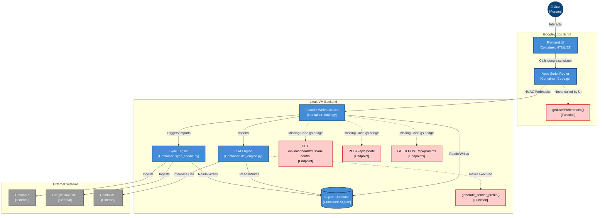

# Attempt 1
## Stage 1: The Dependency Trace
After tracing the Apps Script webhook bridges against the FastAPI backend implementations and background engines, I identified the following Orphaned Elements:

1. getUserPreferences() (Code.gs)
    - Never called. Acts as a redundant getter for /api/settings/pipeline (duplicate of getPipelineSettings()).
2. GET /api/dashboard/mission-control (main.py)
    - Backend KPI dashboard endpoint with no corresponding Code.gs webhook bridge, leaving it inaccessible to the Apps Script UI.
3. POST /api/update (main.py)
    -An endpoint (along with its underlying call to generate_tuning_rule) disconnected from the UI router. Likely a deprecation or unfinished feature for manual UI-based corrections.
4. GET and POST /api/prompts (main.py)
    - Prompt management API routes present in the FastAPI backend, but entirely untethered from the Code.gs frontend router.
5. generate_sender_profile() (llm_engine.py)
    - An isolated entity profile generation function defined in the LLM Engine but never imported into main.py or triggered by the active sync loops.

## Stage 2: The Mermaid C4 Diagram

## Stage 3: Bug Fixes
- Added `from googleapiclient.errors import HttpError` to `sync_engine.py` to resolve `NameError` and allow graceful error handling during Drive file exports.
- Fixed 403 Error in `sync_engine.py` by explicitly requesting the `mimeType` field in Drive API list calls and updating the download logic to ensure `mimeType` is checked safely (`if mime_type and mime_type.startswith(...)`).
- Updated Frontend UI model selection dropdowns in `Index.html` to feature `gemini-2.5-flash` (default) and `gemini-2.5-pro`, replacing the outdated Gemini 1.5 references.
- Implemented architectural isolation in `sync_engine.py` to prevent indexing the user's entire Drive. The `sync_drive` function now fetches the `drive_ingest_dropbox_id` from the config table and explicitly checks if this ID is in the file's `parents` list. If not, the file is immediately skipped and no LLM processing occurs.
- Fixed two `NameError` exceptions in `sync_engine.py`:
  - Added explicit import for `generate_sender_profile` from `llm_engine`.
  - Defined `ingest_dropbox_id` by retrieving its value from the `Config_System` database table before the Google Drive file processing loop begins.

## Fixes Applied: JS_Actions.html Syntax Error

- Investigated the reported frontend freeze issue.
- Diagnosed the core issue: A duplicate/orphaned code block inside the \ppActions\ object (lines 1074-1111) was causing a fatal JavaScript syntax error (\Unexpected identifier 'artifact'\). The code block contained unclosed logic for \
enderDetailsPane\ that was floating outside of any function scope.
- Replaced the fragmented single-item view logic with a properly consolidated \
enderDetailsPane\ function.
- Verified that \Code.gs\ successfully implements the \searchArtifacts\ pass-through webhook calling \/api/artifacts/search\ with no modifications needed.
- Ran runtime syntax validation confirming resolution of the issue.
