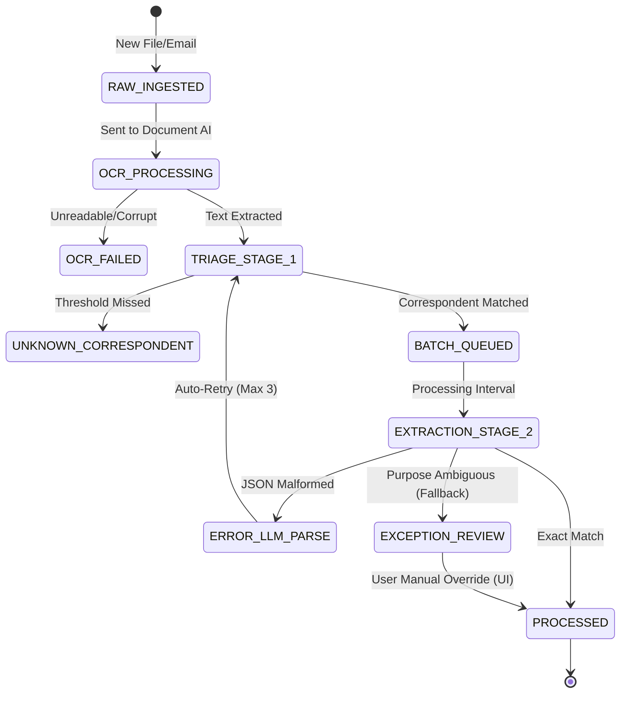
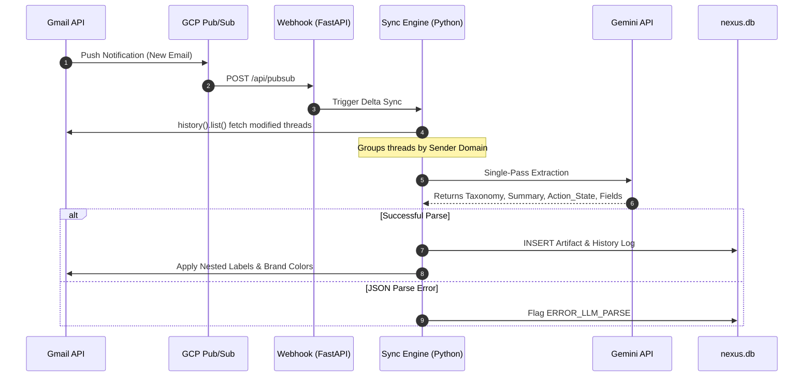
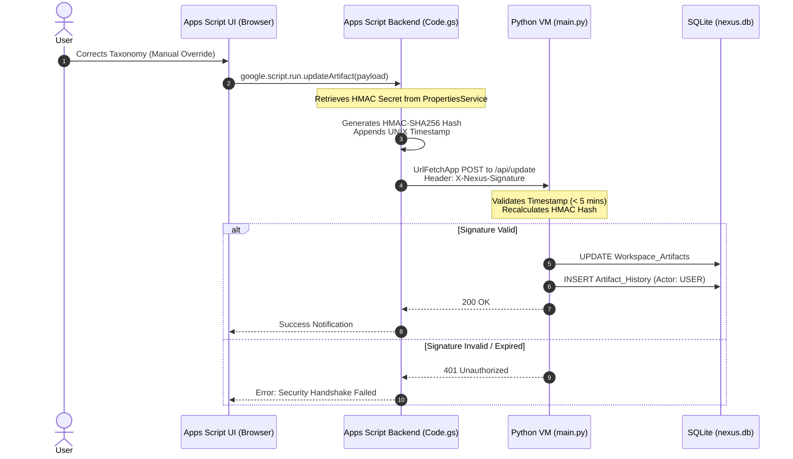

# Nexus Hub for Google - How It Works

This internal documentation provides a detailed look at the core lifecycles within the Nexus Hub architecture. Use this guide to understand how data moves through the system, from Google Workspace ingestion to centralized SQLite persistence.

## 1. Document Lifecycle: Google Drive to SQLite

This section outlines the exact flow of a document from the moment it is uploaded to Google Drive until its metadata is extracted and persisted into the Nexus Hub database.

1. **Ingestion & Delta Synchronization:**
   - The user uploads or modifies a document in Google Drive.
   - The background `sync_engine.py` process executes and calls the Google Drive API (`changes().list`) using the last known `pageToken` retrieved from the `Sync_State` SQLite table.
   - The engine identifies the modified file IDs and updates the `pageToken` to prevent duplicate processing in the future.

2. **Content Extraction (OCR):**
   - The system fetches the document's raw textual content or OCR (Optical Character Recognition) output using the Drive API.

3. **Two-Stage Triage (LLM Engine):**
   - **Stage 1 (Routing):** The raw text is sent to the Gemini AI (`llm_engine.py`) to identify the `Correspondent` against a strict whitelist (e.g., matching a generic invoice to "AWS" or "Stripe"). If the document is unreadable or the correspondent is unknown, it's flagged as `ERROR_STAGE_1_FAILED`.
   - **Stage 2 (Enforce & Extract):** If Stage 1 succeeds, a second, more specific prompt is sent to Gemini, armed with the Correspondent's unique custom field schema (e.g., extracting invoice totals, policy numbers, or due dates).

4. **Database Insertion & Audit Trail:**
   - The `llm_engine.py` receives the structured JSON response from Gemini.
   - It updates the `Workspace_Artifacts` table, changing the status to `PROCESSED` and saving the extracted `custom_data`.
   - A new immutable record is appended to the `Artifact_History` table. This record stores both the `previous_state` and `new_state` of the JSON payload, ensuring a complete, auditable history of the AI's actions.

---

## 2. Email Lifecycle: Gmail to SQLite

This section outlines the flow of an email thread from its arrival in Gmail to its categorization and processing within the Nexus Hub.

1. **Pub/Sub Notification & Delta Sync:**
   - A new email arrives in the user's Gmail inbox.
   - Depending on the deployment environment, a Google Cloud Pub/Sub push notification triggers the webhook, OR the `sync_engine.py` polls the Gmail API (`users().history().list`) using the last known `historyId` from the `Sync_State` table.
   - The sync engine identifies the specific message IDs of the newly added or modified email threads.

2. **Single-Pass Extraction (LLM Engine):**
   - The raw email thread content is fetched via the Gmail API.
   - Because emails natively contain rich metadata (Sender, Subject, Headers), the `llm_engine.py` bypasses the Two-Stage Triage and immediately executes a **Single-Pass** extraction.
   - Gemini maps the thread to an exact `Category \ Correspondent \ Purpose` taxonomy path, generates a concise 1-sentence summary, determines if human action is required, and extracts dynamic custom fields.

3. **Database Insertion & Audit Trail:**
   - The engine updates the `Workspace_Artifacts` table with the newly extracted metadata and summary.
   - A new history log is committed to the `Artifact_History` table, providing a complete audit trail of the AI's action.
   - The status is marked as `PROCESSED` (or `ERROR_LLM_PARSE` if the AI hallucinates an invalid JSON format).

---

## 3. The Exception Queue & Manual UI Overrides

When an artifact (document or email) is flagged as ambiguous (e.g., mapped to 'Purpose/Review'), it enters the Exception Queue.

1. **Frontend Fetch:** The user opens the Nexus Hub Material UI (Google Apps Script). The UI queries the Python VM for artifacts with a `Purpose/Review` status.
2. **Cryptographic Handshake:** When the user manually corrects the taxonomy and submits the form, `Code.gs` generates an HMAC-SHA256 signature using the shared secret and appends a UNIX timestamp.
3. **VM Validation:** The FastAPI backend (`main.py`) receives the payload, verifies the HMAC signature, checks the timestamp to prevent replay attacks, and processes the correction.
4. **Audit Trail:** The `Workspace_Artifacts` table is updated with the manually corrected taxonomy, and an immutable log is inserted into `Artifact_History` (with actor `USER`), linking the new state securely to the manual override.

---

## 4. The Tuning Loop (AI Self-Correction)

The system learns from user overrides to prevent recurring mistakes in the LLM extraction pipelines.

1. **Trigger:** A successful manual UI override on an artifact serves as a "ground truth" correction.
2. **Analysis:** The backend analyzes the difference between the AI's initial extraction (stored in `Artifact_History`) and the user's manual correction.
3. **Prompt Refinement:** If a consistent error pattern is detected for a specific correspondent, the bulk AI correction loop generates a new routing rule or explicit instruction and updates the `Config_Prompts` table.
4. **Application:** Subsequent calls to `llm_engine.py` for that correspondent inject the updated prompt rules, effectively tuning the AI's future accuracy without human intervention.

---

## 5. Programmatic Color Management

To maintain visual continuity across Google Workspace without violating strict API constraints, Nexus Hub employs a programmatic branding engine.

1. **Euclidean Matching:** The user defines an arbitrary hexadecimal brand color for a correspondent in `Taxonomy_Entities`.
2. **Color Snapping:** When `branding_engine.py` executes, it converts the requested hex code to RGB space and calculates the Euclidean distance against the 35 strict color combinations permitted by the Gmail API. It "snaps" to the visually closest allowed pair.
3. **Workspace Sync:** The matched hex color is seamlessly applied to the `folderColorRgb` property of the nested Google Drive folder and the `color` object (both background and text) of the corresponding nested Gmail label, ensuring WCAG contrast compliance and cross-platform branding.
