# Nexus Hub for Google: Technical Architecture & System Lifecycle

## System Overview

Nexus Hub operates on a robust hybrid architecture, bridging the serverless convenience of Google Apps Script with the computational power of a dedicated Python Virtual Machine (VM). Acting as the spiritual successor to "Google Inbox," it utilizes a zero-inbox philosophy to transform unstructured chaos into a highly organized, task-oriented knowledge graph. The Python VM acts as the centralized brain, utilizing a strict, WAL-enabled SQLite database (`nexus.db`) for high-concurrency state management, metadata storage, and immutable audit logging. The Apps Script environment serves as a zero-dependency, Material Design frontend, communicating with the backend VM via a cryptographically secured (HMAC-SHA256), replay-protected webhook bridge. 

---

## 1. The Multi-Dimensional Taxonomy (Three-Tier Hierarchy)

To solve the issue of "directory sprawl," Nexus Hub enforces a strict Three-Tier Relational Hierarchy. Rather than a flat list of hundreds of senders, entities are logically grouped, making both automated routing and manual UI filtering significantly faster.

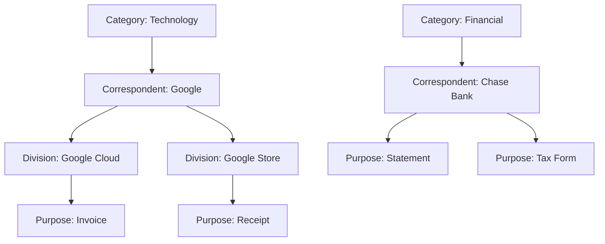

### Zero-Trust Toggles
Every node in this hierarchy contains `is_gmail_enabled` and `is_drive_enabled` booleans. The default state for any new insertion is `FALSE` (Zero-Trust). If both are false, the entity is considered "Quarantined" or "Blacklisted." The AI is physically forbidden from routing documents to disabled paths, ensuring total human control over the taxonomy.

### Entity Profiles
To support robust data extraction, each Correspondent and Purpose is enriched with an Entity Profile. This includes:
- **Sending Subdomains:** JSON arrays of recognized email domains to authenticate senders.
- **Physical Addresses:** JSON arrays of known company addresses to improve document matching.
- **Brand Colors:** JSON arrays of hex pairs to automatically sync visual identity across Google Workspace.
- **Frequency & Confidence Weights:** Integers and floats used to refine the routing algorithm based on historical accuracy.

### Database Schema & Relational Integrity

To ensure high performance, prevent data anomalies, and maintain strict system constraints, the `nexus.db` SQLite index normalizes the taxonomy and isolates system states. 

The `Workspace_Artifacts` table does not redundantly store string names for Categories or Correspondents; it stores a single `purpose_id`. During Python data analysis or API fetching, the backend dynamically joins the `Taxonomy_Purposes`, `Taxonomy_Correspondents`, and `Taxonomy_Categories` tables. This guarantees that if an administrator renames a Correspondent or shifts a Purpose to a different Category in the UI, the change propagates instantly across thousands of artifacts without requiring expensive bulk database updates.

#### Entity Relationship Diagram

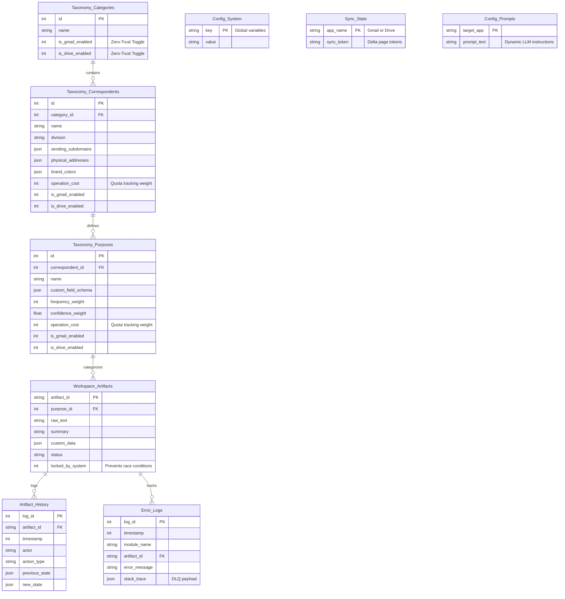

#### Core Data Structures

* **The Taxonomy Core (`Taxonomy_*`):** Divides the hierarchy into three distinct tiers. The `Taxonomy_Correspondents` table utilizes native `JSON` columns to hold multi-dimensional profiles (`sending_subdomains`, `physical_addresses`, `brand_colors`), while `Taxonomy_Purposes` stores the `custom_field_schema`. Both tables track `operation_cost` to feed the API Quota Governor.
* **The Master Index (`Workspace_Artifacts`):** The central truth for all indexed documents and emails. It includes a `locked_by_system` boolean that acts as a mutex, preventing the UI from pushing manual overrides while the background synchronization engine is actively modifying the file.
* **The Dynamic AI Core (`Config_Prompts`):** Isolates the system role, extraction parameters, and AI instructions from the Python logic. This allows the Tuning Loop and UI to mutate AI behavior on the fly without restarting the Docker container.
* **The Telemetry Core (`Artifact_History` & `Error_Logs`):** Strict append-only ledgers. The History table records immutable JSON diffs of metadata overrides, while the Error Logs function as a Dead-Letter Queue (DLQ), catching API timeouts and Python stack traces for automated background retries.

## 2. Intelligent Quota Governor

Google API quotas and Apps Script execution timeouts are the silent killers of enterprise automation. Nexus Hub implements a "Priority Lane" Governor (`QuotaGovernor` class) directly within `sync_engine.py` to actively monitor and throttle API usage.

### The 72-Hour Priority Lane Logic

For every artifact fetched during a delta sync, `process_file_with_governor()` evaluates the item's age. It physically reserves a portion of the daily API quota (e.g., 30%) exclusively for real-time items.

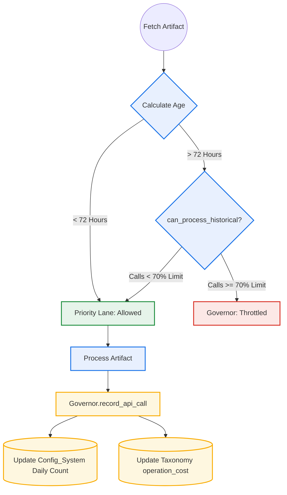

### Entity Cost Tracking
Every time an API call is made, record_api_call() updates the global counter in the Config_System table. Furthermore, if the call was associated with a specific entity, it increments the operation_cost integer column in either Taxonomy_Correspondents or Taxonomy_Purposes. This allows the UI to forecast exactly how much quota a bulk-edit operation will consume based on historical data.

### Seed Ingestion & Zero-Trust Defaults

Before the standard delta syncs occur, `sync_engine.py` executes `ingest_taxonomy_seed()`. This function acts as a passive ingestion bridge, allowing external scrapers (like the standalone Nexus for Gmail worker) to securely feed new entities into the system without requiring open webhook endpoints.

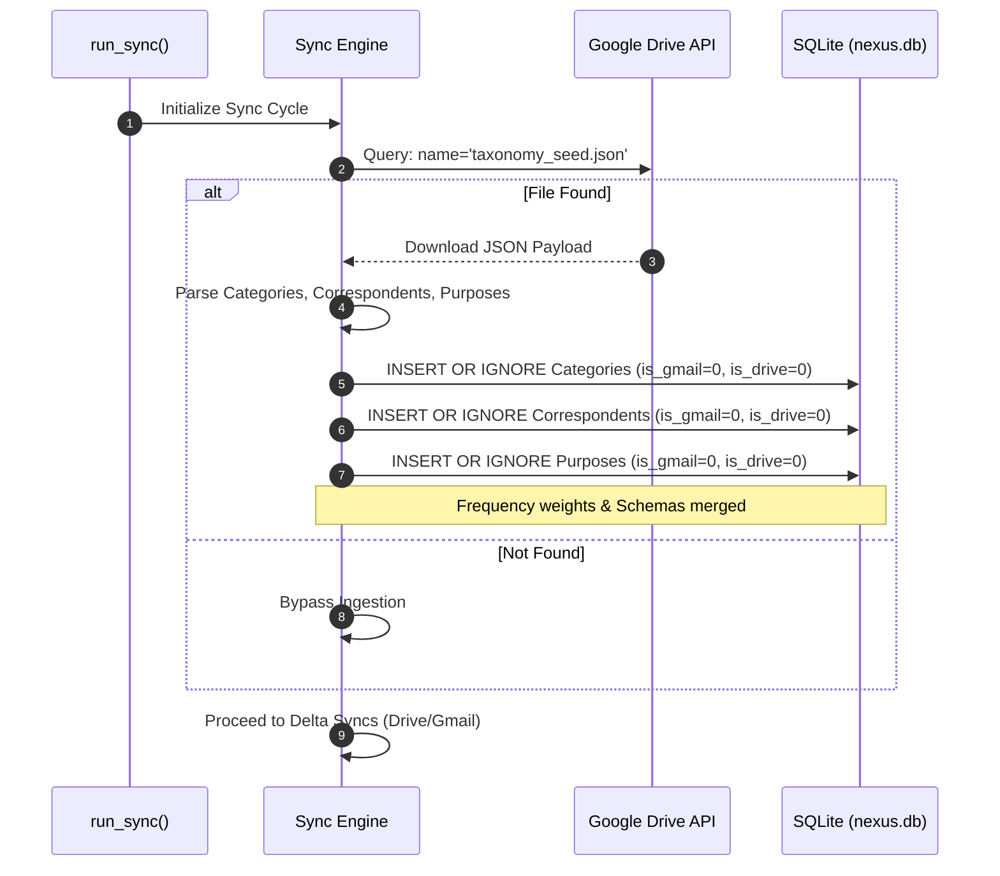

To protect the system against malicious, hallucinated, or misconfigured routing paths from the seed file, the engine forces the is_gmail_enabled and is_drive_enabled booleans to 0 (FALSE) during the INSERT commands. These Zero-Trust toggles quarantine the newly discovered taxonomy nodes until a human administrator explicitly reviews and enables them in the frontend UI.

### Google Contacts Entity Bootstrapping
In addition to passive Drive ingestion, Nexus Hub actively bootstraps its `Taxonomy_Correspondents` table using the user's verified Google Contacts via the Google People API. 

This converts a user's personal address book into a deterministic routing engine.

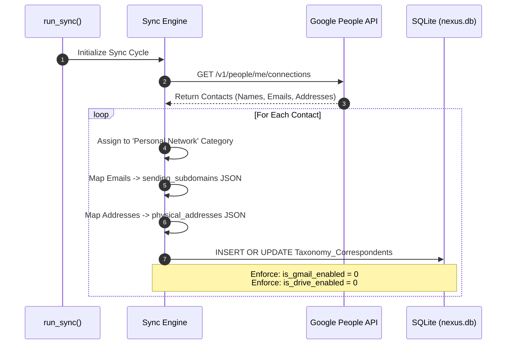
### Data Mapping & Zero-Trust:
When `sync_contacts()` executes, it aggregates all known email addresses and physical addresses for a single person into the native JSON arrays designed in Phase 24. To prevent flooding the active taxonomy with hundreds of personal contacts, every ingested contact is forced into the Zero-Trust Quarantine. This allows the user to selectively enable only the contacts they actively wish to track for document routing.

## 3. The Google Drive Pipeline (Deep Dive)

The Google Drive ingestion pipeline is designed to efficiently process complex, unstructured documents through a rigorous, Two-Stage Triage system powered by Gemini AI.

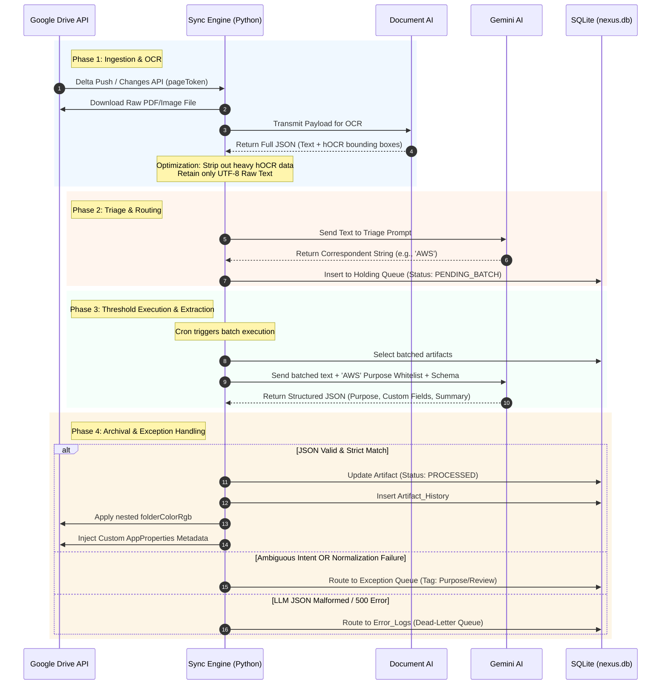

### **Phase 1: Ingestion & OCR Strip-down**

1. **Delta Synchronization:** To avoid the prohibitive latency of full polling, the sync_engine.py process maintains a persistent pageToken in the Sync_State table. It queries the Google Drive API (changes().list) to fetch only files modified since the last check.  
2. **Payload Optimization:** For scanned documents, the engine leverages Document AI for OCR. Because raw hOCR output is massive and token-heavy, the engine strips down this payload, retaining only the UTF-8 text to minimize latency before passing it to the LLM.

### **Phase 2 & 3: Two-Stage Triage & Logical Routing**

Because Drive documents are unstructured, `llm_engine.py` employs a Two-Stage verification process (`process_drive_document`). It strictly enforces whitelists via the `normalize_taxonomy()` function while gracefully capturing "Discovery" suggestions from the LLM if a vendor is unknown.

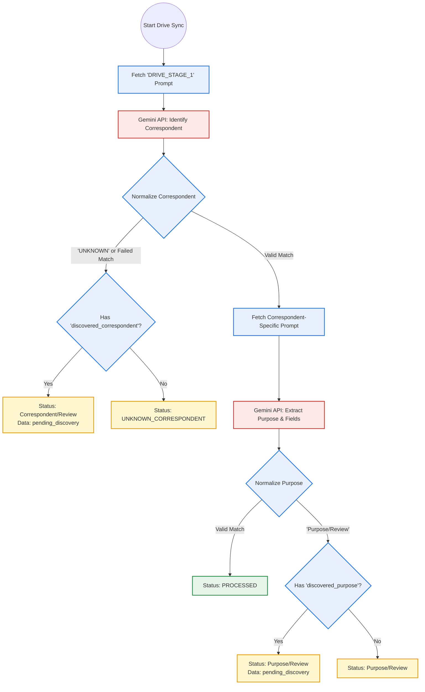

### **Phase 3 & 4: Threshold Batching, Extraction, and Archival**

Once a batch threshold is met for a specific Correspondent, the documents undergo deep extraction for Custom Fields. Successful extractions are written to the database and native Drive metadata. Ambiguous documents are forcefully routed to the Purpose/Review Exception Queue.

## **4. The Gmail Pipeline (Deep Dive)**

Unlike Drive documents, emails arrive with structured metadata, allowing for a highly efficient, single-pass extraction.

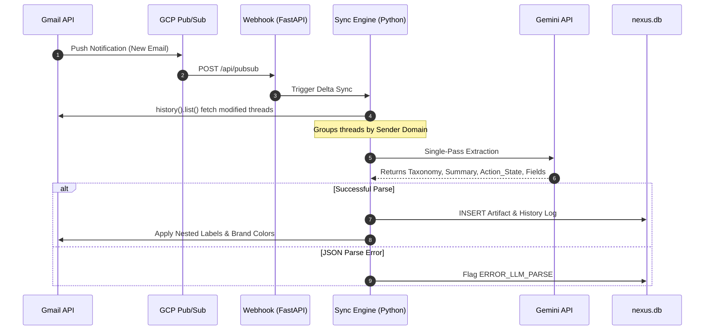

1. **Trigger Mechanisms:** A Cloud Pub/Sub push notification serves as the primary trigger, firing a webhook to initiate the sync. A cron-based polling fallback queries users().history().list.  
2. **Single-Pass Extraction:** The payload is evaluated by Gemini in a single pass to determine the taxonomy path, generate a summary, assess actionability, and extract custom fields simultaneously.

### **The Single-Pass Logical Flow**

Because emails provide rich context (Sender, Subject), `llm_engine.py` executes `process_gmail_thread()` in a single step, injecting the schema and whitelists directly into the unified prompt.

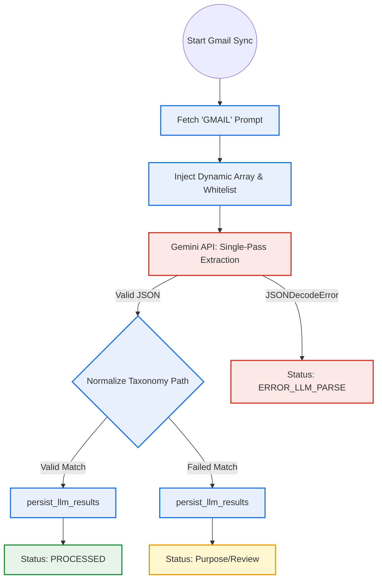

## **5. The Exception Queue & Manual UI Overrides**

When an artifact fails strict normalization or Gemini returns an ambiguous result, it is flagged as Purpose/Review. These items await human verification in the Apps Script frontend. When a user provides a manual correction, the system secures the transmission via a cryptographic handshake.

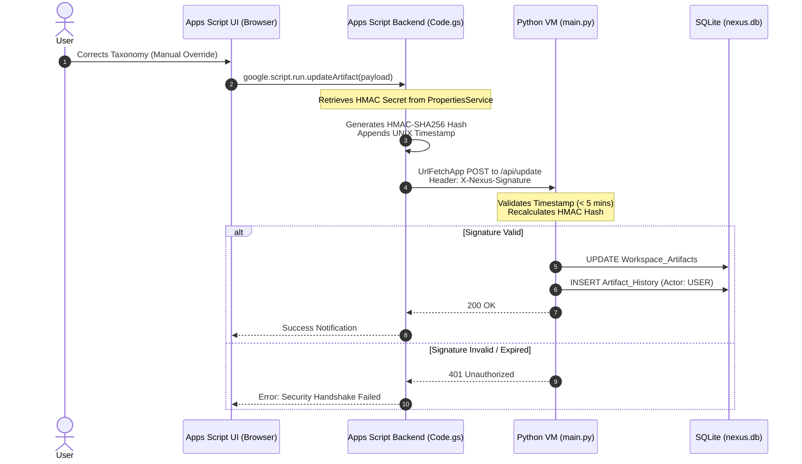

## **6. RAG Knowledge Retrieval Pipeline**

Nexus Hub includes a natural language querying engine (`ask_rag()`). To protect system memory, eliminate context-window limits, and reduce API costs, it implements a strict Two-Step "Text-to-SQL" pipeline rather than blindly feeding semantic vector databases.

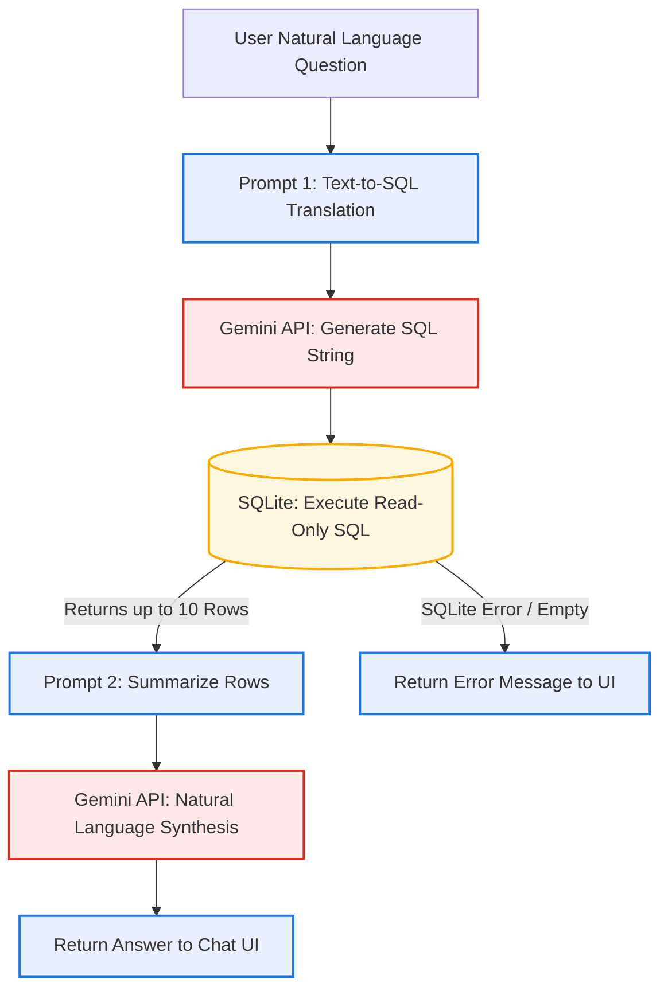

## **7. The Tuning Loop (AI Self-Correction)**

Nexus Hub does not simply log user corrections; it learns from them. The system employs an asynchronous background loop to dynamically tune its own extraction prompts based on human feedback.

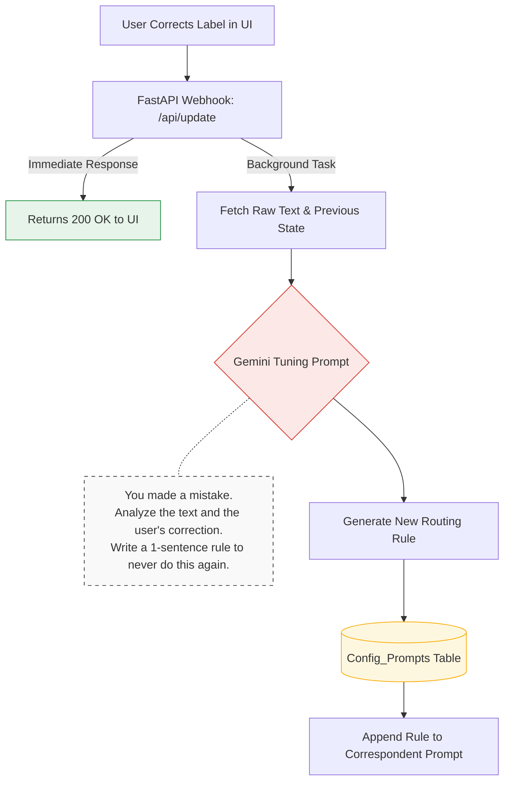

When a manual override occurs, the webhook immediately returns a 200 OK so the UI remains snappy. In the background, the Python engine queries Gemini with the AI's original mistake and the user's correction, generating a new persistent routing rule to prevent future recurrences.

**Technical Implementation:** This asynchronous behavior is achieved using FastAPI's `BackgroundTasks`. During the `POST /api/update` webhook execution, the server attaches the `generate_tuning_rule` function to the background task queue. This guarantees the 200 OK response is dispatched to the Google Apps Script frontend instantaneously, preventing any blocking UI freeze while the Gemini AI API generates and saves the tuning rule.


## **8. Programmatic Color Management**

To maintain visual cohesion across the Google Workspace ecosystem, Nexus Hub employs programmatic visual branding.

1. **The Constraints:** The Gmail API strictly limits label colors to 35 specific background/text hex code combinations.  
2. **Dual-Snapping Algorithm:** The branding_engine.py calculates the Euclidean distance in the RGB color space between a user's requested brand color and the allowed Gmail palette, snapping to the closest WCAG contrast-compliant pair.  
3. **Synchronization:** That precise hex code pair is subsequently applied to both the Gmail nested labels and the corresponding Google Drive folders.

## **9. UI Data Retrieval & Presentation**

The frontend relies on a decoupled, asynchronous data retrieval model to ensure a highly responsive user experience without page reloads.

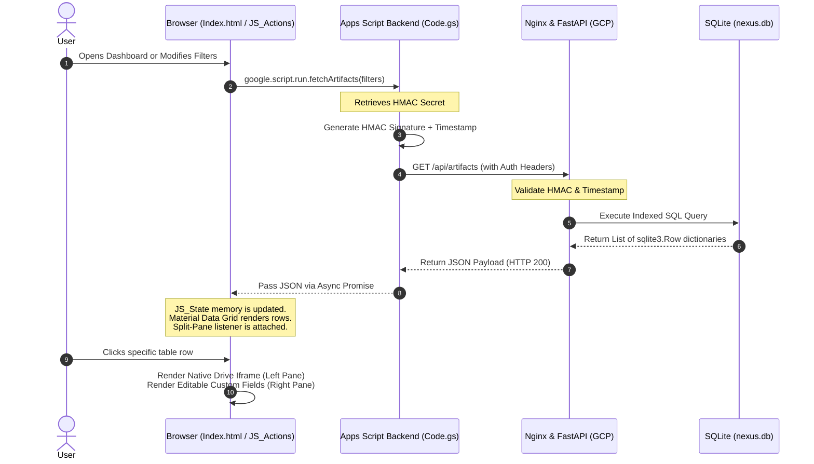

1. **Secure Proxy:** Apps Script fetches the HMAC secret, generates a timestamped signature, and proxies the GET request to the Python VM.  
2. **Database Fetch:** The Python engine validates the signature, queries the SQLite index, and returns standard JSON array payloads utilizing sqlite3.Row dictionary mappings.  
3. **State Management:** The UI receives the payload, stores it in JS_State.html (acting as client-side memory), and immediately renders the split-pane data grid dynamically.

## **10. Error Routing & Dead-Letter Queue**

To ensure the automated ingestion pipeline never crashes or loses data, Nexus Hub employs a robust Dead-Letter Queue (DLQ).

1. **Race Conditions:** If a user modifies a file in Drive while the Python engine is processing it, the locked_by_system boolean in the Workspace_Artifacts table prevents the UI from causing a data collision.  
2. **API Timeouts:** If a 500 error occurs when calling Gemini or Google APIs, the artifact is logged into the Error_Logs table alongside its full stack trace.  
3. **Auto-Retry:** The background sync job periodically polls the Error_Logs table. Failed artifacts are automatically re-queued for processing up to a maximum of 3 attempts before requiring manual admin intervention.

## 11. Automated Health Checks & Diagnostics

To instantly isolate points of failure across the hybrid architecture, Nexus Hub features a decoupled diagnostic suite (`diagnostics.py`). This suite can be triggered manually via the Apps Script UI or invoked via the command line on the host VM. 

Crucially, the diagnostic suite operates under a strict "Isolated Logging" paradigm. If the SQLite database experiences a fatal lock, it cannot log its own failure. Therefore, the diagnostic suite bypasses the internal `Error_Logs` table and uploads its health reports directly to an isolated folder in Google Drive.

The Automated Watchdog: The host VM utilizes a cron job to execute the diagnostic suite every 15 minutes. If any test (Database integrity, OAuth validity, or API health) fails, the suite bypasses standard logging and utilizes the NexusNotifier to push a critical failure alert directly to the user's mobile device via Pushover.

### Diagnostic Watchdog & Communication Flow

```mermaid
flowchart TB
    classDef appsScript fill:#e8f0fe,stroke:#1a73e8,stroke-width:2px;
    classDef gcp fill:#e6f4ea,stroke:#1e8e3e,stroke-width:2px;
    classDef database fill:#fef7e0,stroke:#f9ab00,stroke-width:2px;
    classDef googleApi fill:#e8eaed,stroke:#5f6368,stroke-width:2px;
    classDef external fill:#fce8e6,stroke:#d93025,stroke-width:2px;

    subgraph Execution Triggers
        Cron[Host VM: 15-Min Cron Job]
        UI[Apps Script UI: Manual Run]
    end
    class Cron,UI appsScript

    subgraph GCP Compute Engine (Local VM)
        WH[nexus-api: FastAPI]
        Diag[nexus-sync-engine: diagnostics.py]
        DB[(nexus.db SQLite)]
        Notif[notifier.py]

        UI -- "HMAC Webhook" --> WH
        WH -- "Triggers" --> Diag
        Cron -- "docker run" --> Diag

        Diag -- "1. Test R/W Lock" --> DB
        Diag -- "2. Ping /api/health" --> WH
        Diag -- "If Any Check Fails" --> Notif
    end
    class WH,Diag,Notif gcp
    class DB database

    subgraph External Ecosystem
        Auth[Google OAuth]
        Drive[Google Drive]
        Push[Pushover API]

        Diag -- "3. Verify token.json" --> Auth
        Diag -- "4. Upload JSON Report" --> Drive
        Notif -- "Send CRITICAL Mobile Alert" --> Push
    end
    class Auth,Drive googleApi
    class Push external
```

### The Four-Phase Verification Check

1. **Database R/W Integrity:** The script connects to `nexus.db`, enforces `PRAGMA journal_mode=WAL;`, creates a temporary table `_Diagnostic_Test`, inserts a timestamp, reads it back, and drops the table. This confirms the VM filesystem permissions are intact and the database is not locked by a hung background process.
2. **OAuth Authorization Ping:** The script authenticates using the VM's headless `token.json` and performs a lightweight read-only request (`about().get`) against the Google Drive API. This verifies the token has not expired or lost its requested scopes.
3. **Decentralized Log Upload:** The results of the database and OAuth checks are compiled into a JSON payload. The script locates (or creates) a `Nexus Diagnostics` folder in the user's Google Drive and uploads the JSON file, providing an immutable, timestamped record of system health independent of the VM's local storage.
4. **Telemetry & Log Upload:** If all checks pass, a JSON report is uploaded to the 'Nexus Diagnostics' folder in Google Drive. If any check fails, the script immediately leverages 'notifier.py' to push a CRITICAL alert to the user's mobile device via Pushover, bypassing the internal database entirely.

## **12. Dynamic Prompt Architecture**

Nexus Hub employs a fully database-driven prompt architecture, eliminating hardcoded instructions from the execution environment. This allows administrators to modify AI behavior on-the-fly without needing to restart the Docker container or redeploy the Python VM.

1. **Initialization:** On first boot, the system seeds the default master prompts (Gmail Single-Pass, Drive Stage 1, and Drive Stage 2) into the `Config_Prompts` SQLite table.
2. **Real-time Injection:** Immediately before triggering an external call to the Gemini API, the LLM extraction engine queries the database in real-time to fetch the active instructions.
3. **Frontend Modification:** The backend exposes secured `GET /api/prompts` and `POST /api/prompts` endpoints, allowing the Google Apps Script frontend to seamlessly read and apply updates to these core instructions.

## **13. Telemetry & Alerting Matrix**

Because the engine runs headlessly, Nexus Hub employs a robust notification matrix to alert the user of critical failures via Pushover, and emails daily digests of quarantined items.

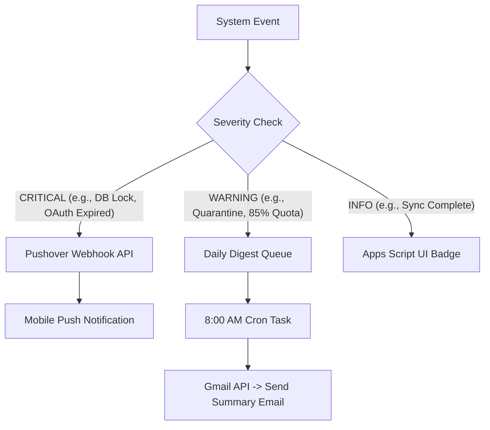
