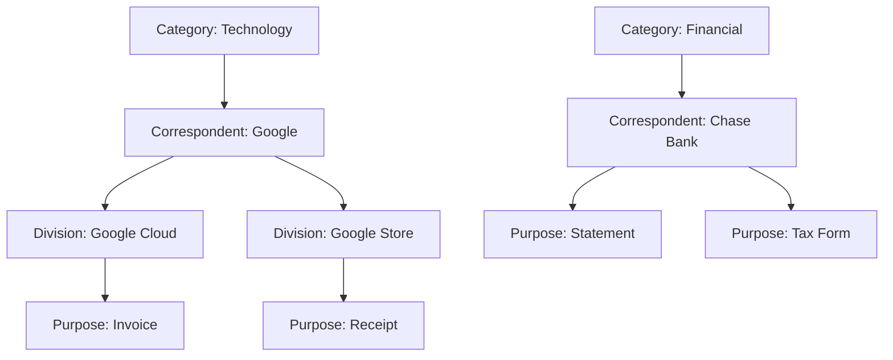
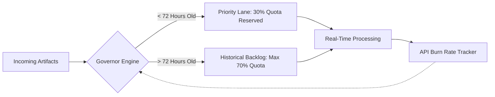
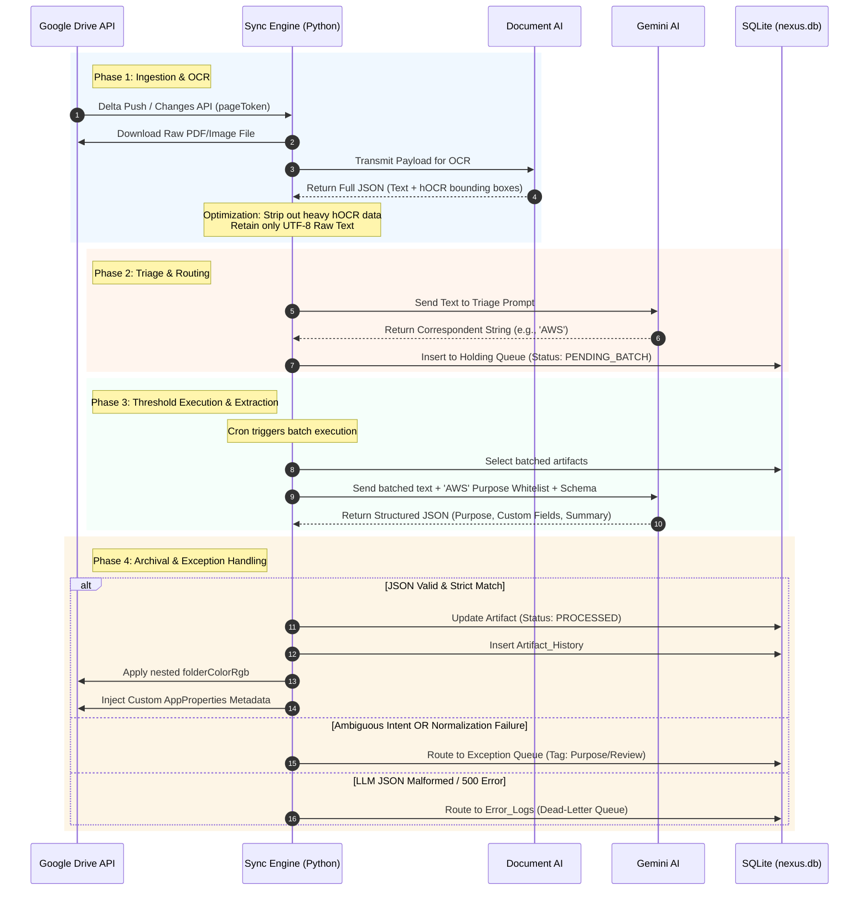
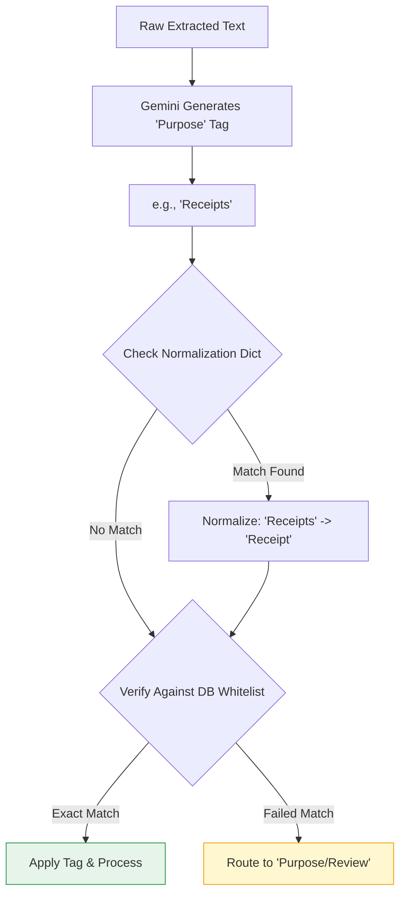
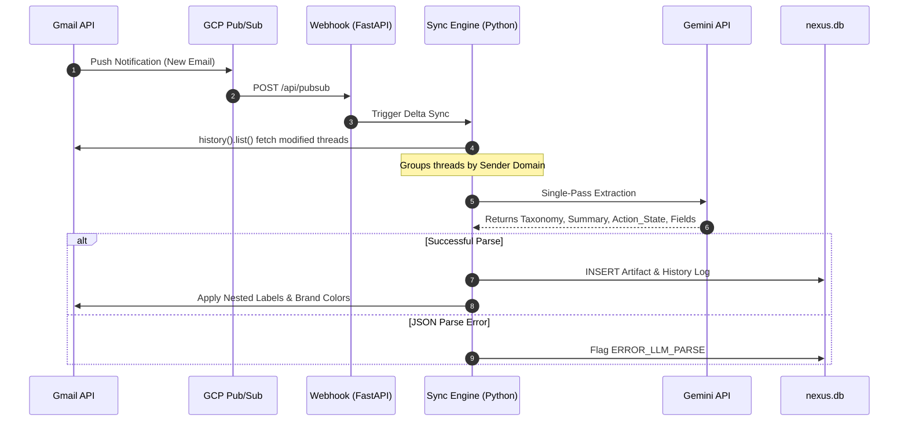
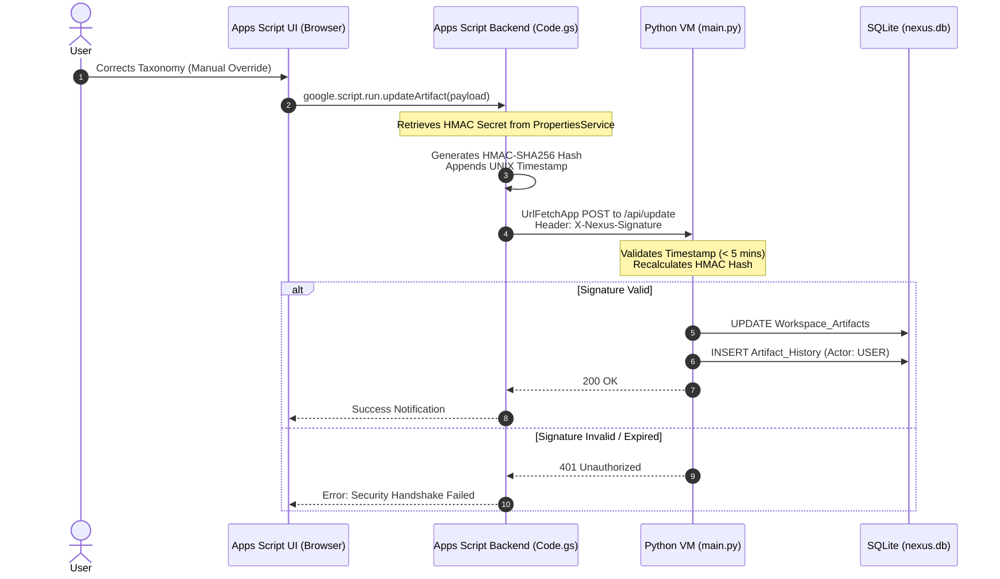
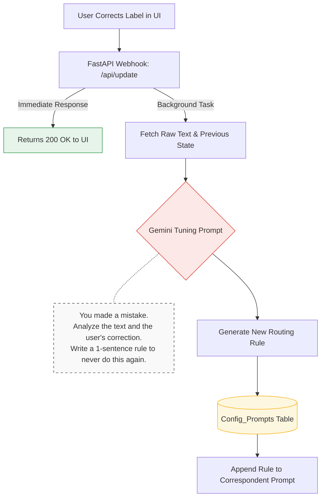
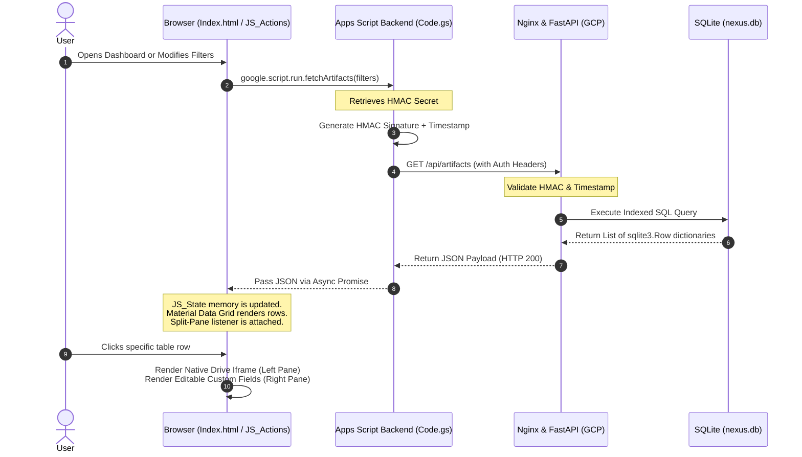
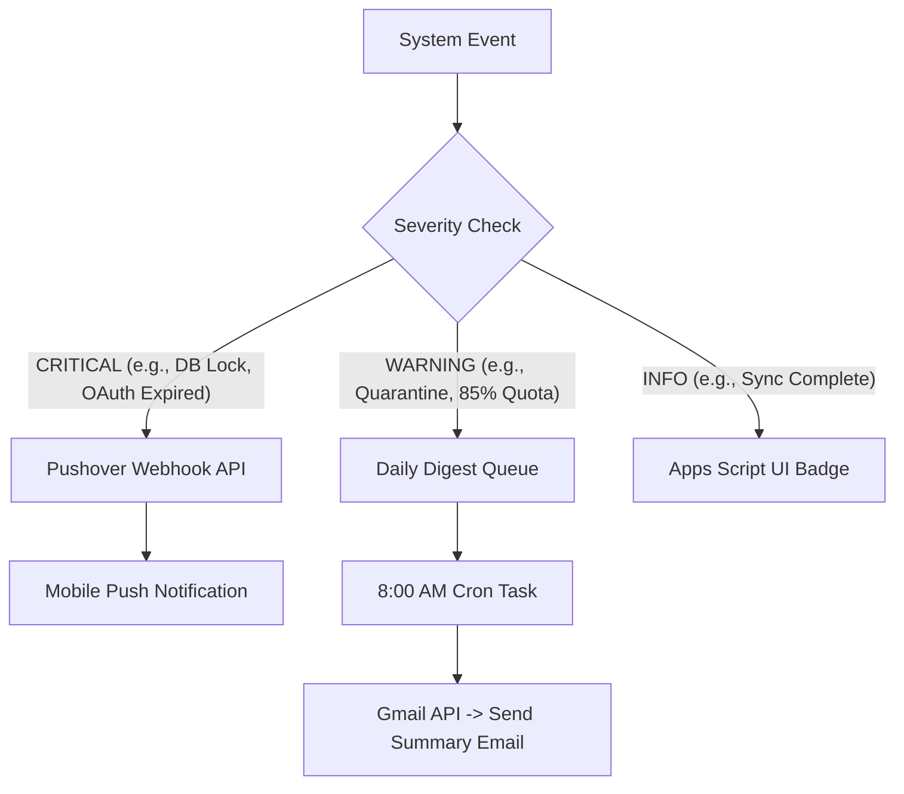

# Nexus Hub for Google: Technical Architecture & System Lifecycle

## System Overview

Nexus Hub operates on a robust hybrid architecture, bridging the serverless convenience of Google Apps Script with the computational power of a dedicated Python Virtual Machine (VM). The Python VM acts as the centralized brain, utilizing a strict, WAL-enabled SQLite database (`nexus.db`) for high-concurrency state management, metadata storage, and immutable audit logging. The Apps Script environment serves as a zero-dependency, Material Design frontend, communicating with the backend VM via a cryptographically secured (HMAC-SHA256), replay-protected webhook bridge. 

---

## 1. The Multi-Dimensional Taxonomy (Three-Tier Hierarchy)

To solve the issue of "directory sprawl," Nexus Hub enforces a strict Three-Tier Relational Hierarchy. Rather than a flat list of hundreds of senders, entities are logically grouped, making both automated routing and manual UI filtering significantly faster.

### Zero-Trust Toggles
Every node in this hierarchy contains is_gmail_enabled and is_drive_enabled booleans. If both are false, the entity is considered "Quarantined" or "Blacklisted." The AI is physically forbidden from routing documents to disabled paths, ensuring total human control over the taxonomy.

## 2. Intelligent Quota Governor
Google API quotas and Apps Script execution timeouts are the silent killers of enterprise automation. Nexus Hub implements a "Priority Lane" Governor to defend the system.

By artificially capping the processing of old historical documents, the system guarantees that new, urgent emails are always processed immediately, even during massive inbox migrations.

## 3. The Google Drive Pipeline (Deep Dive)

The Google Drive ingestion pipeline is designed to efficiently process complex, unstructured documents through a rigorous, Two-Stage Triage system powered by Gemini AI.

### **Phase 1: Ingestion & OCR Strip-down**

1. **Delta Synchronization:** To avoid the prohibitive latency of full polling, the sync_engine.py process maintains a persistent pageToken in the Sync_State table. It queries the Google Drive API (changes().list) to fetch only files modified since the last check.  
2. **Payload Optimization:** For scanned documents, the engine leverages Document AI for OCR. Because raw hOCR output is massive and token-heavy, the engine strips down this payload, retaining only the UTF-8 text to minimize latency before passing it to the LLM.

### **Phase 2: Triage & Routing Queue**

1. **Correspondent Identification (Stage 1):** The stripped text is passed to the LLM to identify the primary organization, vendor, or sender against a strict whitelist.  
2. **Taxonomy Normalization:** The LLM's output is intercepted to prevent "Label Creep."

### **Phase 3 & 4: Threshold Batching, Extraction, and Archival**

Once a batch threshold is met for a specific Correspondent, the documents undergo deep extraction for Custom Fields. Successful extractions are written to the database and native Drive metadata. Ambiguous documents are forcefully routed to the Purpose/Review Exception Queue.

## **4. The Gmail Pipeline (Deep Dive)**

Unlike Drive documents, emails arrive with structured metadata, allowing for a highly efficient, single-pass extraction.

1. **Trigger Mechanisms:** A Cloud Pub/Sub push notification serves as the primary trigger, firing a webhook to initiate the sync. A cron-based polling fallback queries users().history().list.  
2. **Single-Pass Extraction:** The payload is evaluated by Gemini in a single pass to determine the taxonomy path, generate a summary, assess actionability, and extract custom fields simultaneously.

## **5. The Exception Queue & Manual UI Overrides**

When an artifact fails strict normalization or Gemini returns an ambiguous result, it is flagged as Purpose/Review. These items await human verification in the Apps Script frontend. When a user provides a manual correction, the system secures the transmission via a cryptographic handshake.

## **6. RAG Knowledge Retrieval Pipeline**

Nexus Hub includes a natural language querying engine. To protect system memory and API costs, it implements a "Text-to-SQL" pipeline rather than blindly feeding the entire database to the LLM.

## **7. The Tuning Loop (AI Self-Correction)**

Nexus Hub does not simply log user corrections; it learns from them. The system employs an asynchronous background loop to dynamically tune its own extraction prompts based on human feedback.

When a manual override occurs, the webhook immediately returns a 200 OK so the UI remains snappy. In the background, the Python engine queries Gemini with the AI's original mistake and the user's correction, generating a new persistent routing rule to prevent future recurrences.

**Technical Implementation:** This asynchronous behavior is achieved using FastAPI's `BackgroundTasks`. During the `POST /api/update` webhook execution, the server attaches the `generate_tuning_rule` function to the background task queue. This guarantees the 200 OK response is dispatched to the Google Apps Script frontend instantaneously, preventing any blocking UI freeze while the Gemini AI API generates and saves the tuning rule.

## **8. Programmatic Color Management**

To maintain visual cohesion across the Google Workspace ecosystem, Nexus Hub employs programmatic visual branding.

1. **The Constraints:** The Gmail API strictly limits label colors to 35 specific background/text hex code combinations.  
2. **Dual-Snapping Algorithm:** The branding_engine.py calculates the Euclidean distance in the RGB color space between a user's requested brand color and the allowed Gmail palette, snapping to the closest WCAG contrast-compliant pair.  
3. **Synchronization:** That precise hex code pair is subsequently applied to both the Gmail nested labels and the corresponding Google Drive folders.

## **9. UI Data Retrieval & Presentation**

The frontend relies on a decoupled, asynchronous data retrieval model to ensure a highly responsive user experience without page reloads.

1. **Secure Proxy:** Apps Script fetches the HMAC secret, generates a timestamped signature, and proxies the GET request to the Python VM.  
2. **Database Fetch:** The Python engine validates the signature, queries the SQLite index, and returns standard JSON array payloads utilizing sqlite3.Row dictionary mappings.  
3. **State Management:** The UI receives the payload, stores it in JS_State.html (acting as client-side memory), and immediately renders the split-pane data grid dynamically.

## **10. Error Routing & Dead-Letter Queue**

To ensure the automated ingestion pipeline never crashes or loses data, Nexus Hub employs a robust Dead-Letter Queue (DLQ).

1. **Race Conditions:** If a user modifies a file in Drive while the Python engine is processing it, the locked_by_system boolean in the Workspace_Artifacts table prevents the UI from causing a data collision.  
2. **API Timeouts:** If a 500 error occurs when calling Gemini or Google APIs, the artifact is logged into the Error_Logs table alongside its full stack trace.  
3. **Auto-Retry:** The background sync job periodically polls the Error_Logs table. Failed artifacts are automatically re-queued for processing up to a maximum of 3 attempts before requiring manual admin intervention.

## **11. Dynamic Prompt Architecture**

Nexus Hub employs a fully database-driven prompt architecture, eliminating hardcoded instructions from the execution environment. This allows administrators to modify AI behavior on-the-fly without needing to restart the Docker container or redeploy the Python VM.

1. **Initialization:** On first boot, the system seeds the default master prompts (Gmail Single-Pass, Drive Stage 1, and Drive Stage 2) into the `Config_Prompts` SQLite table.
2. **Real-time Injection:** Immediately before triggering an external call to the Gemini API, the LLM extraction engine queries the database in real-time to fetch the active instructions.
3. **Frontend Modification:** The backend exposes secured `GET /api/prompts` and `POST /api/prompts` endpoints, allowing the Google Apps Script frontend to seamlessly read and apply updates to these core instructions.

## 11. Telemetry & Alerting Matrix

Because the engine runs headlessly, Nexus Hub employs a robust notification matrix to alert the user of critical failures via Pushover, and emails daily digests of quarantined items.

