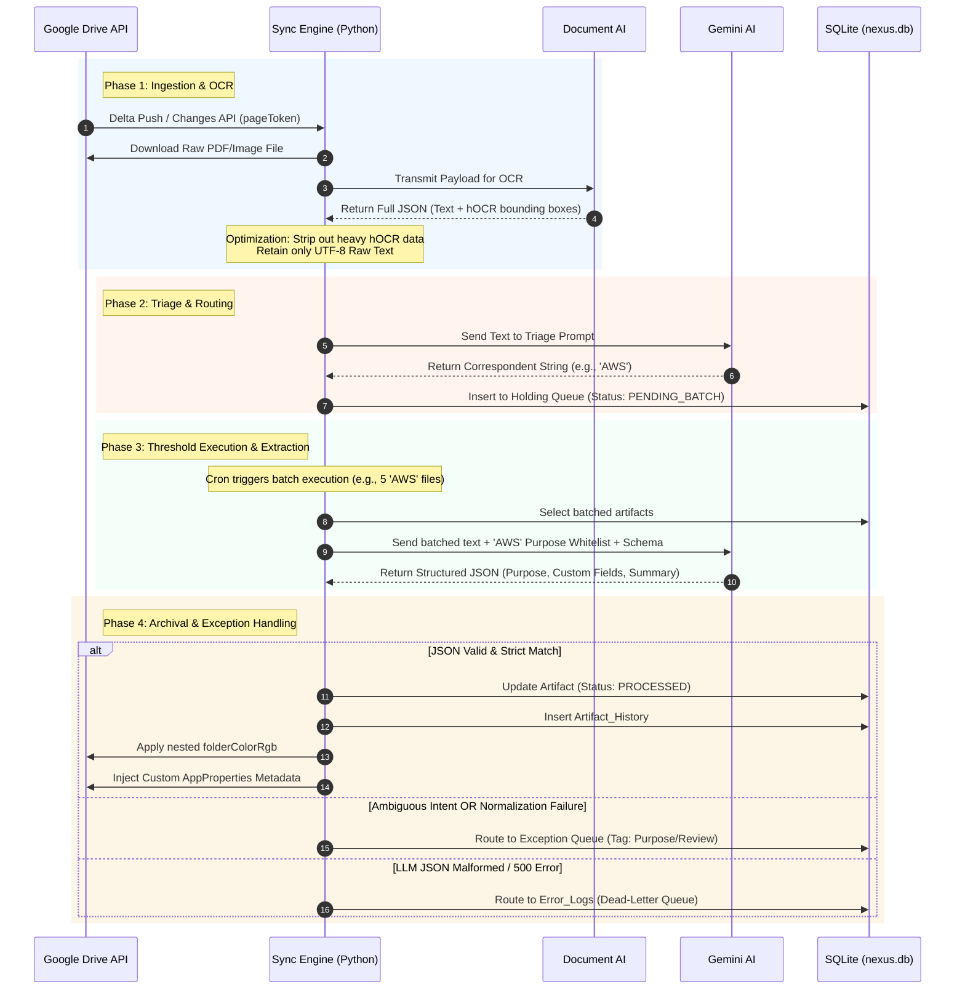
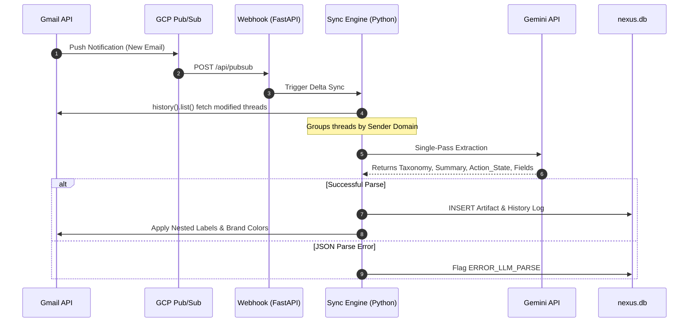
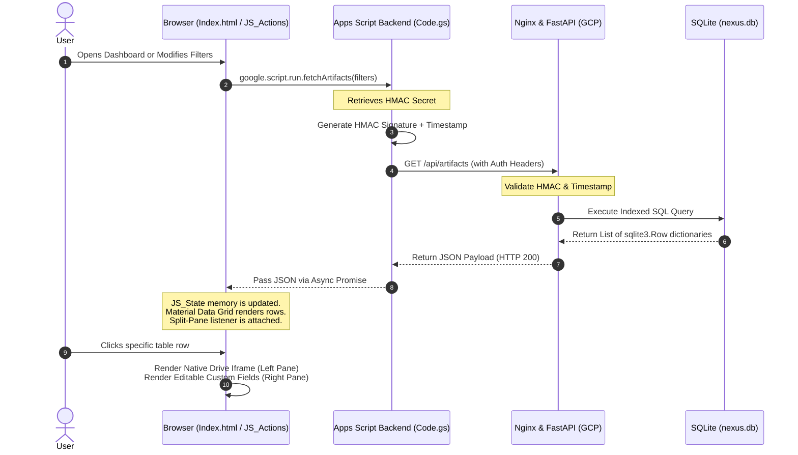

# Nexus Hub for Google: Technical Architecture & System Lifecycle

## System Overview

Nexus Hub operates on a robust hybrid architecture, bridging the serverless convenience of Google Apps Script with the computational power of a dedicated Python Virtual Machine (VM). The Python VM acts as the centralized brain, utilizing a strict, WAL-enabled SQLite database (`nexus.db`) for high-concurrency state management, metadata storage, and immutable audit logging. The Apps Script environment serves as a zero-dependency, Material Design frontend, communicating with the backend VM via a cryptographically secured (HMAC-SHA256), replay-protected webhook bridge. This separation of concerns allows Nexus Hub to leverage the official Google GenAI SDK for complex Document AI and metadata extraction on the backend while providing a seamless, native-feeling UI directly within the user's Google Workspace.

---

## The Google Drive Pipeline (Deep Dive)

The Google Drive ingestion pipeline is designed to efficiently process complex, unstructured documents (like scanned PDFs or images) through a rigorous, Two-Stage Triage system powered by Gemini AI.

### Phase 1: Ingestion & OCR Strip-down
1. **Delta Synchronization:** To avoid the prohibitive latency of full polling, the `sync_engine.py` background process maintains a persistent `pageToken` in the `Sync_State` SQLite table. Upon execution, it queries the Google Drive API (`changes().list`) using this token to fetch only the files modified since the last check.
2. **Targeted Fetching:** For each modified file ID, the engine retrieves the raw text. If the file is an image or scanned PDF, the engine leverages Google Drive's native Optical Character Recognition (OCR) capabilities.
3. **Payload Optimization:** The raw hOCR output can be massive and token-heavy. The engine strips down this payload, extracting only the raw, unstructured text to minimize latency and token consumption before passing it to the LLM engine.

### Phase 2: Triage & Routing Queue
1. **Correspondent Identification (Stage 1):** The stripped text is passed to `llm_engine.py` with the `PROMPT_DRIVE_STAGE_1` prompt. This initial LLM call acts as a low-latency router. Its sole responsibility is to identify the primary organization, vendor, or sender (the "Correspondent") against a strict, pre-defined whitelist.
2. **Taxonomy Normalization:** The LLM's output is intercepted by the `normalize_taxonomy` function. This crucial step prevents hallucinations by stripping whitespace, applying basic pluralization rules (e.g., matching "Receipts" to "Receipt"), and verifying the result against the database whitelist.
3. **Queue Placement:** If a valid Correspondent is identified, the document is placed into a logical holding queue. If the LLM returns "UNKNOWN" or the normalization fails, the document bypasses the next extraction stage and is forcefully routed to the exception queue (flagged as `Purpose/Review`).

### Phase 3: Threshold Batching & Extraction
1. **Batch Accumulation:** To optimize API calls and respect rate limits, documents in the holding queue wait until a predefined `batch_threshold` (configured in `Config_System`) is reached for a specific Correspondent.
2. **Deep Extraction (Stage 2):** Once the threshold is met, the grouped documents are processed using `PROMPT_DRIVE_STAGE_2`. Because the Correspondent is now known, the prompt is dynamically injected with the exact JSON schema required for that specific entity (e.g., extracting "Policy Number" and "Premium" for an insurance provider, or "Invoice Total" and "Due Date" for a utility company).
3. **Exponential Backoff:** All Gemini API calls are wrapped in a `tenacity` decorator. If the API returns a 429 Too Many Requests error, the engine automatically retries using an exponential backoff strategy (up to a configured `max_retries` limit).

### Phase 4: Archival & Exception Handling
1. **Database Persistence:** The resulting JSON payload is parsed. A `try/except` block protects the engine from fatal crashes if the LLM hallucinates an invalid format. Upon successful parsing, the `Workspace_Artifacts` table is updated (`UPDATE`) with the extracted `custom_data` and a status of `PROCESSED`.
2. **Immutable Audit Logging:** Simultaneously, an `INSERT` operation is performed on the `Artifact_History` table. This creates a permanent, immutable record of the AI's action, storing both the `previous_state` and `new_state` of the document's metadata.
3. **Workspace Synchronization:** Finally, `branding_engine.py` calculates the Euclidean color distance for the Correspondent's assigned brand color, applying the closest permissible hex code to the nested Drive folder's `folderColorRgb` property.

---

## The Gmail Pipeline (Deep Dive)

Unlike Google Drive documents, emails arrive with structured metadata (Sender, Subject, Headers). The Gmail pipeline leverages this context to execute a highly efficient, single-pass extraction.

1. **Trigger Mechanisms:**
   - **Primary (Pub/Sub):** In a production GCP environment, a Cloud Pub/Sub push notification serves as the primary trigger. When a new email arrives, a webhook is fired to the FastAPI `/api/pubsub` endpoint, immediately initiating the sync.
   - **Fallback (Polling):** If Pub/Sub is unavailable, the `sync_engine.py` operates on a cron schedule. It polls the Gmail API (`users().history().list`) using the `historyId` stored in the `Sync_State` table to fetch delta updates.
2. **Context Assembly:** The sync engine retrieves the modified email threads. It groups the messages by Sender Domain and assembles a condensed context payload, prioritizing the subject line and the most recent message body.
3. **Single-Pass Extraction:** The payload is passed to `llm_engine.py` using `PROMPT_GMAIL`. Because the context is richer than raw OCR text, the Gemini AI executes a **Single-Pass** operation. It simultaneously determines the taxonomy path (`Category \ Correspondent \ Purpose`), generates a 1-sentence summary, assesses if human action is required, and extracts the dynamic custom fields based on the identified Purpose.
4. **Normalization & Persistence:** The resulting taxonomy path is routed through the `normalize_taxonomy` function. If it passes, the `Workspace_Artifacts` and `Artifact_History` tables are updated within a WAL-enabled SQLite transaction.
5. **Label Color Synchronization:** The `branding_engine.py` calculates the Euclidean distance for the assigned brand color and patches the specific nested Gmail Label's `color` property (background and text), ensuring visual consistency with the Drive folders.

---

## UI Data Retrieval & Presentation

The Google Apps Script frontend provides a zero-dependency, Material Design dashboard without requiring a traditional backend web framework.

1. **The `google.script.run` Trigger:** When a user interacts with the UI (e.g., clicking "Refresh" or switching tabs), the client-side JavaScript (`JS_Actions.html`) triggers an asynchronous `google.script.run` call to the `Code.gs` backend router.
2. **Cryptographic GET Request:** `Code.gs` retrieves the `NEXUS_HMAC_SECRET` from `PropertiesService.getScriptProperties()`. It constructs a payload containing the requested action and a current UNIX timestamp. It then calculates an HMAC-SHA256 signature using `Utilities.computeHmacSha256Signature()` and dispatches a secure `UrlFetchApp` GET request to the Python VM's FastAPI endpoint.
3. **VM Validation & Dictionary Row Fetching:** The FastAPI server (`main.py`) intercepts the request. The HMAC middleware validates the signature and ensures the timestamp is within the 300-second Replay Protection window. Once authenticated, the server queries `nexus.db`. Because `conn.row_factory = sqlite3.Row` is strictly enforced, the database returns robust dictionary objects rather than fragile tuples, ensuring exact column-to-key mapping.
4. **JSON Payload Delivery:** The Python VM serializes the dictionary rows into a JSON response and returns it to `Code.gs`, which passes it back to the client-side success handler.
5. **Client-Side State Management:** The frontend `appState` object (in `JS_State.html`) caches the returned JSON payload in local memory. The `appActions` DOM manipulation logic dynamically iterates over this cached data, re-rendering the Data Grid, the Split-Pane details view, and the Audit Timeline instantly, entirely bypassing the need for slow, full-page reloads.

---

## Error Routing & Dead-Letter Queue

To ensure enterprise-grade resiliency and data integrity during high-volume synchronizations, the architecture implements robust error handling and concurrency controls.

1. **System Locking (`locked_by_system`):** The `Workspace_Artifacts` table features a `locked_by_system` boolean column. When `sync_engine.py` picks up a batch of artifacts for LLM extraction, it toggles this boolean to `1`. This acts as a database-level mutex. If another cron job or Pub/Sub trigger fires concurrently, it will skip locked rows, preventing race conditions, duplicate API calls, and conflicting database updates. The lock is released (`0`) once processing completes.
2. **The `Error_Logs` Dead-Letter Queue:** If a fatal exception occurs during synchronization (e.g., an unhandled API timeout, a malformed JSON hallucination from Gemini, or a permission denial), the failure is intercepted. Instead of silently failing or polluting standard output, a detailed entry is inserted into the strict `Error_Logs` table.
3. **Structured Telemetry:** This table captures the exact `timestamp`, the originating `module_name`, the associated `artifact_id` (if applicable), a human-readable `error_message`, and the complete `stack_trace` formatted as JSON. This centralized telemetry allows administrators to query exact points of failure without digging through scattered text files.
4. **Exception Fallback:** If the LLM extraction succeeds but the `normalize_taxonomy` function cannot match the output to a whitelisted taxonomy, the artifact is aggressively routed to the exception queue by forcefully assigning it a taxonomy of `Purpose/Review`. This guarantees that ambiguous or hallucinated categorizations never bypass human oversight.
